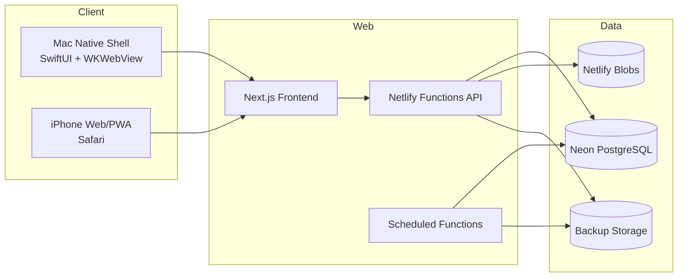
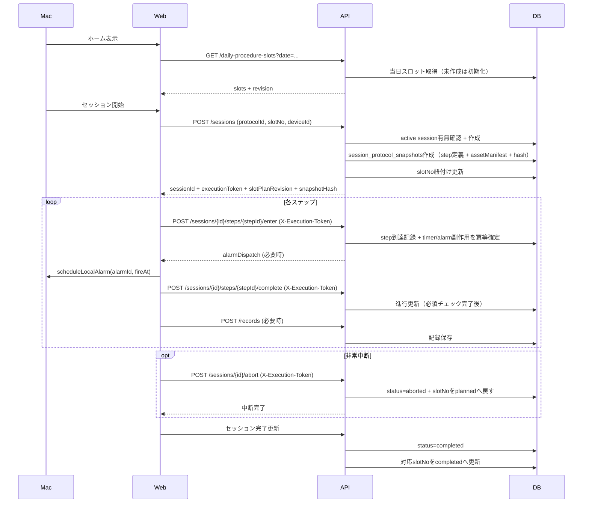

# 01. アーキテクチャ概要

## 1. 目的
CAPD v1 を「共通Web + Macネイティブシェル」で実装する際の全体構成を固定します。

## 2. システム構成

## 3. 設計原則
- セッション進行ロジックはWeb共通で一元化する
- OS依存機能（通知、スリープ抑止、ローカル取り込み）はMacネイティブで扱う
- セッション整合は「単一書き込み」を強制して競合を回避する
- iPhoneは代替運用として必要機能を確保する

## 4. 主要コンポーネント
- Web UI: Next.js（ホーム、セッション、履歴、取り込み結果、設定）
- API: Netlify Functions（REST）
- 同期: `GET /sync/changes` + `syncCursor`
- DB: セッション、日次スロット計画（daily_procedure_plans / daily_procedure_slots）、記録、開始時スナップショット（session_protocol_snapshots）、監査ログ
- オブジェクト保存: 写真、手順画像
- バックアップ: 日次Scheduled Function + 手動エクスポート

## 5. ランタイムシーケンス（セッション開始〜完了）

## 6. 非機能方針
- セキュリティ: アプリ内認証なし（公開URL運用）
- 可用性: オンライン必須、同期失敗時は再試行UI
- 拡張性: `record_event` 追加を想定した列駆動設計
- 保守性: API契約とUI標準を文書で固定

## 7. 開始時スナップショット契約
- 固定対象:
  - `sourceProtocol`（`protocolId`, `protocolVersion`, `importedAt`）
  - step定義本文（通し番号、`step_id/next_step_id`、フェーズ/状態、タイトル、表示/警告文、必須チェック、`timer/alarm/record` 指示）
  - `assetManifest`（`sourceRelativePath` と `assetKey` 対応、`contentSha256`、`sizeBytes`）
  - `snapshotHash`（正規化JSONの `sha256`）
- 保存方式:
  - `POST /sessions` 内で `sessions` と `session_protocol_snapshots` を同一トランザクション保存
  - いずれか失敗時はロールバックし、`SESSION_SNAPSHOT_CREATE_FAILED` を返却
- 復元方式:
  - `GET /sessions/{id}` は `session_protocol_snapshots` のみを参照
  - 現行テンプレート版へのフォールバックは禁止
  - 欠落またはハッシュ不整合は `SESSION_SNAPSHOT_INTEGRITY_ERROR` を返却
