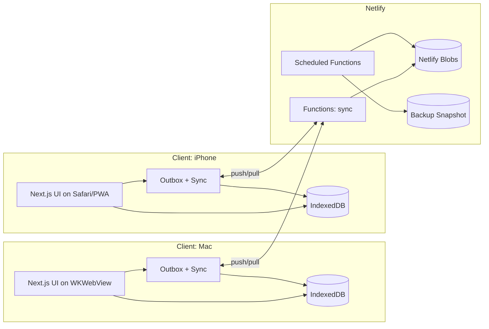
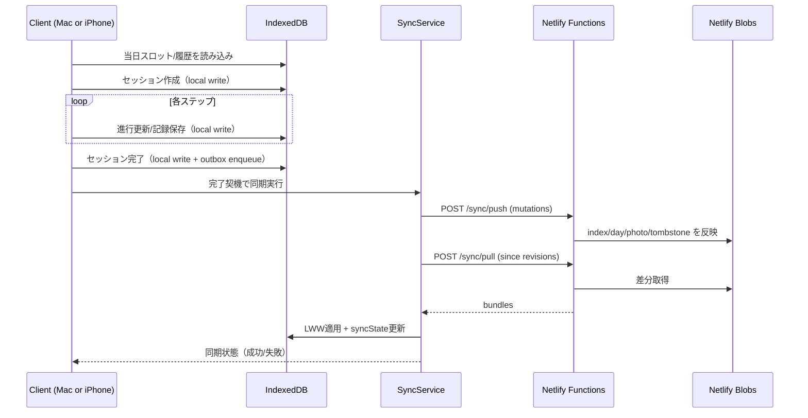

# 01. アーキテクチャ概要

> 移行メモ（2026-02-11）: 本文の正本は `docs/spec/40_contracts/architecture-overview.md` / `docs/spec/40_contracts/storage-model.md` / `docs/spec/40_contracts/api.md` へ再構成済みです。  
> 本書は旧体系参照用として残置し、更新は `docs/spec` 側を優先します。

## 1. 目的
CAPD v1 を「共通Web + Macネイティブシェル」で実装しつつ、データ基盤を `IndexedDB（端末正本） + Netlify Blobs（共有/バックアップ）` に固定します。

## 2. システム構成

## 3. 設計原則
- セッション進行ロジックはクライアント共通実装で一元化する
- データ正本は端末ローカル（IndexedDB）とする
- クラウドは共有・バックアップ用途に限定する
- 競合は同期時に LWW で内部自動解決する
- 同一端末内の進行中セッションは1件に制限する
- 同期データは非暗号化保存とし、HTTPS通信とURL管理で運用リスクを抑制する

## 4. 主要コンポーネント
- Web UI: Next.js（ホーム、セッション、記録一覧、設定）
- Local Domain Service: `SessionService`, `RecordService`, `DailyPlanService`
- Local Persistence: IndexedDB（sessions, records, daily plans, snapshots, outbox, sync state）
- Sync Service: 起動/復帰/完了/手動時に `push + pull`
- API: Netlify Functions（`POST /sync/pull`, `POST /sync/push`）
- Shared Storage: Netlify Blobs（`index.json`, `days/*.json`, `photos/*.jpg`）
- Backup: 日次スナップショット保持（30日）

## 5. ランタイムシーケンス（セッション開始〜完了〜同期）

## 6. 非機能方針
- セキュリティ: アプリ内認証なし（公開URL運用）を継続し、HTTPS通信とURL管理ルールで補完
- 可用性: 通信断時もローカル継続、復帰後同期で最終整合
- 拡張性: `record_event` 追加を想定した列駆動設計
- 保守性: 同期契約（manifest/day bundle/outbox）を文書で固定

## 7. 開始時スナップショット契約
- 固定対象:
  - `sourceProtocol`（`protocolId`, `protocolVersion`, `importedAt`）
  - step定義本文（通し番号、`step_id/next_step_id`、フェーズ/状態、タイトル、表示/警告文、必須チェック、`timer/alarm/record` 指示）
  - `assetManifest`（`sourceRelativePath` と `assetKey` 対応、`contentSha256`、`sizeBytes`）
  - `snapshotHash`（正規化JSONの `sha256`）
- 保存方式:
  - セッション開始時に `sessions` と `session_protocol_snapshots` を同一ローカルトランザクションで保存
  - 失敗時は開始処理をロールバックし、エラーを表示
- 復元方式:
  - セッション再開時は `session_protocol_snapshots` のみ参照
  - 現行テンプレート版へのフォールバックは禁止
  - 欠落またはハッシュ不整合は表示を停止し、復旧導線を提示
