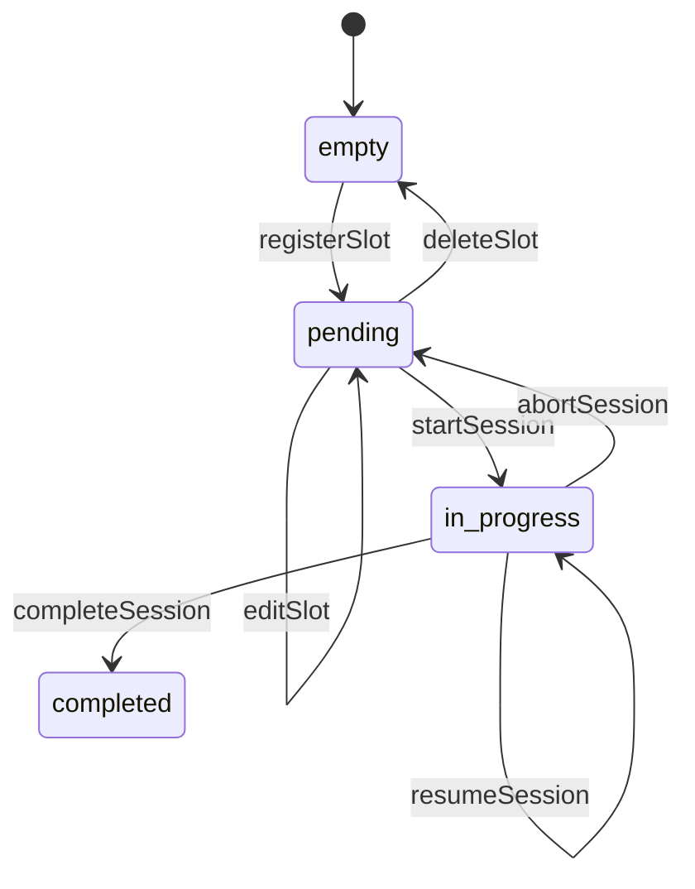
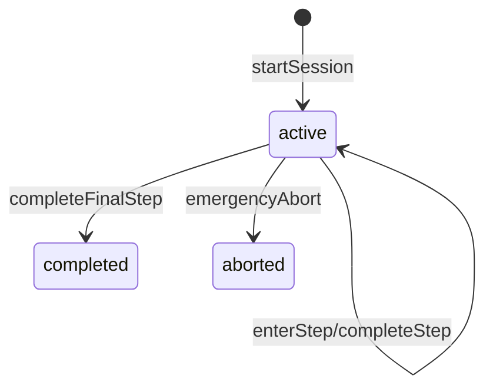
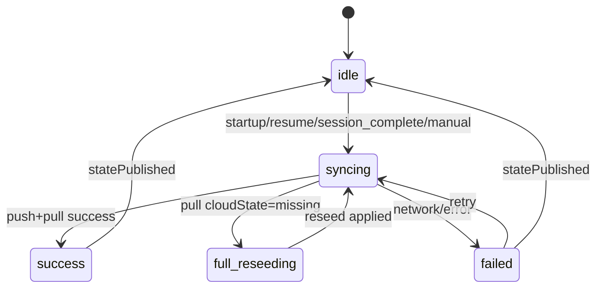
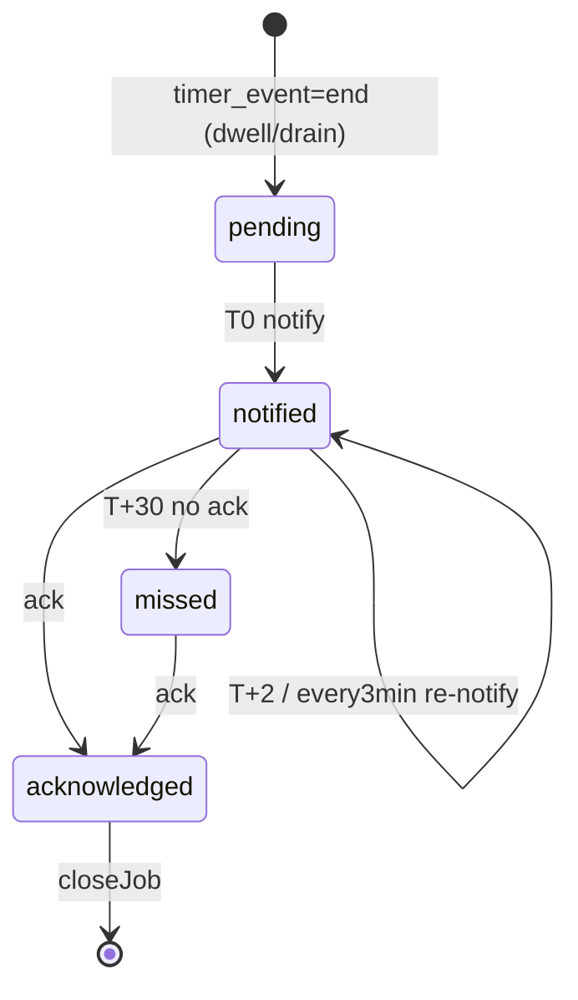

# 11. 状態遷移設計（State Machine）

> 移行メモ（2026-02-11）: 本文の正本は `docs/spec/40_contracts/state-machine.md` へ再構成済みです。  
> 本書は旧体系参照用として残置し、更新は `docs/spec` 側を優先します。

## 1. 目的
本書は、`slot/session/sync/alarm` の状態遷移をイベント単位で固定し、実装差分を防ぐための設計正本です。  
要件は `docs/requirements/10_screen_transition_and_actions.md` と `docs/requirements/12_ui_data_binding_matrix.md` を参照します。

## 2. スロット状態機械

### 2.1 状態
- `empty`（未登録）
- `pending`（未実施）
- `in_progress`（実施中）
- `completed`（実施済み）

### 2.2 遷移

### 2.3 不変条件
- 右側スロット開始は左側すべて `completed` が前提です。
- `completed` スロットは編集/削除を許可しません。
- 同一端末で `in_progress` がある間はスロット編集を許可しません。

## 3. セッション状態機械

### 3.1 状態
- `active`
- `completed`
- `aborted`

### 3.2 遷移

### 3.3 不変条件
- `active` のみ進行更新可能です。
- `completed` / `aborted` から `active` へ戻してはいけません。
- 予期せぬ離脱時は `active` を維持し、再開時に同じ `sessionId` を使用します。

## 4. 同期状態機械

### 4.1 状態
- `idle`
- `syncing`
- `full_reseeding`
- `success`
- `failed`

### 4.2 遷移

### 4.3 不変条件
- `cloudState=missing` 検知時にローカル初期化を行ってはいけません。
- `full_reseeding` 後は再度 `pull` で `cloudState=ok` を確認して完了とします。
- 失敗時は `lastSyncStatus=failed` と再試行導線を必須表示します。

## 5. アラーム状態機械

### 5.1 状態
- `pending`
- `notified`
- `missed`
- `acknowledged`

### 5.2 遷移

### 5.3 不変条件
- 通知対象は `timer_event=end` かつ `timer_segment=dwell/drain` のみです。
- `acknowledged` 遷移時は通知停止と `acked_at` 記録を同時に行います。
- `missed` 後もACKまでは再通知を継続します。

## 6. 実装チェックリスト
1. 各 `ACT-*` が本書の遷移イベントに接続されていること。
2. 状態更新時に `updatedAt/updatedByDeviceId/mutationId` を更新すること。
3. 状態機械にない遷移を追加する場合は、先に本書を改訂すること。
