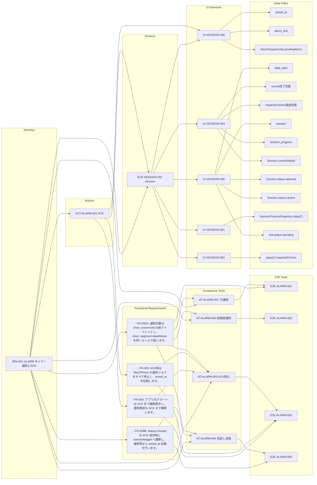

# JRN-001-ALARM マップ

```mermaid
flowchart LR
  %% JRN-001-ALARM
  subgraph JRN["Journeys"]
    N28["JRN-001-ALARM タイマー通知とACK"]
  end
  subgraph ACT["Actions"]
    N1["ACT-ALARM-001 ACK"]
  end
  subgraph SCR["Screens"]
    N29["SCR-SESSION-001 Session"]
  end
  subgraph UI["UI Elements"]
    N30["UI-SESSION-001"]
    N31["UI-SESSION-002"]
    N32["UI-SESSION-003"]
    N33["UI-SESSION-005"]
    N34["UI-SESSION-006"]
  end
  subgraph FR["Functional Requirements"]
    N24["- FR-050A: 通知対象は timer_event=end の終了イベントとし、timer_segment=dwell/drain を同一ルールで扱います。"]
    N25["- FR-053: ACK時は Mac/iPhone の通知ジョブをすべて停止し、acked_at を記録します。"]
    N26["- FR-054: アプリ内アラートは ACK まで継続表示し、通知再送も ACK まで継続します。"]
    N27["- FR-058B: status=missed は ACK 成功時に acknowledged へ遷移し、通知停止と acked_at 記録を行います。"]
  end
  subgraph AT["Acceptance Tests"]
    N2["AT-ALARM-001 T0通知"]
    N3["AT-ALARM-002 段階再通知"]
    N4["AT-ALARM-003 ACK停止"]
    N5["AT-ALARM-004 見逃し状態"]
  end
  subgraph E2E["E2E Tests"]
    N20["E2E-ALARM-001"]
    N21["E2E-ALARM-002"]
    N22["E2E-ALARM-003"]
    N23["E2E-ALARM-004"]
  end
  subgraph DATA["Data Paths"]
    N6["acked_at"]
    N7["alarm_ack"]
    N8["AlarmDispatchJob.pendingAlarm"]
    N9["daily_plan"]
    N10["record完了状態"]
    N11["requiredChecks達成状態"]
    N12["session"]
    N13["session_progress"]
    N14["Session.currentStepId"]
    N15["Session.status=aborted"]
    N16["Session.status=active"]
    N17["SessionProtocolSnapshot.steps[*]"]
    N18["slot.status=pending"]
    N19["steps[*].requiredChecks"]
  end
  N1 --> N25
  N1 --> N26
  N1 --> N29
  N1 --> N34
  N2 --> N20
  N3 --> N21
  N4 --> N22
  N5 --> N23
  N24 --> N2
  N24 --> N3
  N24 --> N4
  N24 --> N5
  N24 --> N20
  N25 --> N4
  N25 --> N22
  N26 --> N4
  N26 --> N22
  N27 --> N5
  N27 --> N23
  N28 --> N1
  N28 --> N2
  N28 --> N3
  N28 --> N4
  N28 --> N5
  N28 --> N24
  N28 --> N27
  N28 --> N29
  N29 --> N30
  N29 --> N31
  N29 --> N32
  N29 --> N33
  N29 --> N34
  N30 --> N17
  N31 --> N19
  N32 --> N10
  N32 --> N11
  N32 --> N13
  N32 --> N14
  N33 --> N9
  N33 --> N12
  N33 --> N15
  N33 --> N16
  N33 --> N18
  N34 --> N6
  N34 --> N7
  N34 --> N8
```

