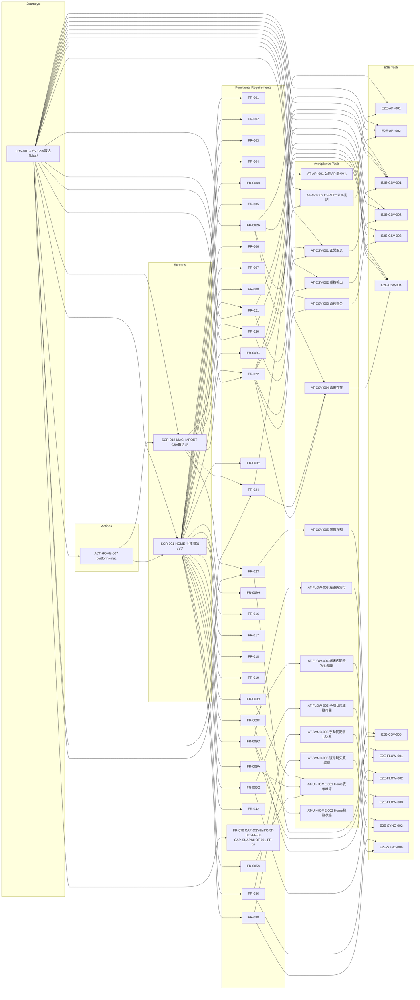

# JRN-001-CSV マップ

```mermaid
flowchart LR
  %% JRN-001-CSV
  subgraph JRN["Journeys"]
    N60["JRN-001-CSV CSV取込（Mac）"]
  end
  subgraph ACT["Actions"]
    N1["ACT-HOME-007 platform=mac"]
  end
  subgraph SCR["Screens"]
    N61["SCR-001-HOME 手技開始ハブ"]
    N62["SCR-012-MAC-IMPORT CSV取込I/F"]
  end
  subgraph FR["Functional Requirements"]
    N28["FR-001"]
    N29["FR-002"]
    N30["FR-003"]
    N31["FR-004"]
    N32["FR-004A"]
    N33["FR-005"]
    N34["FR-005A"]
    N35["FR-006"]
    N36["FR-007"]
    N37["FR-008"]
    N38["FR-009A"]
    N39["FR-009B"]
    N40["FR-009C"]
    N41["FR-009D"]
    N42["FR-009E"]
    N43["FR-009F"]
    N44["FR-009G"]
    N45["FR-009H"]
    N46["FR-016"]
    N47["FR-017"]
    N48["FR-018"]
    N49["FR-019"]
    N50["FR-020"]
    N51["FR-021"]
    N52["FR-022"]
    N53["FR-023"]
    N54["FR-024"]
    N55["FR-042"]
    N56["FR-070 CAP-CSV-IMPORT-001-FR-06<br>CAP-SNAPSHOT-001-FR-07"]
    N57["FR-082A"]
    N58["FR-086"]
    N59["FR-088"]
  end
  subgraph AT["Acceptance Tests"]
    N2["AT-API-001 公開API最小化"]
    N3["AT-API-003 CSVローカル完結"]
    N4["AT-CSV-001 正常取込"]
    N5["AT-CSV-002 重複検出"]
    N6["AT-CSV-003 直列整合"]
    N7["AT-CSV-004 画像存在"]
    N8["AT-CSV-005 警告検知"]
    N9["AT-FLOW-004 端末内同時実行制限"]
    N10["AT-FLOW-005 左優先実行"]
    N11["AT-FLOW-006 予期せぬ離脱再開"]
    N12["AT-SYNC-005 手動同期消し込み"]
    N13["AT-SYNC-006 復帰時失敗導線"]
    N14["AT-UI-HOME-001 Home表示確認"]
    N15["AT-UI-HOME-002 Home初期状態"]
  end
  subgraph E2E["E2E Tests"]
    N16["E2E-API-001"]
    N17["E2E-API-002"]
    N18["E2E-CSV-001"]
    N19["E2E-CSV-002"]
    N20["E2E-CSV-003"]
    N21["E2E-CSV-004"]
    N22["E2E-CSV-005"]
    N23["E2E-FLOW-001"]
    N24["E2E-FLOW-002"]
    N25["E2E-FLOW-003"]
    N26["E2E-SYNC-002"]
    N27["E2E-SYNC-006"]
  end
  N1 --> N61
  N1 --> N62
  N2 --> N16
  N3 --> N17
  N4 --> N18
  N5 --> N19
  N6 --> N20
  N7 --> N21
  N8 --> N22
  N9 --> N24
  N10 --> N23
  N11 --> N25
  N12 --> N26
  N13 --> N27
  N34 --> N14
  N38 --> N14
  N39 --> N14
  N41 --> N10
  N41 --> N15
  N41 --> N23
  N43 --> N9
  N43 --> N24
  N44 --> N11
  N44 --> N25
  N50 --> N4
  N50 --> N18
  N51 --> N4
  N51 --> N18
  N52 --> N5
  N52 --> N6
  N52 --> N7
  N52 --> N19
  N52 --> N20
  N52 --> N21
  N53 --> N8
  N53 --> N22
  N54 --> N7
  N54 --> N21
  N57 --> N2
  N57 --> N3
  N57 --> N16
  N57 --> N17
  N58 --> N12
  N58 --> N26
  N59 --> N13
  N59 --> N27
  N60 --> N1
  N60 --> N3
  N60 --> N4
  N60 --> N5
  N60 --> N6
  N60 --> N7
  N60 --> N17
  N60 --> N18
  N60 --> N19
  N60 --> N20
  N60 --> N21
  N60 --> N50
  N60 --> N51
  N60 --> N52
  N60 --> N53
  N60 --> N54
  N60 --> N56
  N60 --> N57
  N60 --> N61
  N60 --> N62
  N61 --> N28
  N61 --> N29
  N61 --> N30
  N61 --> N31
  N61 --> N32
  N61 --> N33
  N61 --> N34
  N61 --> N35
  N61 --> N36
  N61 --> N37
  N61 --> N38
  N61 --> N39
  N61 --> N40
  N61 --> N41
  N61 --> N42
  N61 --> N43
  N61 --> N44
  N61 --> N45
  N61 --> N46
  N61 --> N47
  N61 --> N48
  N61 --> N49
  N61 --> N55
  N61 --> N58
  N61 --> N59
  N62 --> N50
  N62 --> N51
  N62 --> N52
  N62 --> N53
  N62 --> N54
```

