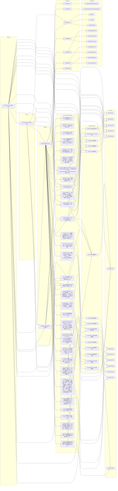

# JRN-001-CSV マップ

```mermaid
flowchart LR
  %% JRN-001-CSV
  subgraph JRN["Journeys"]
    N74["JRN-001-CSV CSV取込（Mac）"]
  end
  subgraph ACT["Actions"]
    N1["ACT-HOME-007 CSV取り込み"]
  end
  subgraph SCR["Screens"]
    N75["SCR-001-HOME Home"]
    N76["SCR-012-MAC-IMPORT CSV取込I/F"]
  end
  subgraph UI["UI Elements"]
    N77["UI-HOME-001"]
    N78["UI-HOME-002"]
    N79["UI-HOME-003"]
    N80["UI-HOME-003A"]
    N81["UI-HOME-007"]
    N82["UI-HOME-008"]
    N83["UI-HOME-009"]
  end
  subgraph FR["Functional Requirements"]
    N42["- FR-001: 複数手技テンプレート一覧を表示します。"]
    N43["- FR-002: テンプレートごとに名称、版、有効開始日を表示します。"]
    N44["- FR-003: 選択した1手技でセッションを開始します。"]
    N45["- FR-004: 手技開始通知は本アプリ対象外とし、Mac/iPhoneの時計アプリ等の外部アラームで運用します。"]
    N46["- FR-004A: ホームに「手技開始通知は外部アラーム運用」の注記を表示します。"]
    N47["- FR-005: ホームには手技開始情報に加え、当日分のみCAPD記録ノート互換表を表示します（過去分は一覧画面で表示）。"]
    N48["- FR-005A: ホームAの先頭見出しは日付と曜日を表示し、手技スロットと当日ノート表は同一パネル内に配置します。"]
    N49["- FR-006: ホームから「記録一覧」画面へ遷移できる導線を提供します。"]
    N50["- FR-007: ホームAスパイクでは、1日あたり4件の手技スロットを横並びで表示します。"]
    N51["- FR-008: 手技スロットの初期状態は「+ のみ表示」とし、+ 押下で手技設定モーダル（CSV選択、推奨実施時間）を開きます。"]
    N52["- FR-009A: 右上 ••• メニューから「確認/編集」を開きます。確認モーダルは閲覧専用とし、ここからの「開始/再開」は手順表示のみ（確認モード）とします。確認モードでは記録保存、タイマー開始、通知ジョブ生成、アラーム設定、スロット/セッション状態更新、同期対象更新を行いません。"]
    N53["- FR-009B: 手技スロットの表示状態は 未登録(+) / 未実施 / 実施中 / 実施済み とします。実施済み のカード本体タップは無効化します。"]
    N54["- FR-009C: スロット登録時は、右隣スロットほど推奨実施時間が遅くなるように検証します（左から右へ厳密昇順、同時刻不可）。"]
    N55["- FR-009D: 右側スロットの開始時は、左側スロットがすべて 実施済み であることを必須条件にします（未登録/未実施が1件でもあれば開始不可）。"]
    N56["- FR-009E: 4スロット設定は dateLocal 単位でローカル永続化し、同期時に localRevision と cloudRevision を更新します。"]
    N57["- FR-009F: 実施済み スロットは編集/削除不可とします。同一端末で進行中セッションがある間は全スロット編集を禁止します。"]
    N58["- FR-009G: 実施中 スロットをタップした場合は新規開始せず、進行中セッションを再開します。"]
    N59["- FR-009H: 記録やタイマーを伴う実運用セッション開始/再開はカード本体タップ導線で実行し、••• > 確認 導線は閲覧専用（確認モード）とします。"]
    N60["- FR-016: 当日ノート表と記録一覧の交換列は #1〜#5 の5列固定とし、列位置は *_exchange_no で決定します。"]
    N61["- FR-017: 透析液濃度欄は、取り込みCSVのタイトル（例"]
    N62["- FR-018: record_event の値は record_exchange_no で列マッピングし、drain_weight_g は排液量、bag_weight_g は注液量、drain_appearance は排液の確認に表示します。"]
    N63["- FR-019: timer_event の値は timer_exchange_no で列マッピングし、timer_segment=dwell の start/end は貯留時間、timer_segment=drain の start/end は排液時間に表示します。"]
    N64["- FR-020: MacネイティブシェルでCSV+画像ディレクトリを選択できます。"]
    N65["- FR-021: CSV v3フォーマットのみ受け付けます。"]
    N66["- FR-022: 検証エラー1件以上で取り込みを中止します。"]
    N67["- FR-023: 警告は取り込み結果画面で一覧表示します。"]
    N68["- FR-024: 画像相対パスを protocol.csv ディレクトリ基準で解決します。"]
    N69["- FR-042: 廃液の記録写真（drain）は任意入力です。"]
    N70["- FR-070: 新版取り込み後、テンプレート版として保存します。"]
    N71["- FR-082A: 公開HTTP APIは POST /sync/push と POST /sync/pull のみとし、CSV取り込みはローカルI/F（ProtocolImportService.importFromDirectory）で実行します。"]
    N72["- FR-086: 手動同期ボタンを提供し、失敗時は再試行導線を表示します。"]
    N73["- FR-088: 同期失敗時は直近同期状態（成功/失敗）を更新し、再試行導線を表示します。"]
  end
  subgraph AT["Acceptance Tests"]
    N2["AT-API-001 公開API最小化"]
    N3["AT-API-003 CSVローカル完結"]
    N4["AT-CSV-001 正常取込"]
    N5["AT-CSV-002 重複検出"]
    N6["AT-CSV-003 直列整合"]
    N7["AT-CSV-004 画像存在"]
    N8["AT-CSV-005 警告検知"]
    N9["AT-FLOW-004 端末内同時実行制限"]
    N10["AT-FLOW-005 左優先実行"]
    N11["AT-FLOW-006 予期せぬ離脱再開"]
    N12["AT-FLOW-007 非常中断"]
    N13["AT-SYNC-005 手動同期消し込み"]
    N14["AT-SYNC-006 復帰時失敗導線"]
    N15["AT-UI-HOME-001 Home表示確認"]
    N16["AT-UI-HOME-002 Home初期状態"]
  end
  subgraph E2E["E2E Tests"]
    N29["E2E-API-001"]
    N30["E2E-API-002"]
    N31["E2E-CSV-001"]
    N32["E2E-CSV-002"]
    N33["E2E-CSV-003"]
    N34["E2E-CSV-004"]
    N35["E2E-CSV-005"]
    N36["E2E-FLOW-001"]
    N37["E2E-FLOW-002"]
    N38["E2E-FLOW-003"]
    N39["E2E-FLOW-004"]
    N40["E2E-SYNC-002"]
    N41["E2E-SYNC-006"]
  end
  subgraph DATA["Data Paths"]
    N17["DailyProcedurePlan.dateLocal"]
    N18["DailyProcedurePlan.slots[*].displayStatus"]
    N19["platform"]
    N20["protocol"]
    N21["ProtocolPackage"]
    N22["recommendedAtLocal"]
    N23["record_exchange_no)"]
    N24["Record(record_event"]
    N25["Record(timer_event"]
    N26["slots[*].protocolTitle"]
    N27["slots[n].displayStatus"]
    N28["timer_exchange_no)"]
  end
  N1 --> N64
  N1 --> N65
  N1 --> N66
  N1 --> N67
  N1 --> N68
  N1 --> N75
  N1 --> N76
  N1 --> N81
  N2 --> N29
  N3 --> N30
  N4 --> N31
  N5 --> N32
  N6 --> N33
  N7 --> N34
  N8 --> N35
  N9 --> N37
  N10 --> N36
  N11 --> N38
  N12 --> N39
  N13 --> N40
  N14 --> N41
  N48 --> N15
  N50 --> N9
  N50 --> N10
  N52 --> N15
  N53 --> N15
  N55 --> N10
  N55 --> N16
  N55 --> N36
  N57 --> N9
  N57 --> N37
  N58 --> N11
  N58 --> N12
  N58 --> N38
  N64 --> N3
  N64 --> N4
  N64 --> N5
  N64 --> N6
  N64 --> N7
  N64 --> N31
  N65 --> N4
  N65 --> N31
  N66 --> N5
  N66 --> N6
  N66 --> N7
  N66 --> N32
  N66 --> N33
  N66 --> N34
  N67 --> N8
  N67 --> N35
  N68 --> N7
  N68 --> N34
  N71 --> N2
  N71 --> N3
  N71 --> N29
  N71 --> N30
  N72 --> N13
  N72 --> N40
  N73 --> N14
  N73 --> N41
  N74 --> N1
  N74 --> N3
  N74 --> N4
  N74 --> N5
  N74 --> N6
  N74 --> N7
  N74 --> N30
  N74 --> N31
  N74 --> N32
  N74 --> N33
  N74 --> N34
  N74 --> N64
  N74 --> N65
  N74 --> N66
  N74 --> N67
  N74 --> N68
  N74 --> N70
  N74 --> N71
  N74 --> N75
  N74 --> N76
  N75 --> N42
  N75 --> N43
  N75 --> N44
  N75 --> N45
  N75 --> N46
  N75 --> N47
  N75 --> N48
  N75 --> N49
  N75 --> N50
  N75 --> N51
  N75 --> N52
  N75 --> N53
  N75 --> N54
  N75 --> N55
  N75 --> N56
  N75 --> N57
  N75 --> N58
  N75 --> N59
  N75 --> N60
  N75 --> N61
  N75 --> N62
  N75 --> N63
  N75 --> N69
  N75 --> N72
  N75 --> N73
  N75 --> N77
  N75 --> N78
  N75 --> N79
  N75 --> N80
  N75 --> N81
  N75 --> N82
  N75 --> N83
  N76 --> N64
  N76 --> N65
  N76 --> N66
  N76 --> N67
  N76 --> N68
  N77 --> N17
  N78 --> N18
  N79 --> N22
  N79 --> N26
  N80 --> N27
  N81 --> N19
  N81 --> N20
  N81 --> N21
  N82 --> N25
  N82 --> N28
  N83 --> N23
  N83 --> N24
```

