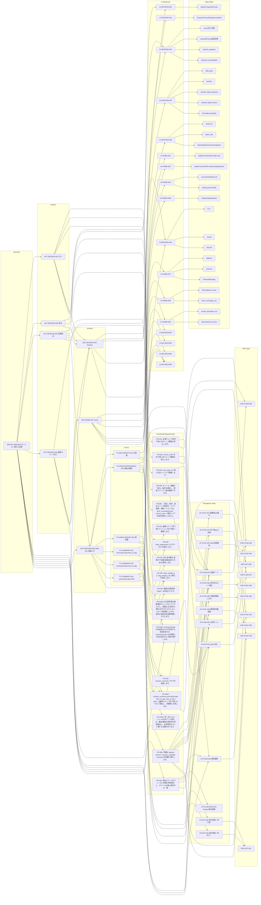

# JRN-001-SESSION マップ

```mermaid
flowchart LR
  %% JRN-001-SESSION
  subgraph JRN["Journeys"]
    N81["JRN-001-SESSION セッション進行と記録"]
  end
  subgraph ACT["Actions"]
    N1["ACT-SESSION-001 次へ"]
    N2["ACT-SESSION-002 戻る"]
    N3["ACT-SESSION-003 記録保存"]
    N4["ACT-SESSION-004 最終ステップ完了"]
  end
  subgraph SCR["Screens"]
    N82["SCR-HOME-001 Home"]
    N83["SCR-SESSION-001 Session"]
    N84["SCR-SESSION-RECORD-001 記録入力"]
  end
  subgraph FC["Forms"]
    N58["FC-BAG-WEIGHT-001 注液量"]
    N59["FC-DRAIN-APPEARANCE-001 排液の確認"]
    N60["FC-DRAIN-WEIGHT-001 排液量"]
    N61["FC-SUMMARY-001 summaryScope=first_of_day"]
    N62["FC-SUMMARY-002 summaryScope=last_of_day"]
    N63["FC-SUMMARY-003 summaryScope=both"]
  end
  subgraph UI["UI Elements"]
    N85["UI-001-RECORD"]
    N86["UI-002-RECORD"]
    N87["UI-003-RECORD"]
    N88["UI-004-RECORD"]
    N89["UI-HOME-001"]
    N90["UI-HOME-002"]
    N91["UI-HOME-003"]
    N92["UI-HOME-003A"]
    N93["UI-HOME-007"]
    N94["UI-HOME-008"]
    N95["UI-HOME-009"]
    N96["UI-SESSION-001"]
    N97["UI-SESSION-002"]
    N98["UI-SESSION-003"]
    N99["UI-SESSION-004"]
    N100["UI-SESSION-005"]
    N101["UI-SESSION-006"]
  end
  subgraph FR["Functional Requirements"]
    N64["- FR-030: 現在ステップのフェーズと状態を常時表示し、タイトルは通し番号付き（例"]
    N65["- FR-031: 必須チェック未完了時に次ステップ遷移を禁止します。"]
    N66["- FR-032: record_event 未完了時に次ステップ遷移を禁止します。"]
    N67["- FR-033: next_step_id に従い完全シリアルで遷移します。"]
    N68["- FR-034: 最終ステップ完了時にセッション完了状態へ遷移します。"]
    N69["- FR-039: セッション画面に「戻る」操作を提供し、直前ステップへ表示遷移できます。"]
    N70["- FR-040: drain_appearance 入力モーダルを提供します。"]
    N71["- FR-041: 見た目分類は 透明/やや混濁/混濁/血性/その他 を提供します。"]
    N72["- FR-042: 廃液の記録写真（drain）は任意入力です。"]
    N73["- FR-043: drain_weight_g と bag_weight_g を g単位で保存します。"]
    N74["- FR-044: session_summary で以下を収集します。"]
    N75["- FR-044A: 同一日に1セッションのみ完了した場合は、最初/最後の両条件を同時適用し、必須項目をすべて満たす必要があります。"]
    N76["- FR-044B: 出口部状態は複数選択チェックボックスで入力し、語彙は 正常/赤み/痛み/はれ/かさぶた/じゅくじゅく/出血/膿 とします。追加の自由記述は備考欄に入力します。"]
    N77["- FR-044C: session_summary.summaryScope（first_of_day / last_of_day / both）は最終ステップ完了時にローカルで算出し、同期時に共有します。"]
    N78["- FR-044D: summaryScope が未指定または不正値でも保存拒否せず、summaryScope のみ破棄して他の妥当な入力値を保存します。"]
    N79["- FR-056: 「戻る」操作、過去ステップ再表示、アプリ再開、通信リトライでは、timer_event(start/end)・record_event・通知ジョブ生成を再発火しません。"]
    N80["- FR-080: 同期は startup / resume / session_complete / manual の4契機で実行します。"]
  end
  subgraph AT["Acceptance Tests"]
    N5["AT-EXIT-001 表示前提（未完了）"]
    N6["AT-EXIT-002 表示前提（完了後）"]
    N7["AT-EXIT-011 both 対応"]
    N8["AT-FLOW-001 必須チェック"]
    N9["AT-FLOW-002 記録ゲート"]
    N10["AT-FLOW-003 直列遷移"]
    N11["AT-SYNC-001 起動時pull復元"]
    N12["AT-SYNC-002 完了時push反映"]
    N13["AT-SYNC-003 LWW内部適用"]
    N14["AT-SYNC-004 同日同スロット競合"]
    N15["AT-SYNC-005 手動同期消し込み"]
    N16["AT-SYNC-006 復帰時失敗導線"]
    N17["AT-UI-SESSION-001 Session表示確認"]
  end
  subgraph E2E["E2E Tests"]
    N47["E2E-EXIT-001"]
    N48["E2E-EXIT-006"]
    N49["E2E-FLOW-005"]
    N50["E2E-FLOW-006"]
    N51["E2E-FLOW-007"]
    N52["E2E-SYNC-001"]
    N53["E2E-SYNC-002"]
    N54["E2E-SYNC-003"]
    N55["E2E-SYNC-004"]
    N56["E2E-SYNC-005"]
    N57["E2E-SYNC-006"]
  end
  subgraph DATA["Data Paths"]
    N18["acked_at"]
    N19["alarm_ack"]
    N20["AlarmDispatchJob.pendingAlarm"]
    N21["daily_plan"]
    N22["DailyProcedurePlan.dateLocal"]
    N23["DailyProcedurePlan.slots[*].displayStatus"]
    N24["FC-*"]
    N25["platform"]
    N26["protocol"]
    N27["ProtocolPackage"]
    N28["recommendedAtLocal"]
    N29["record"]
    N30["Record"]
    N31["record_exchange_no)"]
    N32["Record(record_event"]
    N33["Record(timer_event"]
    N34["record完了状態"]
    N35["requiredChecks達成状態"]
    N36["session"]
    N37["session_progress"]
    N38["Session.currentStepId"]
    N39["Session.status=aborted"]
    N40["Session.status=active"]
    N41["SessionProtocolSnapshot.steps[*]"]
    N42["slot.status=pending"]
    N43["slots[*].protocolTitle"]
    N44["slots[n].displayStatus"]
    N45["steps[*].requiredChecks"]
    N46["timer_exchange_no)"]
  end
  N1 --> N65
  N1 --> N66
  N1 --> N67
  N1 --> N83
  N1 --> N97
  N1 --> N98
  N2 --> N69
  N2 --> N79
  N2 --> N83
  N3 --> N70
  N3 --> N78
  N3 --> N83
  N3 --> N84
  N3 --> N99
  N4 --> N68
  N4 --> N80
  N4 --> N82
  N4 --> N83
  N5 --> N47
  N6 --> N47
  N7 --> N48
  N8 --> N49
  N9 --> N50
  N10 --> N51
  N11 --> N52
  N12 --> N54
  N13 --> N55
  N14 --> N56
  N15 --> N53
  N16 --> N57
  N58 --> N9
  N58 --> N73
  N58 --> N87
  N59 --> N9
  N59 --> N70
  N59 --> N71
  N59 --> N72
  N59 --> N85
  N60 --> N9
  N60 --> N73
  N60 --> N86
  N61 --> N6
  N61 --> N74
  N61 --> N76
  N61 --> N77
  N61 --> N88
  N62 --> N5
  N62 --> N74
  N62 --> N77
  N62 --> N88
  N63 --> N7
  N63 --> N75
  N63 --> N77
  N63 --> N88
  N64 --> N8
  N64 --> N9
  N64 --> N10
  N64 --> N17
  N65 --> N8
  N65 --> N49
  N66 --> N9
  N66 --> N50
  N67 --> N10
  N67 --> N51
  N77 --> N7
  N77 --> N48
  N80 --> N11
  N80 --> N12
  N80 --> N13
  N80 --> N14
  N80 --> N15
  N80 --> N16
  N80 --> N52
  N80 --> N54
  N81 --> N1
  N81 --> N2
  N81 --> N3
  N81 --> N4
  N81 --> N8
  N81 --> N9
  N81 --> N10
  N81 --> N64
  N81 --> N78
  N81 --> N83
  N81 --> N84
  N82 --> N89
  N82 --> N90
  N82 --> N91
  N82 --> N92
  N82 --> N93
  N82 --> N94
  N82 --> N95
  N83 --> N96
  N83 --> N97
  N83 --> N98
  N83 --> N100
  N83 --> N101
  N84 --> N58
  N84 --> N59
  N84 --> N60
  N84 --> N61
  N84 --> N62
  N84 --> N63
  N84 --> N99
  N89 --> N22
  N90 --> N23
  N91 --> N28
  N91 --> N43
  N92 --> N44
  N93 --> N25
  N93 --> N26
  N93 --> N27
  N94 --> N33
  N94 --> N46
  N95 --> N31
  N95 --> N32
  N96 --> N41
  N97 --> N45
  N98 --> N34
  N98 --> N35
  N98 --> N37
  N98 --> N38
  N99 --> N24
  N99 --> N29
  N99 --> N30
  N100 --> N21
  N100 --> N36
  N100 --> N39
  N100 --> N40
  N100 --> N42
  N101 --> N18
  N101 --> N19
  N101 --> N20
```

