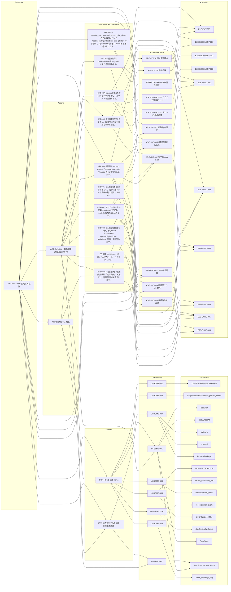

# JRN-001-SYNC マップ

```mermaid
flowchart LR
  %% JRN-001-SYNC
  subgraph JRN["Journeys"]
    N50["JRN-001-SYNC 同期と再試行"]
  end
  subgraph ACT["Actions"]
    N1["ACT-HOME-011 なし"]
    N2["ACT-SYNC-001 自動同期（起動/復帰/完了）"]
  end
  subgraph SCR["Screens"]
    N51["SCR-HOME-001 Home"]
    N52["SCR-SYNC-STATUS-001 同期状態表示"]
  end
  subgraph UI["UI Elements"]
    N53["UI-HOME-001"]
    N54["UI-HOME-002"]
    N55["UI-HOME-003"]
    N56["UI-HOME-003A"]
    N57["UI-HOME-007"]
    N58["UI-HOME-008"]
    N59["UI-HOME-009"]
    N60["UI-SYNC-001"]
    N61["UI-SYNC-002"]
  end
  subgraph FR["Functional Requirements"]
    N40["- FR-080: 同期は startup / resume / session_complete / manual の4契機で実行します。"]
    N41["- FR-081: すべてのローカル更新は outbox に追記し、push成功時に消し込みます。"]
    N42["- FR-082: 差分取得は cloudRevision と dayRefs に基づき実行します。"]
    N43["- FR-083: 競合解決はエンティティ単位LWW（updatedAt, updatedByDeviceId, mutationId 降順）で固定します。"]
    N44["- FR-084: tombstone（削除）もLWW同一ルールで解決します。"]
    N45["- FR-085: 競合解決は内部適用のみとし、競合件数バナーや詳細一覧は提供しません。"]
    N46["- FR-086: 手動同期ボタンを提供し、失敗時は再試行導線を表示します。"]
    N47["- FR-087: IndexedDB消失検知時はクラウドからフルリストアを実行します。"]
    N48["- FR-088: 同期失敗時は直近同期状態（成功/失敗）を更新し、再試行導線を表示します。"]
    N49["- FR-089A: session_summary.payload.exit_site_photo の更新は部分パッチ（patch_path=payload.exit_site_photo）で同期し、同一record内の他フィールドを上書きしません。"]
  end
  subgraph AT["Acceptance Tests"]
    N3["AT-EXIT-009 同期反映"]
    N4["AT-EXIT-010 部分更新競合"]
    N5["AT-RECOVERY-001 DB消失復元"]
    N6["AT-RECOVERY-002 クラウド欠損再シード"]
    N7["AT-RECOVERY-003 再シード失敗時保全"]
    N8["AT-SYNC-001 起動時pull復元"]
    N9["AT-SYNC-002 完了時push反映"]
    N10["AT-SYNC-003 LWW内部適用"]
    N11["AT-SYNC-004 同日同スロット競合"]
    N12["AT-SYNC-005 手動同期消し込み"]
    N13["AT-SYNC-006 復帰時失敗導線"]
  end
  subgraph E2E["E2E Tests"]
    N30["E2E-EXIT-005"]
    N31["E2E-RECOVERY-001"]
    N32["E2E-RECOVERY-002"]
    N33["E2E-RECOVERY-003"]
    N34["E2E-SYNC-001"]
    N35["E2E-SYNC-002"]
    N36["E2E-SYNC-003"]
    N37["E2E-SYNC-004"]
    N38["E2E-SYNC-005"]
    N39["E2E-SYNC-006"]
  end
  subgraph DATA["Data Paths"]
    N14["DailyProcedurePlan.dateLocal"]
    N15["DailyProcedurePlan.slots[*].displayStatus"]
    N16["lastError"]
    N17["lastSyncedAt"]
    N18["platform"]
    N19["protocol"]
    N20["ProtocolPackage"]
    N21["recommendedAtLocal"]
    N22["record_exchange_no)"]
    N23["Record(record_event"]
    N24["Record(timer_event"]
    N25["slots[*].protocolTitle"]
    N26["slots[n].displayStatus"]
    N27["SyncState"]
    N28["SyncState.lastSyncStatus"]
    N29["timer_exchange_no)"]
  end
  N1 --> N46
  N1 --> N48
  N1 --> N51
  N1 --> N61
  N2 --> N40
  N2 --> N41
  N2 --> N42
  N2 --> N43
  N2 --> N44
  N2 --> N45
  N2 --> N46
  N2 --> N47
  N2 --> N48
  N2 --> N52
  N2 --> N60
  N3 --> N30
  N4 --> N30
  N5 --> N31
  N6 --> N32
  N7 --> N33
  N8 --> N34
  N9 --> N36
  N10 --> N37
  N11 --> N38
  N12 --> N35
  N13 --> N39
  N40 --> N8
  N40 --> N9
  N40 --> N10
  N40 --> N11
  N40 --> N12
  N40 --> N13
  N40 --> N34
  N40 --> N36
  N41 --> N9
  N41 --> N12
  N41 --> N35
  N41 --> N36
  N42 --> N8
  N42 --> N34
  N43 --> N10
  N43 --> N11
  N43 --> N37
  N43 --> N38
  N44 --> N11
  N44 --> N38
  N46 --> N12
  N46 --> N35
  N47 --> N5
  N47 --> N6
  N47 --> N7
  N47 --> N31
  N48 --> N13
  N48 --> N39
  N49 --> N3
  N49 --> N4
  N49 --> N30
  N50 --> N1
  N50 --> N2
  N50 --> N8
  N50 --> N9
  N50 --> N10
  N50 --> N11
  N50 --> N12
  N50 --> N13
  N50 --> N40
  N50 --> N49
  N50 --> N51
  N50 --> N52
  N51 --> N53
  N51 --> N54
  N51 --> N55
  N51 --> N56
  N51 --> N57
  N51 --> N58
  N51 --> N59
  N52 --> N60
  N52 --> N61
  N53 --> N14
  N54 --> N15
  N55 --> N21
  N55 --> N25
  N56 --> N26
  N57 --> N18
  N57 --> N19
  N57 --> N20
  N58 --> N24
  N58 --> N29
  N59 --> N22
  N59 --> N23
  N60 --> N16
  N60 --> N17
  N60 --> N27
  N60 --> N28
  N61 --> N28
```

