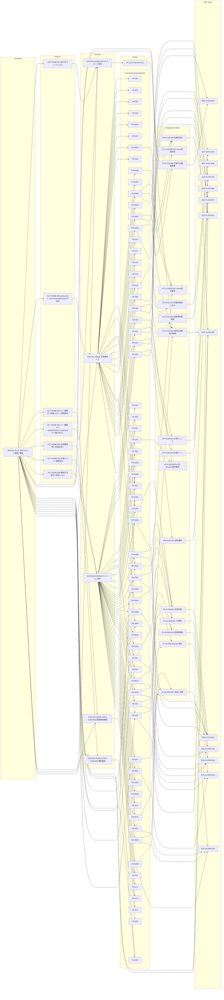

# JRN-002-SLOT マップ

```mermaid
flowchart LR
  %% JRN-002-SLOT
  subgraph JRN["Journeys"]
    N104["JRN-002-SLOT 当日スロット登録と開始"]
  end
  subgraph ACT["Actions"]
    N1["ACT-HOME-001 進行中セッションなし"]
    N2["ACT-HOME-002 protocolId と recommendedAtLocal が妥当"]
    N3["ACT-HOME-003 ••• > 確認 かつ対象スロット登録済み"]
    N4["ACT-HOME-004 ••• > 編集 かつdisplayStatus!=completed かつ進行中なし"]
    N5["ACT-HOME-005 右側開始時に左側全完了"]
    N6["ACT-HOME-006 対象スロット登録済み"]
    N7["ACT-HOME-008 開始不可条件に該当しない"]
  end
  subgraph SCR["Screens"]
    N105["SCR-001-HOME 手技開始ハブ"]
    N106["SCR-002-HOME-SETUP スロット設定"]
    N107["SCR-003-HOME-START-CONFIRM 開始確認"]
    N108["SCR-004-HOME-VIEW-CONFIRM 閲覧専用確認"]
    N109["SCR-006-SESSION セッション進行"]
  end
  subgraph FC["Forms"]
    N37["FC-SLOT-SETUP-001"]
  end
  subgraph FR["Functional Requirements"]
    N38["FR-001"]
    N39["FR-002"]
    N40["FR-003"]
    N41["FR-004"]
    N42["FR-004A"]
    N43["FR-005"]
    N44["FR-005A"]
    N45["FR-006"]
    N46["FR-007"]
    N47["FR-008"]
    N48["FR-009"]
    N49["FR-009A"]
    N50["FR-009B"]
    N51["FR-009C"]
    N52["FR-009D"]
    N53["FR-009E"]
    N54["FR-009F"]
    N55["FR-009G"]
    N56["FR-009H"]
    N57["FR-016"]
    N58["FR-017"]
    N59["FR-018"]
    N60["FR-019"]
    N61["FR-030"]
    N62["FR-031"]
    N63["FR-032"]
    N64["FR-033"]
    N65["FR-034"]
    N66["FR-035"]
    N67["FR-036"]
    N68["FR-037"]
    N69["FR-038"]
    N70["FR-039"]
    N71["FR-039A"]
    N72["FR-039B"]
    N73["FR-039C"]
    N74["FR-039D"]
    N75["FR-039E"]
    N76["FR-039F"]
    N77["FR-039G"]
    N78["FR-042"]
    N79["FR-050A"]
    N80["FR-050B"]
    N81["FR-050C"]
    N82["FR-050D"]
    N83["FR-051"]
    N84["FR-052"]
    N85["FR-052A"]
    N86["FR-052B"]
    N87["FR-053"]
    N88["FR-054"]
    N89["FR-055"]
    N90["FR-055A"]
    N91["FR-055B"]
    N92["FR-056"]
    N93["FR-057"]
    N94["FR-057A"]
    N95["FR-058"]
    N96["FR-058A"]
    N97["FR-058B"]
    N98["FR-071"]
    N99["FR-072"]
    N100["FR-073"]
    N101["FR-074"]
    N102["FR-086"]
    N103["FR-088"]
  end
  subgraph AT["Acceptance Tests"]
    N8["AT-ALARM-001 T0通知"]
    N9["AT-ALARM-002 段階再通知"]
    N10["AT-ALARM-003 ACK停止"]
    N11["AT-ALARM-004 見逃し状態"]
    N12["AT-FLOW-001 必須チェック"]
    N13["AT-FLOW-002 記録ゲート"]
    N14["AT-FLOW-003 直列遷移"]
    N15["AT-FLOW-004 端末内同時実行制限"]
    N16["AT-FLOW-005 左優先実行"]
    N17["AT-FLOW-006 予期せぬ離脱再開"]
    N18["AT-FLOW-007 非常中断"]
    N19["AT-SYNC-005 手動同期消し込み"]
    N20["AT-SYNC-006 復帰時失敗導線"]
    N21["AT-UI-HOME-001 Home表示確認"]
    N22["AT-UI-HOME-002 Home初期状態"]
    N23["AT-UI-SESSION-001 Session表示確認"]
  end
  subgraph E2E["E2E Tests"]
    N24["E2E-ALARM-001"]
    N25["E2E-ALARM-002"]
    N26["E2E-ALARM-003"]
    N27["E2E-ALARM-004"]
    N28["E2E-FLOW-001"]
    N29["E2E-FLOW-002"]
    N30["E2E-FLOW-003"]
    N31["E2E-FLOW-004"]
    N32["E2E-FLOW-005"]
    N33["E2E-FLOW-006"]
    N34["E2E-FLOW-007"]
    N35["E2E-SYNC-002"]
    N36["E2E-SYNC-006"]
  end
  N1 --> N106
  N2 --> N105
  N3 --> N108
  N4 --> N106
  N5 --> N107
  N6 --> N109
  N7 --> N109
  N8 --> N24
  N9 --> N25
  N10 --> N26
  N11 --> N27
  N12 --> N32
  N13 --> N33
  N14 --> N34
  N15 --> N29
  N16 --> N28
  N17 --> N30
  N18 --> N31
  N19 --> N35
  N20 --> N36
  N37 --> N16
  N44 --> N21
  N49 --> N21
  N50 --> N21
  N52 --> N16
  N52 --> N22
  N52 --> N28
  N54 --> N15
  N54 --> N29
  N55 --> N17
  N55 --> N30
  N61 --> N23
  N62 --> N12
  N62 --> N32
  N63 --> N13
  N63 --> N33
  N64 --> N14
  N64 --> N34
  N67 --> N15
  N67 --> N29
  N69 --> N23
  N74 --> N18
  N74 --> N31
  N75 --> N18
  N75 --> N31
  N76 --> N18
  N76 --> N31
  N79 --> N8
  N79 --> N24
  N83 --> N8
  N83 --> N24
  N85 --> N9
  N85 --> N25
  N86 --> N9
  N86 --> N25
  N87 --> N10
  N87 --> N26
  N88 --> N10
  N88 --> N26
  N95 --> N11
  N95 --> N27
  N96 --> N11
  N96 --> N27
  N97 --> N11
  N97 --> N27
  N102 --> N19
  N102 --> N35
  N103 --> N20
  N103 --> N36
  N104 --> N1
  N104 --> N2
  N104 --> N3
  N104 --> N4
  N104 --> N5
  N104 --> N6
  N104 --> N7
  N104 --> N15
  N104 --> N16
  N104 --> N28
  N104 --> N29
  N104 --> N46
  N104 --> N47
  N104 --> N48
  N104 --> N49
  N104 --> N56
  N104 --> N67
  N104 --> N105
  N104 --> N106
  N104 --> N107
  N104 --> N108
  N105 --> N38
  N105 --> N39
  N105 --> N40
  N105 --> N41
  N105 --> N42
  N105 --> N43
  N105 --> N44
  N105 --> N45
  N105 --> N46
  N105 --> N47
  N105 --> N49
  N105 --> N50
  N105 --> N51
  N105 --> N52
  N105 --> N53
  N105 --> N54
  N105 --> N55
  N105 --> N56
  N105 --> N57
  N105 --> N58
  N105 --> N59
  N105 --> N60
  N105 --> N78
  N105 --> N102
  N105 --> N103
  N106 --> N37
  N107 --> N48
  N108 --> N92
  N109 --> N61
  N109 --> N62
  N109 --> N63
  N109 --> N64
  N109 --> N65
  N109 --> N66
  N109 --> N67
  N109 --> N68
  N109 --> N69
  N109 --> N70
  N109 --> N71
  N109 --> N72
  N109 --> N73
  N109 --> N74
  N109 --> N75
  N109 --> N76
  N109 --> N77
  N109 --> N79
  N109 --> N80
  N109 --> N81
  N109 --> N82
  N109 --> N83
  N109 --> N84
  N109 --> N85
  N109 --> N86
  N109 --> N87
  N109 --> N88
  N109 --> N89
  N109 --> N90
  N109 --> N91
  N109 --> N93
  N109 --> N94
  N109 --> N95
  N109 --> N96
  N109 --> N97
  N109 --> N98
  N109 --> N99
  N109 --> N100
  N109 --> N101
```

