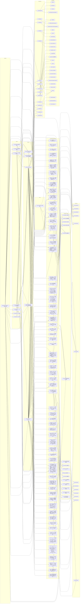

# JRN-002-SLOT マップ

```mermaid
flowchart LR
  %% JRN-002-SLOT
  subgraph JRN["Journeys"]
    N133["JRN-002-SLOT 当日スロット登録と開始"]
  end
  subgraph ACT["Actions"]
    N1["ACT-HOME-001 + で手技設定を開く"]
    N2["ACT-HOME-002 手技設定を保存"]
    N3["ACT-HOME-003 ••• > 確認"]
    N4["ACT-HOME-004 ••• > 編集"]
    N5["ACT-HOME-005 カード本体タップ"]
    N6["ACT-HOME-006 確認モードで手順表示"]
    N7["ACT-HOME-008 開始/再開を確定"]
  end
  subgraph SCR["Screens"]
    N134["SCR-001-HOME Home"]
    N135["SCR-002-HOME-SETUP スロット設定"]
    N136["SCR-003-HOME-START-CONFIRM 開始確認"]
    N137["SCR-004-HOME-VIEW-CONFIRM 閲覧専用確認"]
    N138["SCR-006-SESSION Session"]
  end
  subgraph FC["Forms"]
    N66["FC-SLOT-SETUP-001 手技設定"]
  end
  subgraph UI["UI Elements"]
    N139["UI-HOME-001"]
    N140["UI-HOME-002"]
    N141["UI-HOME-003"]
    N142["UI-HOME-003A"]
    N143["UI-HOME-004"]
    N144["UI-HOME-005"]
    N145["UI-HOME-006"]
    N146["UI-HOME-007"]
    N147["UI-HOME-008"]
    N148["UI-HOME-009"]
    N149["UI-SESSION-001"]
    N150["UI-SESSION-002"]
    N151["UI-SESSION-003"]
    N152["UI-SESSION-005"]
    N153["UI-SESSION-006"]
  end
  subgraph FR["Functional Requirements"]
    N67["- FR-001: 複数手技テンプレート一覧を表示します。"]
    N68["- FR-002: テンプレートごとに名称、版、有効開始日を表示します。"]
    N69["- FR-003: 選択した1手技でセッションを開始します。"]
    N70["- FR-004: 手技開始通知は本アプリ対象外とし、Mac/iPhoneの時計アプリ等の外部アラームで運用します。"]
    N71["- FR-004A: ホームに「手技開始通知は外部アラーム運用」の注記を表示します。"]
    N72["- FR-005: ホームには手技開始情報に加え、当日分のみCAPD記録ノート互換表を表示します（過去分は一覧画面で表示）。"]
    N73["- FR-005A: ホームAの先頭見出しは日付と曜日を表示し、手技スロットと当日ノート表は同一パネル内に配置します。"]
    N74["- FR-006: ホームから「記録一覧」画面へ遷移できる導線を提供します。"]
    N75["- FR-007: ホームAスパイクでは、1日あたり4件の手技スロットを横並びで表示します。"]
    N76["- FR-008: 手技スロットの初期状態は「+ のみ表示」とし、+ 押下で手技設定モーダル（CSV選択、推奨実施時間）を開きます。"]
    N77["- FR-009: 手技設定後は「カード本体タップ=開始」とし、開始前に「手技の開始」確認ダイアログを表示します。"]
    N78["- FR-009A: 右上 ••• メニューから「確認/編集」を開きます。確認モーダルは閲覧専用とし、ここからの「開始/再開」は手順表示のみ（確認モード）とします。確認モードでは記録保存、タイマー開始、通知ジョブ生成、アラーム設定、スロット/セッション状態更新、同期対象更新を行いません。"]
    N79["- FR-009B: 手技スロットの表示状態は 未登録(+) / 未実施 / 実施中 / 実施済み とします。実施済み のカード本体タップは無効化します。"]
    N80["- FR-009C: スロット登録時は、右隣スロットほど推奨実施時間が遅くなるように検証します（左から右へ厳密昇順、同時刻不可）。"]
    N81["- FR-009D: 右側スロットの開始時は、左側スロットがすべて 実施済み であることを必須条件にします（未登録/未実施が1件でもあれば開始不可）。"]
    N82["- FR-009E: 4スロット設定は dateLocal 単位でローカル永続化し、同期時に localRevision と cloudRevision を更新します。"]
    N83["- FR-009F: 実施済み スロットは編集/削除不可とします。同一端末で進行中セッションがある間は全スロット編集を禁止します。"]
    N84["- FR-009G: 実施中 スロットをタップした場合は新規開始せず、進行中セッションを再開します。"]
    N85["- FR-009H: 記録やタイマーを伴う実運用セッション開始/再開はカード本体タップ導線で実行し、••• > 確認 導線は閲覧専用（確認モード）とします。"]
    N86["- FR-016: 当日ノート表と記録一覧の交換列は #1〜#5 の5列固定とし、列位置は *_exchange_no で決定します。"]
    N87["- FR-017: 透析液濃度欄は、取り込みCSVのタイトル（例"]
    N88["- FR-018: record_event の値は record_exchange_no で列マッピングし、drain_weight_g は排液量、bag_weight_g は注液量、drain_appearance は排液の確認に表示します。"]
    N89["- FR-019: timer_event の値は timer_exchange_no で列マッピングし、timer_segment=dwell の start/end は貯留時間、timer_segment=drain の start/end は排液時間に表示します。"]
    N90["- FR-030: 現在ステップのフェーズと状態を常時表示し、タイトルは通し番号付き（例"]
    N91["- FR-031: 必須チェック未完了時に次ステップ遷移を禁止します。"]
    N92["- FR-032: record_event 未完了時に次ステップ遷移を禁止します。"]
    N93["- FR-033: next_step_id に従い完全シリアルで遷移します。"]
    N94["- FR-034: 最終ステップ完了時にセッション完了状態へ遷移します。"]
    N95["- FR-035: セッション開始端末のみ進行更新できます。"]
    N96["- FR-036: 同時実行セッションを端末ごとに1件へ制限します。"]
    N97["- FR-037: セッション画面の手順画像は1"]
    N98["- FR-038: セッション画面は iPhoneで1カラム、Macで2カラム表示に切り替えます。"]
    N99["- FR-039: セッション画面に「戻る」操作を提供し、直前ステップへ表示遷移できます。"]
    N100["- FR-039A: セッション画面の「戻る」と「次へ」は、iPhone/Macの双方で横並び・同幅で表示します。"]
    N101["- FR-039B: 「次へ」「戻る」押下時、および Enter キーによる次ステップ遷移時は、メインパネルを左右スライドで遷移表示します。"]
    N102["- FR-039C: セッション画面のカルーセルは、左右ナビゲーションボタンを表示しません。"]
    N103["- FR-039D: セッション画面右上 ••• メニューに セッションを中断（非常用） を配置します。"]
    N104["- FR-039E: セッションを中断（非常用） は確認ダイアログを経て実行し、中断後はホームへ戻します。"]
    N105["- FR-039F: 明示中断時はセッションを aborted で終了し、対応スロットの表示状態を 未実施 へ戻します。"]
    N106["- FR-039G: ホームのスロットには 前回中断あり の表示を出しません（履歴は記録一覧で確認）。"]
    N107["- FR-042: 廃液の記録写真（drain）は任意入力です。"]
    N108["- FR-050A: 通知対象は timer_event=end の終了イベントとし、timer_segment=dwell/drain を同一ルールで扱います。"]
    N109["- FR-050B: 同一セッション内の通知ジョブは alarm_id 単位で独立管理します。"]
    N110["- FR-050C: 通知ジョブは最低限 alarm_id / segment / due_at / acked_at / attempt_no / status を保持します。"]
    N111["- FR-050D: pendingAlarm は未ACKジョブ（pending/notified/missed）から due_at 最小を優先して1件選択し、同値時は alarm_id 昇順を採用します。"]
    N112["- FR-051: 終了時刻 T0 で Mac ローカル通知（音+バナー）を発火し、同時にアプリ内未確認アラートを固定表示します。"]
    N113["- FR-052: 未確認時は段階再通知を行います。"]
    N114["- FR-052A: 再通知間隔は T+2分（iPhone補助通知1回 + Mac再通知）、T+5分以降（3分間隔でMac+iPhone再通知）とします。"]
    N115["- FR-052B: 段階再通知の対象は「貯留終了（dwell）」「廃液終了（drain）」に限定します。"]
    N116["- FR-053: ACK時は Mac/iPhone の通知ジョブをすべて停止し、acked_at を記録します。"]
    N117["- FR-054: アプリ内アラートは ACK まで継続表示し、通知再送も ACK まで継続します。"]
    N118["- FR-055: 通知チャネルは Mac主チャネル固定 + iPhone補助 とします。"]
    N119["- FR-055A: iPhone未利用かつ離席想定時は「見逃し高リスク」警告を必須表示します。"]
    N120["- FR-055B: iPhone補助通知の利用可否は Push購読状態（登録/無効化）で管理します。"]
    N121["- FR-056: 「戻る」操作、過去ステップ再表示、アプリ再開、通信リトライでは、timer_event(start/end)・record_event・通知ジョブ生成を再発火しません。"]
    N122["- FR-057: 30秒テスト通知は手動実行とし、通知設定変更時・OS更新後・通知不調時に実施できること。"]
    N123["- FR-057A: 手動30秒テストに失敗した場合は、当日を「iPhone補助なし（Mac主導）」として扱います。"]
    N124["- FR-058: T+30分 未確認時は status=missed を永続化し、「見逃し状態」を表示します。"]
    N125["- FR-058A: status=missed になった後も、ACKまで3分間隔の再通知を継続します。"]
    N126["- FR-058B: status=missed は ACK 成功時に acknowledged へ遷移し、通知停止と acked_at 記録を行います。"]
    N127["- FR-071: セッション開始時は SessionProtocolSnapshot をローカル同一トランザクションで保存し、保存失敗時は開始自体を失敗させます。"]
    N128["- FR-072: スナップショットには sourceProtocol(meta)、step定義本文（通し番号/タイトル/文言/必須チェック/timer/alarm/record）、画像 assetKey、assetManifest、snapshotHash を含めます。"]
    N129["- FR-073: セッション表示/再開時は開始時スナップショットを常に優先し、現行テンプレート版へフォールバックしません。"]
    N130["- FR-074: スナップショット欠落またはハッシュ不整合は整合性エラーとして扱い、セッション表示を停止します。"]
    N131["- FR-086: 手動同期ボタンを提供し、失敗時は再試行導線を表示します。"]
    N132["- FR-088: 同期失敗時は直近同期状態（成功/失敗）を更新し、再試行導線を表示します。"]
  end
  subgraph AT["Acceptance Tests"]
    N8["AT-ALARM-001 T0通知"]
    N9["AT-ALARM-002 段階再通知"]
    N10["AT-ALARM-003 ACK停止"]
    N11["AT-ALARM-004 見逃し状態"]
    N12["AT-FLOW-001 必須チェック"]
    N13["AT-FLOW-002 記録ゲート"]
    N14["AT-FLOW-003 直列遷移"]
    N15["AT-FLOW-004 端末内同時実行制限"]
    N16["AT-FLOW-005 左優先実行"]
    N17["AT-FLOW-006 予期せぬ離脱再開"]
    N18["AT-FLOW-007 非常中断"]
    N19["AT-SYNC-005 手動同期消し込み"]
    N20["AT-SYNC-006 復帰時失敗導線"]
    N21["AT-UI-HOME-001 Home表示確認"]
    N22["AT-UI-HOME-002 Home初期状態"]
    N23["AT-UI-SESSION-001 Session表示確認"]
  end
  subgraph E2E["E2E Tests"]
    N53["E2E-ALARM-001"]
    N54["E2E-ALARM-002"]
    N55["E2E-ALARM-003"]
    N56["E2E-ALARM-004"]
    N57["E2E-FLOW-001"]
    N58["E2E-FLOW-002"]
    N59["E2E-FLOW-003"]
    N60["E2E-FLOW-004"]
    N61["E2E-FLOW-005"]
    N62["E2E-FLOW-006"]
    N63["E2E-FLOW-007"]
    N64["E2E-SYNC-002"]
    N65["E2E-SYNC-006"]
  end
  subgraph DATA["Data Paths"]
    N24["acked_at"]
    N25["activeSession"]
    N26["alarm_ack"]
    N27["AlarmDispatchJob.pendingAlarm"]
    N28["daily_plan"]
    N29["DailyProcedurePlan.dateLocal"]
    N30["DailyProcedurePlan.slots[*].displayStatus"]
    N31["platform"]
    N32["protocol"]
    N33["ProtocolPackage"]
    N34["recommendedAtLocal"]
    N35["record_exchange_no)"]
    N36["Record(record_event"]
    N37["Record(timer_event"]
    N38["record完了状態"]
    N39["requiredChecks達成状態"]
    N40["session"]
    N41["Session"]
    N42["session_progress"]
    N43["Session.currentStepId"]
    N44["Session.status=aborted"]
    N45["Session.status=active"]
    N46["SessionProtocolSnapshot.steps[*]"]
    N47["slot.status=pending"]
    N48["slots[*].protocolTitle"]
    N49["slots[n]"]
    N50["slots[n].displayStatus"]
    N51["steps[*].requiredChecks"]
    N52["timer_exchange_no)"]
  end
  N1 --> N83
  N1 --> N134
  N1 --> N135
  N2 --> N80
  N2 --> N82
  N2 --> N134
  N2 --> N135
  N2 --> N143
  N3 --> N78
  N3 --> N85
  N3 --> N134
  N3 --> N137
  N4 --> N83
  N4 --> N134
  N4 --> N135
  N5 --> N81
  N5 --> N84
  N5 --> N134
  N5 --> N136
  N5 --> N142
  N6 --> N78
  N6 --> N85
  N6 --> N137
  N6 --> N138
  N6 --> N145
  N7 --> N77
  N7 --> N84
  N7 --> N136
  N7 --> N138
  N7 --> N144
  N8 --> N53
  N9 --> N54
  N10 --> N55
  N11 --> N56
  N12 --> N61
  N13 --> N62
  N14 --> N63
  N15 --> N58
  N16 --> N57
  N17 --> N59
  N18 --> N60
  N19 --> N64
  N20 --> N65
  N66 --> N16
  N66 --> N76
  N66 --> N80
  N66 --> N82
  N73 --> N21
  N75 --> N15
  N75 --> N16
  N78 --> N21
  N79 --> N21
  N81 --> N16
  N81 --> N22
  N81 --> N57
  N83 --> N15
  N83 --> N58
  N84 --> N17
  N84 --> N18
  N84 --> N59
  N90 --> N12
  N90 --> N13
  N90 --> N14
  N90 --> N23
  N91 --> N12
  N91 --> N61
  N92 --> N13
  N92 --> N62
  N93 --> N14
  N93 --> N63
  N96 --> N15
  N96 --> N58
  N98 --> N23
  N103 --> N18
  N103 --> N60
  N104 --> N18
  N104 --> N60
  N105 --> N18
  N105 --> N60
  N108 --> N8
  N108 --> N9
  N108 --> N10
  N108 --> N11
  N108 --> N53
  N112 --> N8
  N112 --> N53
  N114 --> N9
  N114 --> N54
  N115 --> N9
  N115 --> N54
  N116 --> N10
  N116 --> N55
  N117 --> N10
  N117 --> N55
  N124 --> N11
  N124 --> N56
  N125 --> N11
  N125 --> N56
  N126 --> N11
  N126 --> N56
  N131 --> N19
  N131 --> N64
  N132 --> N20
  N132 --> N65
  N133 --> N1
  N133 --> N2
  N133 --> N3
  N133 --> N4
  N133 --> N5
  N133 --> N6
  N133 --> N7
  N133 --> N15
  N133 --> N16
  N133 --> N57
  N133 --> N58
  N133 --> N75
  N133 --> N76
  N133 --> N77
  N133 --> N78
  N133 --> N85
  N133 --> N96
  N133 --> N134
  N133 --> N135
  N133 --> N136
  N133 --> N137
  N134 --> N67
  N134 --> N68
  N134 --> N69
  N134 --> N70
  N134 --> N71
  N134 --> N72
  N134 --> N73
  N134 --> N74
  N134 --> N75
  N134 --> N76
  N134 --> N78
  N134 --> N79
  N134 --> N80
  N134 --> N81
  N134 --> N82
  N134 --> N83
  N134 --> N84
  N134 --> N85
  N134 --> N86
  N134 --> N87
  N134 --> N88
  N134 --> N89
  N134 --> N107
  N134 --> N131
  N134 --> N132
  N134 --> N139
  N134 --> N140
  N134 --> N141
  N134 --> N142
  N134 --> N146
  N134 --> N147
  N134 --> N148
  N135 --> N66
  N135 --> N143
  N136 --> N77
  N136 --> N144
  N137 --> N121
  N137 --> N145
  N138 --> N90
  N138 --> N91
  N138 --> N92
  N138 --> N93
  N138 --> N94
  N138 --> N95
  N138 --> N96
  N138 --> N97
  N138 --> N98
  N138 --> N99
  N138 --> N100
  N138 --> N101
  N138 --> N102
  N138 --> N103
  N138 --> N104
  N138 --> N105
  N138 --> N106
  N138 --> N108
  N138 --> N109
  N138 --> N110
  N138 --> N111
  N138 --> N112
  N138 --> N113
  N138 --> N114
  N138 --> N115
  N138 --> N116
  N138 --> N117
  N138 --> N118
  N138 --> N119
  N138 --> N120
  N138 --> N122
  N138 --> N123
  N138 --> N124
  N138 --> N125
  N138 --> N126
  N138 --> N127
  N138 --> N128
  N138 --> N129
  N138 --> N130
  N138 --> N149
  N138 --> N150
  N138 --> N151
  N138 --> N152
  N138 --> N153
  N139 --> N29
  N140 --> N30
  N141 --> N34
  N141 --> N48
  N142 --> N50
  N143 --> N28
  N143 --> N49
  N144 --> N25
  N144 --> N40
  N144 --> N41
  N144 --> N49
  N145 --> N49
  N146 --> N31
  N146 --> N32
  N146 --> N33
  N147 --> N37
  N147 --> N52
  N148 --> N35
  N148 --> N36
  N149 --> N46
  N150 --> N51
  N151 --> N38
  N151 --> N39
  N151 --> N42
  N151 --> N43
  N152 --> N28
  N152 --> N40
  N152 --> N44
  N152 --> N45
  N152 --> N47
  N153 --> N24
  N153 --> N26
  N153 --> N27
```

