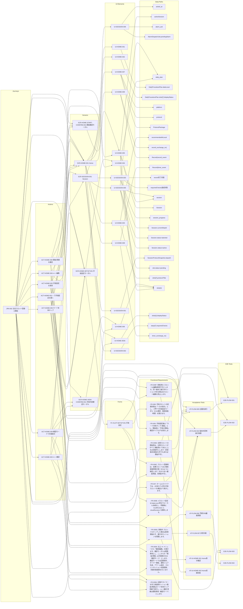

# JRN-002 マップ

```mermaid
flowchart LR
  %% JRN-002
  subgraph JRN["Journeys"]
    N58["JRN-002 当日スロット登録と開始"]
  end
  subgraph ACT["Actions"]
    N1["ACT-HOME-001 + で手技設定を開く"]
    N2["ACT-HOME-002 手技設定を保存"]
    N3["ACT-HOME-003 ••• > 確認"]
    N4["ACT-HOME-004 ••• > 編集"]
    N5["ACT-HOME-005 カード本体タップ"]
    N6["ACT-HOME-006 確認モードで手順表示"]
    N7["ACT-HOME-008 開始/再開を確定"]
  end
  subgraph SCR["Screens"]
    N59["SCR-HOME-001 Home"]
    N60["SCR-HOME-SETUP-001 手技設定モーダル"]
    N61["SCR-HOME-START-CONFIRM-001 開始確認モーダル"]
    N62["SCR-HOME-VIEW-CONFIRM-001 手技内容確認モーダル"]
    N63["SCR-SESSION-001 Session"]
  end
  subgraph FC["Forms"]
    N47["FC-SLOT-SETUP-001 手技設定"]
  end
  subgraph UI["UI Elements"]
    N64["UI-HOME-001"]
    N65["UI-HOME-002"]
    N66["UI-HOME-003"]
    N67["UI-HOME-003A"]
    N68["UI-HOME-004"]
    N69["UI-HOME-005"]
    N70["UI-HOME-006"]
    N71["UI-HOME-007"]
    N72["UI-HOME-008"]
    N73["UI-HOME-009"]
    N74["UI-SESSION-001"]
    N75["UI-SESSION-002"]
    N76["UI-SESSION-003"]
    N77["UI-SESSION-005"]
    N78["UI-SESSION-006"]
  end
  subgraph FR["Functional Requirements"]
    N48["- FR-007: ホームAスパイクでは、1日あたり4件の手技スロットを横並びで表示します。"]
    N49["- FR-008: 手技スロットの初期状態は「+ のみ表示」とし、+ 押下で手技設定モーダル（CSV選択、推奨実施時間）を開きます。"]
    N50["- FR-009: 手技設定後は「カード本体タップ=開始」とし、開始前に「手技の開始」確認ダイアログを表示します。"]
    N51["- FR-009A: 右上 ••• メニューから「確認/編集」を開きます。確認モーダルは閲覧専用とし、ここからの「開始/再開」は手順表示のみ（確認モード）とします。確認モードでは記録保存、タイマー開始、通知ジョブ生成、アラーム設定、スロット/セッション状態更新、同期対象更新を行いません。"]
    N52["- FR-009C: スロット登録時は、右隣スロットほど推奨実施時間が遅くなるように検証します（左から右へ厳密昇順、同時刻不可）。"]
    N53["- FR-009D: 右側スロットの開始時は、左側スロットがすべて 実施済み であることを必須条件にします（未登録/未実施が1件でもあれば開始不可）。"]
    N54["- FR-009E: 4スロット設定は dateLocal 単位でローカル永続化し、同期時に localRevision と cloudRevision を更新します。"]
    N55["- FR-009F: 実施済み スロットは編集/削除不可とします。同一端末で進行中セッションがある間は全スロット編集を禁止します。"]
    N56["- FR-009G: 実施中 スロットをタップした場合は新規開始せず、進行中セッションを再開します。"]
    N57["- FR-009H: 記録やタイマーを伴う実運用セッション開始/再開はカード本体タップ導線で実行し、••• > 確認 導線は閲覧専用（確認モード）とします。"]
  end
  subgraph AT["Acceptance Tests"]
    N8["AT-FLOW-004 端末内同時実行制限"]
    N9["AT-FLOW-005 左優先実行"]
    N10["AT-FLOW-006 予期せぬ離脱再開"]
    N11["AT-FLOW-007 非常中断"]
    N12["AT-UI-HOME-001 Home表示確認"]
    N13["AT-UI-HOME-002 Home初期状態"]
  end
  subgraph E2E["E2E Tests"]
    N43["E2E-FLOW-001"]
    N44["E2E-FLOW-002"]
    N45["E2E-FLOW-003"]
    N46["E2E-FLOW-004"]
  end
  subgraph DATA["Data Paths"]
    N14["acked_at"]
    N15["activeSession"]
    N16["alarm_ack"]
    N17["AlarmDispatchJob.pendingAlarm"]
    N18["daily_plan"]
    N19["DailyProcedurePlan.dateLocal"]
    N20["DailyProcedurePlan.slots[*].displayStatus"]
    N21["platform"]
    N22["protocol"]
    N23["ProtocolPackage"]
    N24["recommendedAtLocal"]
    N25["record_exchange_no)"]
    N26["Record(record_event"]
    N27["Record(timer_event"]
    N28["record完了状態"]
    N29["requiredChecks達成状態"]
    N30["session"]
    N31["Session"]
    N32["session_progress"]
    N33["Session.currentStepId"]
    N34["Session.status=aborted"]
    N35["Session.status=active"]
    N36["SessionProtocolSnapshot.steps[*]"]
    N37["slot.status=pending"]
    N38["slots[*].protocolTitle"]
    N39["slots[n]"]
    N40["slots[n].displayStatus"]
    N41["steps[*].requiredChecks"]
    N42["timer_exchange_no)"]
  end
  N1 --> N55
  N1 --> N59
  N1 --> N60
  N2 --> N52
  N2 --> N54
  N2 --> N59
  N2 --> N60
  N2 --> N68
  N3 --> N51
  N3 --> N57
  N3 --> N59
  N3 --> N62
  N4 --> N55
  N4 --> N59
  N4 --> N60
  N5 --> N53
  N5 --> N56
  N5 --> N59
  N5 --> N61
  N5 --> N67
  N6 --> N51
  N6 --> N57
  N6 --> N62
  N6 --> N63
  N6 --> N70
  N7 --> N50
  N7 --> N56
  N7 --> N61
  N7 --> N63
  N7 --> N69
  N8 --> N44
  N9 --> N43
  N10 --> N45
  N11 --> N46
  N47 --> N9
  N47 --> N49
  N47 --> N52
  N47 --> N54
  N48 --> N8
  N48 --> N9
  N51 --> N12
  N53 --> N9
  N53 --> N13
  N53 --> N43
  N55 --> N8
  N55 --> N44
  N56 --> N10
  N56 --> N11
  N56 --> N45
  N58 --> N1
  N58 --> N2
  N58 --> N3
  N58 --> N4
  N58 --> N5
  N58 --> N6
  N58 --> N7
  N58 --> N8
  N58 --> N9
  N58 --> N48
  N58 --> N57
  N58 --> N59
  N58 --> N60
  N58 --> N61
  N58 --> N62
  N59 --> N64
  N59 --> N65
  N59 --> N66
  N59 --> N67
  N59 --> N71
  N59 --> N72
  N59 --> N73
  N60 --> N47
  N60 --> N68
  N61 --> N69
  N62 --> N70
  N63 --> N74
  N63 --> N75
  N63 --> N76
  N63 --> N77
  N63 --> N78
  N64 --> N19
  N65 --> N20
  N66 --> N24
  N66 --> N38
  N67 --> N40
  N68 --> N18
  N68 --> N39
  N69 --> N15
  N69 --> N30
  N69 --> N31
  N69 --> N39
  N70 --> N39
  N71 --> N21
  N71 --> N22
  N71 --> N23
  N72 --> N27
  N72 --> N42
  N73 --> N25
  N73 --> N26
  N74 --> N36
  N75 --> N41
  N76 --> N28
  N76 --> N29
  N76 --> N32
  N76 --> N33
  N77 --> N18
  N77 --> N30
  N77 --> N34
  N77 --> N35
  N77 --> N37
  N78 --> N14
  N78 --> N16
  N78 --> N17
```

