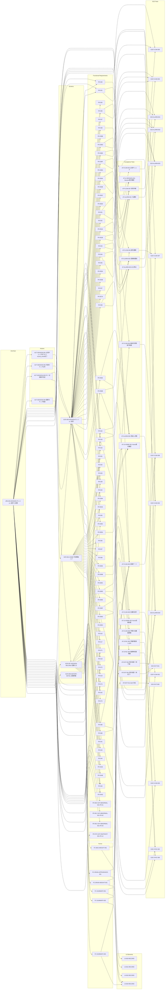

# JRN-003-SESSION マップ

```mermaid
flowchart LR
  %% JRN-003-SESSION
  subgraph JRN["Journeys"]
    N120["JRN-003-SESSION セッション進行と記録"]
  end
  subgraph ACT["Actions"]
    N1["ACT-SESSION-001 必須チェック完了かつrecord_event完了"]
    N2["ACT-SESSION-002 先頭ステップ以外"]
    N3["ACT-SESSION-003 FC-* 必須条件充足"]
    N4["ACT-SESSION-004 最終ステップ到達"]
  end
  subgraph SCR["Screens"]
    N121["SCR-001-HOME 手技開始ハブ"]
    N122["SCR-006-SESSION セッション進行"]
    N123["SCR-007-SESSION-RECORD 記録入力"]
    N124["SCR-009-HISTORY-DETAIL 記録詳細"]
  end
  subgraph FC["Forms"]
    N39["FC-BAG-WEIGHT-001"]
    N40["FC-DRAIN-APPEARANCE-001"]
    N41["FC-DRAIN-WEIGHT-001"]
    N42["FC-SUMMARY-001"]
    N43["FC-SUMMARY-002"]
    N44["FC-SUMMARY-003"]
  end
  subgraph UI["UI Elements"]
    N125["UI-001-RECORD"]
    N126["UI-002-RECORD"]
    N127["UI-003-RECORD"]
    N128["UI-004-RECORD"]
  end
  subgraph FR["Functional Requirements"]
    N45["FR-001"]
    N46["FR-002"]
    N47["FR-003"]
    N48["FR-004"]
    N49["FR-004A"]
    N50["FR-005"]
    N51["FR-005A"]
    N52["FR-006"]
    N53["FR-007"]
    N54["FR-008"]
    N55["FR-009A"]
    N56["FR-009B"]
    N57["FR-009C"]
    N58["FR-009D"]
    N59["FR-009E"]
    N60["FR-009F"]
    N61["FR-009G"]
    N62["FR-009H"]
    N63["FR-016"]
    N64["FR-017"]
    N65["FR-018"]
    N66["FR-019"]
    N67["FR-030"]
    N68["FR-031"]
    N69["FR-032"]
    N70["FR-033"]
    N71["FR-034"]
    N72["FR-035"]
    N73["FR-036"]
    N74["FR-037"]
    N75["FR-038"]
    N76["FR-039"]
    N77["FR-039A"]
    N78["FR-039B"]
    N79["FR-039C"]
    N80["FR-039D"]
    N81["FR-039E"]
    N82["FR-039F"]
    N83["FR-039G"]
    N84["FR-040"]
    N85["FR-041"]
    N86["FR-042"]
    N87["FR-043"]
    N88["FR-044"]
    N89["FR-044A"]
    N90["FR-044B"]
    N91["FR-044D"]
    N92["FR-050A"]
    N93["FR-050B"]
    N94["FR-050C"]
    N95["FR-050D"]
    N96["FR-051"]
    N97["FR-052"]
    N98["FR-052A"]
    N99["FR-052B"]
    N100["FR-053"]
    N101["FR-054"]
    N102["FR-055"]
    N103["FR-055A"]
    N104["FR-055B"]
    N105["FR-057"]
    N106["FR-057A"]
    N107["FR-058"]
    N108["FR-058A"]
    N109["FR-058B"]
    N110["FR-060 CAP-ABNORMAL-001-FR-01"]
    N111["FR-061 CAP-ABNORMAL-001-FR-02"]
    N112["FR-062 CAP-ABNORMAL-001-FR-03"]
    N113["FR-071"]
    N114["FR-072"]
    N115["FR-073"]
    N116["FR-074"]
    N117["FR-075 CAP-SNAPSHOT-001-FR-12"]
    N118["FR-086"]
    N119["FR-088"]
  end
  subgraph AT["Acceptance Tests"]
    N5["AT-ALARM-001 T0通知"]
    N6["AT-ALARM-002 段階再通知"]
    N7["AT-ALARM-003 ACK停止"]
    N8["AT-ALARM-004 見逃し状態"]
    N9["AT-EXIT-001 表示前提（未完了）"]
    N10["AT-EXIT-002 表示前提（完了後）"]
    N11["AT-EXIT-011 both 対応"]
    N12["AT-FLOW-001 必須チェック"]
    N13["AT-FLOW-002 記録ゲート"]
    N14["AT-FLOW-003 直列遷移"]
    N15["AT-FLOW-004 端末内同時実行制限"]
    N16["AT-FLOW-005 左優先実行"]
    N17["AT-FLOW-006 予期せぬ離脱再開"]
    N18["AT-FLOW-007 非常中断"]
    N19["AT-SYNC-005 手動同期消し込み"]
    N20["AT-SYNC-006 復帰時失敗導線"]
    N21["AT-UI-HOME-001 Home表示確認"]
    N22["AT-UI-HOME-002 Home初期状態"]
    N23["AT-UI-SESSION-001 Session表示確認"]
  end
  subgraph E2E["E2E Tests"]
    N24["E2E-ALARM-001"]
    N25["E2E-ALARM-002"]
    N26["E2E-ALARM-003"]
    N27["E2E-ALARM-004"]
    N28["E2E-EXIT-001"]
    N29["E2E-EXIT-006"]
    N30["E2E-FLOW-001"]
    N31["E2E-FLOW-002"]
    N32["E2E-FLOW-003"]
    N33["E2E-FLOW-004"]
    N34["E2E-FLOW-005"]
    N35["E2E-FLOW-006"]
    N36["E2E-FLOW-007"]
    N37["E2E-SYNC-002"]
    N38["E2E-SYNC-006"]
  end
  N1 --> N122
  N2 --> N122
  N3 --> N122
  N3 --> N123
  N4 --> N121
  N5 --> N24
  N6 --> N25
  N7 --> N26
  N8 --> N27
  N9 --> N28
  N10 --> N28
  N11 --> N29
  N12 --> N34
  N13 --> N35
  N14 --> N36
  N15 --> N31
  N16 --> N30
  N17 --> N32
  N18 --> N33
  N19 --> N37
  N20 --> N38
  N39 --> N13
  N39 --> N127
  N40 --> N13
  N40 --> N125
  N41 --> N13
  N41 --> N126
  N42 --> N10
  N42 --> N128
  N43 --> N9
  N43 --> N128
  N44 --> N11
  N44 --> N128
  N51 --> N21
  N55 --> N21
  N56 --> N21
  N58 --> N16
  N58 --> N22
  N58 --> N30
  N60 --> N15
  N60 --> N31
  N61 --> N17
  N61 --> N32
  N67 --> N23
  N68 --> N12
  N68 --> N34
  N69 --> N13
  N69 --> N35
  N70 --> N14
  N70 --> N36
  N73 --> N15
  N73 --> N31
  N75 --> N23
  N80 --> N18
  N80 --> N33
  N81 --> N18
  N81 --> N33
  N82 --> N18
  N82 --> N33
  N92 --> N5
  N92 --> N24
  N96 --> N5
  N96 --> N24
  N98 --> N6
  N98 --> N25
  N99 --> N6
  N99 --> N25
  N100 --> N7
  N100 --> N26
  N101 --> N7
  N101 --> N26
  N107 --> N8
  N107 --> N27
  N108 --> N8
  N108 --> N27
  N109 --> N8
  N109 --> N27
  N118 --> N19
  N118 --> N37
  N119 --> N20
  N119 --> N38
  N120 --> N1
  N120 --> N2
  N120 --> N3
  N120 --> N4
  N120 --> N12
  N120 --> N13
  N120 --> N14
  N120 --> N34
  N120 --> N35
  N120 --> N36
  N120 --> N67
  N120 --> N68
  N120 --> N69
  N120 --> N70
  N120 --> N71
  N120 --> N76
  N120 --> N77
  N120 --> N79
  N120 --> N84
  N120 --> N91
  N120 --> N110
  N120 --> N111
  N120 --> N112
  N120 --> N113
  N120 --> N114
  N120 --> N115
  N120 --> N116
  N120 --> N117
  N120 --> N122
  N120 --> N123
  N120 --> N124
  N121 --> N45
  N121 --> N46
  N121 --> N47
  N121 --> N48
  N121 --> N49
  N121 --> N50
  N121 --> N51
  N121 --> N52
  N121 --> N53
  N121 --> N54
  N121 --> N55
  N121 --> N56
  N121 --> N57
  N121 --> N58
  N121 --> N59
  N121 --> N60
  N121 --> N61
  N121 --> N62
  N121 --> N63
  N121 --> N64
  N121 --> N65
  N121 --> N66
  N121 --> N86
  N121 --> N118
  N121 --> N119
  N122 --> N67
  N122 --> N68
  N122 --> N69
  N122 --> N70
  N122 --> N71
  N122 --> N72
  N122 --> N73
  N122 --> N74
  N122 --> N75
  N122 --> N76
  N122 --> N77
  N122 --> N78
  N122 --> N79
  N122 --> N80
  N122 --> N81
  N122 --> N82
  N122 --> N83
  N122 --> N92
  N122 --> N93
  N122 --> N94
  N122 --> N95
  N122 --> N96
  N122 --> N97
  N122 --> N98
  N122 --> N99
  N122 --> N100
  N122 --> N101
  N122 --> N102
  N122 --> N103
  N122 --> N104
  N122 --> N105
  N122 --> N106
  N122 --> N107
  N122 --> N108
  N122 --> N109
  N122 --> N113
  N122 --> N114
  N122 --> N115
  N122 --> N116
  N123 --> N39
  N123 --> N40
  N123 --> N41
  N123 --> N42
  N123 --> N43
  N123 --> N44
  N123 --> N84
  N123 --> N85
  N123 --> N87
  N123 --> N88
  N123 --> N89
  N123 --> N90
  N123 --> N91
```

