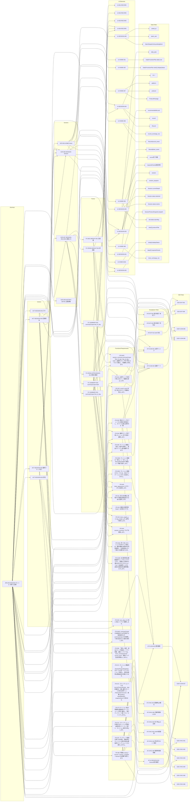

# JRN-003-SESSION マップ

```mermaid
flowchart LR
  %% JRN-003-SESSION
  subgraph JRN["Journeys"]
    N88["JRN-003-SESSION セッション進行と記録"]
  end
  subgraph ACT["Actions"]
    N1["ACT-SESSION-001 次へ"]
    N2["ACT-SESSION-002 戻る"]
    N3["ACT-SESSION-003 記録保存"]
    N4["ACT-SESSION-004 最終ステップ完了"]
  end
  subgraph SCR["Screens"]
    N89["SCR-001-HOME Home"]
    N90["SCR-006-SESSION Session"]
    N91["SCR-007-SESSION-RECORD 記録入力"]
    N92["SCR-009-HISTORY-DETAIL 記録詳細"]
  end
  subgraph FC["Forms"]
    N58["FC-BAG-WEIGHT-001 注液量"]
    N59["FC-DRAIN-APPEARANCE-001 排液の確認"]
    N60["FC-DRAIN-WEIGHT-001 排液量"]
    N61["FC-SUMMARY-001 summaryScope=first_of_day"]
    N62["FC-SUMMARY-002 summaryScope=last_of_day"]
    N63["FC-SUMMARY-003 summaryScope=both"]
  end
  subgraph UI["UI Elements"]
    N93["UI-001-RECORD"]
    N94["UI-002-RECORD"]
    N95["UI-003-RECORD"]
    N96["UI-004-RECORD"]
    N97["UI-HOME-001"]
    N98["UI-HOME-002"]
    N99["UI-HOME-003"]
    N100["UI-HOME-003A"]
    N101["UI-HOME-007"]
    N102["UI-HOME-008"]
    N103["UI-HOME-009"]
    N104["UI-SESSION-001"]
    N105["UI-SESSION-002"]
    N106["UI-SESSION-003"]
    N107["UI-SESSION-004"]
    N108["UI-SESSION-005"]
    N109["UI-SESSION-006"]
  end
  subgraph FR["Functional Requirements"]
    N64["- FR-030: 現在ステップのフェーズと状態を常時表示し、タイトルは通し番号付き（例"]
    N65["- FR-031: 必須チェック未完了時に次ステップ遷移を禁止します。"]
    N66["- FR-032: record_event 未完了時に次ステップ遷移を禁止します。"]
    N67["- FR-033: next_step_id に従い完全シリアルで遷移します。"]
    N68["- FR-034: 最終ステップ完了時にセッション完了状態へ遷移します。"]
    N69["- FR-039: セッション画面に「戻る」操作を提供し、直前ステップへ表示遷移できます。"]
    N70["- FR-039A: セッション画面の「戻る」と「次へ」は、iPhone/Macの双方で横並び・同幅で表示します。"]
    N71["- FR-039C: セッション画面のカルーセルは、左右ナビゲーションボタンを表示しません。"]
    N72["- FR-040: drain_appearance 入力モーダルを提供します。"]
    N73["- FR-041: 見た目分類は 透明/やや混濁/混濁/血性/その他 を提供します。"]
    N74["- FR-042: 廃液の記録写真（drain）は任意入力です。"]
    N75["- FR-043: drain_weight_g と bag_weight_g を g単位で保存します。"]
    N76["- FR-044: session_summary で以下を収集します。"]
    N77["- FR-044A: 同一日に1セッションのみ完了した場合は、最初/最後の両条件を同時適用し、必須項目をすべて満たす必要があります。"]
    N78["- FR-044B: 出口部状態は複数選択チェックボックスで入力し、語彙は 正常/赤み/痛み/はれ/かさぶた/じゅくじゅく/出血/膿 とします。追加の自由記述は備考欄に入力します。"]
    N79["- FR-044C: session_summary.summaryScope（first_of_day / last_of_day / both）は最終ステップ完了時にローカルで算出し、同期時に共有します。"]
    N80["- FR-044D: summaryScope が未指定または不正値でも保存拒否せず、summaryScope のみ破棄して他の妥当な入力値を保存します。"]
    N81["- FR-056: 「戻る」操作、過去ステップ再表示、アプリ再開、通信リトライでは、timer_event(start/end)・record_event・通知ジョブ生成を再発火しません。"]
    N82["- FR-071: セッション開始時は SessionProtocolSnapshot をローカル同一トランザクションで保存し、保存失敗時は開始自体を失敗させます。"]
    N83["- FR-072: スナップショットには sourceProtocol(meta)、step定義本文（通し番号/タイトル/文言/必須チェック/timer/alarm/record）、画像 assetKey、assetManifest、snapshotHash を含めます。"]
    N84["- FR-073: セッション表示/再開時は開始時スナップショットを常に優先し、現行テンプレート版へフォールバックしません。"]
    N85["- FR-074: スナップショット欠落またはハッシュ不整合は整合性エラーとして扱い、セッション表示を停止します。"]
    N86["- FR-075: テンプレート新版の取り込み後も、開始済みセッションの表示内容は開始時スナップショットから変化しません。"]
    N87["- FR-080: 同期は startup / resume / session_complete / manual の4契機で実行します。"]
  end
  subgraph AT["Acceptance Tests"]
    N5["AT-EXIT-001 表示前提（未完了）"]
    N6["AT-EXIT-002 表示前提（完了後）"]
    N7["AT-EXIT-011 both 対応"]
    N8["AT-FLOW-001 必須チェック"]
    N9["AT-FLOW-002 記録ゲート"]
    N10["AT-FLOW-003 直列遷移"]
    N11["AT-SYNC-001 起動時pull復元"]
    N12["AT-SYNC-002 完了時push反映"]
    N13["AT-SYNC-003 LWW内部適用"]
    N14["AT-SYNC-004 同日同スロット競合"]
    N15["AT-SYNC-005 手動同期消し込み"]
    N16["AT-SYNC-006 復帰時失敗導線"]
    N17["AT-UI-SESSION-001 Session表示確認"]
  end
  subgraph E2E["E2E Tests"]
    N47["E2E-EXIT-001"]
    N48["E2E-EXIT-006"]
    N49["E2E-FLOW-005"]
    N50["E2E-FLOW-006"]
    N51["E2E-FLOW-007"]
    N52["E2E-SYNC-001"]
    N53["E2E-SYNC-002"]
    N54["E2E-SYNC-003"]
    N55["E2E-SYNC-004"]
    N56["E2E-SYNC-005"]
    N57["E2E-SYNC-006"]
  end
  subgraph DATA["Data Paths"]
    N18["acked_at"]
    N19["alarm_ack"]
    N20["AlarmDispatchJob.pendingAlarm"]
    N21["daily_plan"]
    N22["DailyProcedurePlan.dateLocal"]
    N23["DailyProcedurePlan.slots[*].displayStatus"]
    N24["FC-*"]
    N25["platform"]
    N26["protocol"]
    N27["ProtocolPackage"]
    N28["recommendedAtLocal"]
    N29["record"]
    N30["Record"]
    N31["record_exchange_no)"]
    N32["Record(record_event"]
    N33["Record(timer_event"]
    N34["record完了状態"]
    N35["requiredChecks達成状態"]
    N36["session"]
    N37["session_progress"]
    N38["Session.currentStepId"]
    N39["Session.status=aborted"]
    N40["Session.status=active"]
    N41["SessionProtocolSnapshot.steps[*]"]
    N42["slot.status=pending"]
    N43["slots[*].protocolTitle"]
    N44["slots[n].displayStatus"]
    N45["steps[*].requiredChecks"]
    N46["timer_exchange_no)"]
  end
  N1 --> N65
  N1 --> N66
  N1 --> N67
  N1 --> N90
  N1 --> N105
  N1 --> N106
  N2 --> N69
  N2 --> N81
  N2 --> N90
  N3 --> N72
  N3 --> N80
  N3 --> N90
  N3 --> N91
  N3 --> N107
  N4 --> N68
  N4 --> N87
  N4 --> N89
  N4 --> N90
  N5 --> N47
  N6 --> N47
  N7 --> N48
  N8 --> N49
  N9 --> N50
  N10 --> N51
  N11 --> N52
  N12 --> N54
  N13 --> N55
  N14 --> N56
  N15 --> N53
  N16 --> N57
  N58 --> N9
  N58 --> N75
  N58 --> N95
  N59 --> N9
  N59 --> N72
  N59 --> N73
  N59 --> N74
  N59 --> N93
  N60 --> N9
  N60 --> N75
  N60 --> N94
  N61 --> N6
  N61 --> N76
  N61 --> N78
  N61 --> N79
  N61 --> N96
  N62 --> N5
  N62 --> N76
  N62 --> N79
  N62 --> N96
  N63 --> N7
  N63 --> N77
  N63 --> N79
  N63 --> N96
  N64 --> N8
  N64 --> N9
  N64 --> N10
  N64 --> N17
  N65 --> N8
  N65 --> N49
  N66 --> N9
  N66 --> N50
  N67 --> N10
  N67 --> N51
  N79 --> N7
  N79 --> N48
  N87 --> N11
  N87 --> N12
  N87 --> N13
  N87 --> N14
  N87 --> N15
  N87 --> N16
  N87 --> N52
  N87 --> N54
  N88 --> N1
  N88 --> N2
  N88 --> N3
  N88 --> N4
  N88 --> N8
  N88 --> N9
  N88 --> N10
  N88 --> N49
  N88 --> N50
  N88 --> N51
  N88 --> N64
  N88 --> N65
  N88 --> N66
  N88 --> N67
  N88 --> N68
  N88 --> N69
  N88 --> N70
  N88 --> N71
  N88 --> N72
  N88 --> N80
  N88 --> N82
  N88 --> N83
  N88 --> N84
  N88 --> N85
  N88 --> N86
  N88 --> N90
  N88 --> N91
  N88 --> N92
  N89 --> N97
  N89 --> N98
  N89 --> N99
  N89 --> N100
  N89 --> N101
  N89 --> N102
  N89 --> N103
  N90 --> N104
  N90 --> N105
  N90 --> N106
  N90 --> N108
  N90 --> N109
  N91 --> N58
  N91 --> N59
  N91 --> N60
  N91 --> N61
  N91 --> N62
  N91 --> N63
  N91 --> N107
  N97 --> N22
  N98 --> N23
  N99 --> N28
  N99 --> N43
  N100 --> N44
  N101 --> N25
  N101 --> N26
  N101 --> N27
  N102 --> N33
  N102 --> N46
  N103 --> N31
  N103 --> N32
  N104 --> N41
  N105 --> N45
  N106 --> N34
  N106 --> N35
  N106 --> N37
  N106 --> N38
  N107 --> N24
  N107 --> N29
  N107 --> N30
  N108 --> N21
  N108 --> N36
  N108 --> N39
  N108 --> N40
  N108 --> N42
  N109 --> N18
  N109 --> N19
  N109 --> N20
```

