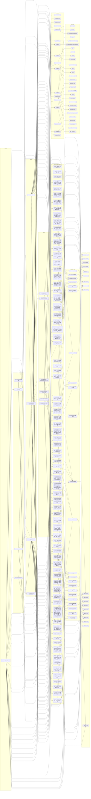

# JRN-003-SESSION マップ

```mermaid
flowchart LR
  %% JRN-003-SESSION
  subgraph JRN["Journeys"]
    N160["JRN-003-SESSION セッション進行と記録"]
  end
  subgraph ACT["Actions"]
    N1["ACT-SESSION-001 次へ"]
    N2["ACT-SESSION-002 戻る"]
    N3["ACT-SESSION-003 記録保存"]
    N4["ACT-SESSION-004 最終ステップ完了"]
  end
  subgraph SCR["Screens"]
    N161["SCR-001-HOME Home"]
    N162["SCR-006-SESSION Session"]
    N163["SCR-007-SESSION-RECORD 記録入力"]
    N164["SCR-009-HISTORY-DETAIL 記録詳細"]
  end
  subgraph FC["Forms"]
    N76["FC-BAG-WEIGHT-001 注液量"]
    N77["FC-DRAIN-APPEARANCE-001 排液の確認"]
    N78["FC-DRAIN-WEIGHT-001 排液量"]
    N79["FC-SUMMARY-001 summaryScope=first_of_day"]
    N80["FC-SUMMARY-002 summaryScope=last_of_day"]
    N81["FC-SUMMARY-003 summaryScope=both"]
  end
  subgraph UI["UI Elements"]
    N165["UI-001-RECORD"]
    N166["UI-002-RECORD"]
    N167["UI-003-RECORD"]
    N168["UI-004-RECORD"]
    N169["UI-HOME-001"]
    N170["UI-HOME-002"]
    N171["UI-HOME-003"]
    N172["UI-HOME-003A"]
    N173["UI-HOME-007"]
    N174["UI-HOME-008"]
    N175["UI-HOME-009"]
    N176["UI-SESSION-001"]
    N177["UI-SESSION-002"]
    N178["UI-SESSION-003"]
    N179["UI-SESSION-004"]
    N180["UI-SESSION-005"]
    N181["UI-SESSION-006"]
  end
  subgraph FR["Functional Requirements"]
    N82["- FR-001: 複数手技テンプレート一覧を表示します。"]
    N83["- FR-002: テンプレートごとに名称、版、有効開始日を表示します。"]
    N84["- FR-003: 選択した1手技でセッションを開始します。"]
    N85["- FR-004: 手技開始通知は本アプリ対象外とし、Mac/iPhoneの時計アプリ等の外部アラームで運用します。"]
    N86["- FR-004A: ホームに「手技開始通知は外部アラーム運用」の注記を表示します。"]
    N87["- FR-005: ホームには手技開始情報に加え、当日分のみCAPD記録ノート互換表を表示します（過去分は一覧画面で表示）。"]
    N88["- FR-005A: ホームAの先頭見出しは日付と曜日を表示し、手技スロットと当日ノート表は同一パネル内に配置します。"]
    N89["- FR-006: ホームから「記録一覧」画面へ遷移できる導線を提供します。"]
    N90["- FR-007: ホームAスパイクでは、1日あたり4件の手技スロットを横並びで表示します。"]
    N91["- FR-008: 手技スロットの初期状態は「+ のみ表示」とし、+ 押下で手技設定モーダル（CSV選択、推奨実施時間）を開きます。"]
    N92["- FR-009A: 右上 ••• メニューから「確認/編集」を開きます。確認モーダルは閲覧専用とし、ここからの「開始/再開」は手順表示のみ（確認モード）とします。確認モードでは記録保存、タイマー開始、通知ジョブ生成、アラーム設定、スロット/セッション状態更新、同期対象更新を行いません。"]
    N93["- FR-009B: 手技スロットの表示状態は 未登録(+) / 未実施 / 実施中 / 実施済み とします。実施済み のカード本体タップは無効化します。"]
    N94["- FR-009C: スロット登録時は、右隣スロットほど推奨実施時間が遅くなるように検証します（左から右へ厳密昇順、同時刻不可）。"]
    N95["- FR-009D: 右側スロットの開始時は、左側スロットがすべて 実施済み であることを必須条件にします（未登録/未実施が1件でもあれば開始不可）。"]
    N96["- FR-009E: 4スロット設定は dateLocal 単位でローカル永続化し、同期時に localRevision と cloudRevision を更新します。"]
    N97["- FR-009F: 実施済み スロットは編集/削除不可とします。同一端末で進行中セッションがある間は全スロット編集を禁止します。"]
    N98["- FR-009G: 実施中 スロットをタップした場合は新規開始せず、進行中セッションを再開します。"]
    N99["- FR-009H: 記録やタイマーを伴う実運用セッション開始/再開はカード本体タップ導線で実行し、••• > 確認 導線は閲覧専用（確認モード）とします。"]
    N100["- FR-016: 当日ノート表と記録一覧の交換列は #1〜#5 の5列固定とし、列位置は *_exchange_no で決定します。"]
    N101["- FR-017: 透析液濃度欄は、取り込みCSVのタイトル（例"]
    N102["- FR-018: record_event の値は record_exchange_no で列マッピングし、drain_weight_g は排液量、bag_weight_g は注液量、drain_appearance は排液の確認に表示します。"]
    N103["- FR-019: timer_event の値は timer_exchange_no で列マッピングし、timer_segment=dwell の start/end は貯留時間、timer_segment=drain の start/end は排液時間に表示します。"]
    N104["- FR-030: 現在ステップのフェーズと状態を常時表示し、タイトルは通し番号付き（例"]
    N105["- FR-031: 必須チェック未完了時に次ステップ遷移を禁止します。"]
    N106["- FR-032: record_event 未完了時に次ステップ遷移を禁止します。"]
    N107["- FR-033: next_step_id に従い完全シリアルで遷移します。"]
    N108["- FR-034: 最終ステップ完了時にセッション完了状態へ遷移します。"]
    N109["- FR-035: セッション開始端末のみ進行更新できます。"]
    N110["- FR-036: 同時実行セッションを端末ごとに1件へ制限します。"]
    N111["- FR-037: セッション画面の手順画像は1"]
    N112["- FR-038: セッション画面は iPhoneで1カラム、Macで2カラム表示に切り替えます。"]
    N113["- FR-039: セッション画面に「戻る」操作を提供し、直前ステップへ表示遷移できます。"]
    N114["- FR-039A: セッション画面の「戻る」と「次へ」は、iPhone/Macの双方で横並び・同幅で表示します。"]
    N115["- FR-039B: 「次へ」「戻る」押下時、および Enter キーによる次ステップ遷移時は、メインパネルを左右スライドで遷移表示します。"]
    N116["- FR-039C: セッション画面のカルーセルは、左右ナビゲーションボタンを表示しません。"]
    N117["- FR-039D: セッション画面右上 ••• メニューに セッションを中断（非常用） を配置します。"]
    N118["- FR-039E: セッションを中断（非常用） は確認ダイアログを経て実行し、中断後はホームへ戻します。"]
    N119["- FR-039F: 明示中断時はセッションを aborted で終了し、対応スロットの表示状態を 未実施 へ戻します。"]
    N120["- FR-039G: ホームのスロットには 前回中断あり の表示を出しません（履歴は記録一覧で確認）。"]
    N121["- FR-040: drain_appearance 入力モーダルを提供します。"]
    N122["- FR-041: 見た目分類は 透明/やや混濁/混濁/血性/その他 を提供します。"]
    N123["- FR-042: 廃液の記録写真（drain）は任意入力です。"]
    N124["- FR-043: drain_weight_g と bag_weight_g を g単位で保存します。"]
    N125["- FR-044: session_summary で以下を収集します。"]
    N126["- FR-044A: 同一日に1セッションのみ完了した場合は、最初/最後の両条件を同時適用し、必須項目をすべて満たす必要があります。"]
    N127["- FR-044B: 出口部状態は複数選択チェックボックスで入力し、語彙は 正常/赤み/痛み/はれ/かさぶた/じゅくじゅく/出血/膿 とします。追加の自由記述は備考欄に入力します。"]
    N128["- FR-044C: session_summary.summaryScope（first_of_day / last_of_day / both）は最終ステップ完了時にローカルで算出し、同期時に共有します。"]
    N129["- FR-044D: summaryScope が未指定または不正値でも保存拒否せず、summaryScope のみ破棄して他の妥当な入力値を保存します。"]
    N130["- FR-050A: 通知対象は timer_event=end の終了イベントとし、timer_segment=dwell/drain を同一ルールで扱います。"]
    N131["- FR-050B: 同一セッション内の通知ジョブは alarm_id 単位で独立管理します。"]
    N132["- FR-050C: 通知ジョブは最低限 alarm_id / segment / due_at / acked_at / attempt_no / status を保持します。"]
    N133["- FR-050D: pendingAlarm は未ACKジョブ（pending/notified/missed）から due_at 最小を優先して1件選択し、同値時は alarm_id 昇順を採用します。"]
    N134["- FR-051: 終了時刻 T0 で Mac ローカル通知（音+バナー）を発火し、同時にアプリ内未確認アラートを固定表示します。"]
    N135["- FR-052: 未確認時は段階再通知を行います。"]
    N136["- FR-052A: 再通知間隔は T+2分（iPhone補助通知1回 + Mac再通知）、T+5分以降（3分間隔でMac+iPhone再通知）とします。"]
    N137["- FR-052B: 段階再通知の対象は「貯留終了（dwell）」「廃液終了（drain）」に限定します。"]
    N138["- FR-053: ACK時は Mac/iPhone の通知ジョブをすべて停止し、acked_at を記録します。"]
    N139["- FR-054: アプリ内アラートは ACK まで継続表示し、通知再送も ACK まで継続します。"]
    N140["- FR-055: 通知チャネルは Mac主チャネル固定 + iPhone補助 とします。"]
    N141["- FR-055A: iPhone未利用かつ離席想定時は「見逃し高リスク」警告を必須表示します。"]
    N142["- FR-055B: iPhone補助通知の利用可否は Push購読状態（登録/無効化）で管理します。"]
    N143["- FR-056: 「戻る」操作、過去ステップ再表示、アプリ再開、通信リトライでは、timer_event(start/end)・record_event・通知ジョブ生成を再発火しません。"]
    N144["- FR-057: 30秒テスト通知は手動実行とし、通知設定変更時・OS更新後・通知不調時に実施できること。"]
    N145["- FR-057A: 手動30秒テストに失敗した場合は、当日を「iPhone補助なし（Mac主導）」として扱います。"]
    N146["- FR-058: T+30分 未確認時は status=missed を永続化し、「見逃し状態」を表示します。"]
    N147["- FR-058A: status=missed になった後も、ACKまで3分間隔の再通知を継続します。"]
    N148["- FR-058B: status=missed は ACK 成功時に acknowledged へ遷移し、通知停止と acked_at 記録を行います。"]
    N149["- FR-060: 見た目分類ベースの簡易判定を行います。"]
    N150["- FR-061: 異常時は警告表示のみ行います。"]
    N151["FR-062 CAP-ABNORMAL-001-FR-03"]
    N152["- FR-071: セッション開始時は SessionProtocolSnapshot をローカル同一トランザクションで保存し、保存失敗時は開始自体を失敗させます。"]
    N153["- FR-072: スナップショットには sourceProtocol(meta)、step定義本文（通し番号/タイトル/文言/必須チェック/timer/alarm/record）、画像 assetKey、assetManifest、snapshotHash を含めます。"]
    N154["- FR-073: セッション表示/再開時は開始時スナップショットを常に優先し、現行テンプレート版へフォールバックしません。"]
    N155["- FR-074: スナップショット欠落またはハッシュ不整合は整合性エラーとして扱い、セッション表示を停止します。"]
    N156["FR-075 CAP-SNAPSHOT-001-FR-12"]
    N157["- FR-080: 同期は startup / resume / session_complete / manual の4契機で実行します。"]
    N158["- FR-086: 手動同期ボタンを提供し、失敗時は再試行導線を表示します。"]
    N159["- FR-088: 同期失敗時は直近同期状態（成功/失敗）を更新し、再試行導線を表示します。"]
  end
  subgraph AT["Acceptance Tests"]
    N5["AT-ALARM-001 T0通知"]
    N6["AT-ALARM-002 段階再通知"]
    N7["AT-ALARM-003 ACK停止"]
    N8["AT-ALARM-004 見逃し状態"]
    N9["AT-EXIT-001 表示前提（未完了）"]
    N10["AT-EXIT-002 表示前提（完了後）"]
    N11["AT-EXIT-011 both 対応"]
    N12["AT-FLOW-001 必須チェック"]
    N13["AT-FLOW-002 記録ゲート"]
    N14["AT-FLOW-003 直列遷移"]
    N15["AT-FLOW-004 端末内同時実行制限"]
    N16["AT-FLOW-005 左優先実行"]
    N17["AT-FLOW-006 予期せぬ離脱再開"]
    N18["AT-FLOW-007 非常中断"]
    N19["AT-SYNC-001 起動時pull復元"]
    N20["AT-SYNC-002 完了時push反映"]
    N21["AT-SYNC-003 LWW内部適用"]
    N22["AT-SYNC-004 同日同スロット競合"]
    N23["AT-SYNC-005 手動同期消し込み"]
    N24["AT-SYNC-006 復帰時失敗導線"]
    N25["AT-UI-HOME-001 Home表示確認"]
    N26["AT-UI-HOME-002 Home初期状態"]
    N27["AT-UI-SESSION-001 Session表示確認"]
  end
  subgraph E2E["E2E Tests"]
    N57["E2E-ALARM-001"]
    N58["E2E-ALARM-002"]
    N59["E2E-ALARM-003"]
    N60["E2E-ALARM-004"]
    N61["E2E-EXIT-001"]
    N62["E2E-EXIT-006"]
    N63["E2E-FLOW-001"]
    N64["E2E-FLOW-002"]
    N65["E2E-FLOW-003"]
    N66["E2E-FLOW-004"]
    N67["E2E-FLOW-005"]
    N68["E2E-FLOW-006"]
    N69["E2E-FLOW-007"]
    N70["E2E-SYNC-001"]
    N71["E2E-SYNC-002"]
    N72["E2E-SYNC-003"]
    N73["E2E-SYNC-004"]
    N74["E2E-SYNC-005"]
    N75["E2E-SYNC-006"]
  end
  subgraph DATA["Data Paths"]
    N28["acked_at"]
    N29["alarm_ack"]
    N30["AlarmDispatchJob.pendingAlarm"]
    N31["daily_plan"]
    N32["DailyProcedurePlan.dateLocal"]
    N33["DailyProcedurePlan.slots[*].displayStatus"]
    N34["FC-*"]
    N35["platform"]
    N36["protocol"]
    N37["ProtocolPackage"]
    N38["recommendedAtLocal"]
    N39["record"]
    N40["Record"]
    N41["record_exchange_no)"]
    N42["Record(record_event"]
    N43["Record(timer_event"]
    N44["record完了状態"]
    N45["requiredChecks達成状態"]
    N46["session"]
    N47["session_progress"]
    N48["Session.currentStepId"]
    N49["Session.status=aborted"]
    N50["Session.status=active"]
    N51["SessionProtocolSnapshot.steps[*]"]
    N52["slot.status=pending"]
    N53["slots[*].protocolTitle"]
    N54["slots[n].displayStatus"]
    N55["steps[*].requiredChecks"]
    N56["timer_exchange_no)"]
  end
  N1 --> N105
  N1 --> N106
  N1 --> N107
  N1 --> N162
  N1 --> N177
  N1 --> N178
  N2 --> N113
  N2 --> N143
  N2 --> N162
  N3 --> N121
  N3 --> N129
  N3 --> N162
  N3 --> N163
  N3 --> N179
  N4 --> N108
  N4 --> N157
  N4 --> N161
  N4 --> N162
  N5 --> N57
  N6 --> N58
  N7 --> N59
  N8 --> N60
  N9 --> N61
  N10 --> N61
  N11 --> N62
  N12 --> N67
  N13 --> N68
  N14 --> N69
  N15 --> N64
  N16 --> N63
  N17 --> N65
  N18 --> N66
  N19 --> N70
  N20 --> N72
  N21 --> N73
  N22 --> N74
  N23 --> N71
  N24 --> N75
  N76 --> N13
  N76 --> N124
  N76 --> N167
  N77 --> N13
  N77 --> N121
  N77 --> N122
  N77 --> N123
  N77 --> N165
  N78 --> N13
  N78 --> N124
  N78 --> N166
  N79 --> N10
  N79 --> N125
  N79 --> N127
  N79 --> N128
  N79 --> N168
  N80 --> N9
  N80 --> N125
  N80 --> N128
  N80 --> N168
  N81 --> N11
  N81 --> N126
  N81 --> N128
  N81 --> N168
  N88 --> N25
  N90 --> N15
  N90 --> N16
  N92 --> N25
  N93 --> N25
  N95 --> N16
  N95 --> N26
  N95 --> N63
  N97 --> N15
  N97 --> N64
  N98 --> N17
  N98 --> N18
  N98 --> N65
  N104 --> N12
  N104 --> N13
  N104 --> N14
  N104 --> N27
  N105 --> N12
  N105 --> N67
  N106 --> N13
  N106 --> N68
  N107 --> N14
  N107 --> N69
  N110 --> N15
  N110 --> N64
  N112 --> N27
  N117 --> N18
  N117 --> N66
  N118 --> N18
  N118 --> N66
  N119 --> N18
  N119 --> N66
  N128 --> N11
  N128 --> N62
  N130 --> N5
  N130 --> N6
  N130 --> N7
  N130 --> N8
  N130 --> N57
  N134 --> N5
  N134 --> N57
  N136 --> N6
  N136 --> N58
  N137 --> N6
  N137 --> N58
  N138 --> N7
  N138 --> N59
  N139 --> N7
  N139 --> N59
  N146 --> N8
  N146 --> N60
  N147 --> N8
  N147 --> N60
  N148 --> N8
  N148 --> N60
  N157 --> N19
  N157 --> N20
  N157 --> N21
  N157 --> N22
  N157 --> N23
  N157 --> N24
  N157 --> N70
  N157 --> N72
  N158 --> N23
  N158 --> N71
  N159 --> N24
  N159 --> N75
  N160 --> N1
  N160 --> N2
  N160 --> N3
  N160 --> N4
  N160 --> N12
  N160 --> N13
  N160 --> N14
  N160 --> N67
  N160 --> N68
  N160 --> N69
  N160 --> N104
  N160 --> N105
  N160 --> N106
  N160 --> N107
  N160 --> N108
  N160 --> N113
  N160 --> N114
  N160 --> N116
  N160 --> N121
  N160 --> N129
  N160 --> N149
  N160 --> N150
  N160 --> N151
  N160 --> N152
  N160 --> N153
  N160 --> N154
  N160 --> N155
  N160 --> N156
  N160 --> N162
  N160 --> N163
  N160 --> N164
  N161 --> N82
  N161 --> N83
  N161 --> N84
  N161 --> N85
  N161 --> N86
  N161 --> N87
  N161 --> N88
  N161 --> N89
  N161 --> N90
  N161 --> N91
  N161 --> N92
  N161 --> N93
  N161 --> N94
  N161 --> N95
  N161 --> N96
  N161 --> N97
  N161 --> N98
  N161 --> N99
  N161 --> N100
  N161 --> N101
  N161 --> N102
  N161 --> N103
  N161 --> N123
  N161 --> N158
  N161 --> N159
  N161 --> N169
  N161 --> N170
  N161 --> N171
  N161 --> N172
  N161 --> N173
  N161 --> N174
  N161 --> N175
  N162 --> N104
  N162 --> N105
  N162 --> N106
  N162 --> N107
  N162 --> N108
  N162 --> N109
  N162 --> N110
  N162 --> N111
  N162 --> N112
  N162 --> N113
  N162 --> N114
  N162 --> N115
  N162 --> N116
  N162 --> N117
  N162 --> N118
  N162 --> N119
  N162 --> N120
  N162 --> N130
  N162 --> N131
  N162 --> N132
  N162 --> N133
  N162 --> N134
  N162 --> N135
  N162 --> N136
  N162 --> N137
  N162 --> N138
  N162 --> N139
  N162 --> N140
  N162 --> N141
  N162 --> N142
  N162 --> N144
  N162 --> N145
  N162 --> N146
  N162 --> N147
  N162 --> N148
  N162 --> N152
  N162 --> N153
  N162 --> N154
  N162 --> N155
  N162 --> N176
  N162 --> N177
  N162 --> N178
  N162 --> N180
  N162 --> N181
  N163 --> N76
  N163 --> N77
  N163 --> N78
  N163 --> N79
  N163 --> N80
  N163 --> N81
  N163 --> N121
  N163 --> N122
  N163 --> N124
  N163 --> N125
  N163 --> N126
  N163 --> N127
  N163 --> N129
  N163 --> N179
  N169 --> N32
  N170 --> N33
  N171 --> N38
  N171 --> N53
  N172 --> N54
  N173 --> N35
  N173 --> N36
  N173 --> N37
  N174 --> N43
  N174 --> N56
  N175 --> N41
  N175 --> N42
  N176 --> N51
  N177 --> N55
  N178 --> N44
  N178 --> N45
  N178 --> N47
  N178 --> N48
  N179 --> N34
  N179 --> N39
  N179 --> N40
  N180 --> N31
  N180 --> N46
  N180 --> N49
  N180 --> N50
  N180 --> N52
  N181 --> N28
  N181 --> N29
  N181 --> N30
```

