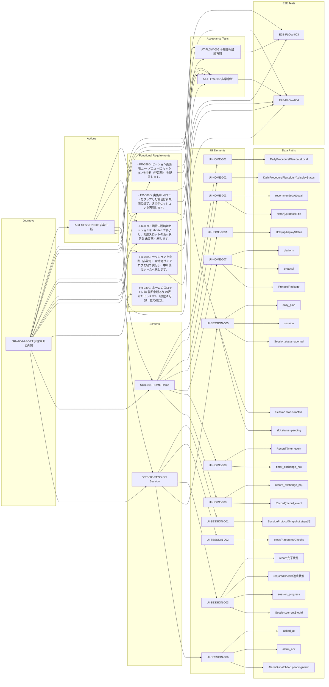

# JRN-004-ABORT マップ

```mermaid
flowchart LR
  %% JRN-004-ABORT
  subgraph JRN["Journeys"]
    N37["JRN-004-ABORT 非常中断と再開"]
  end
  subgraph ACT["Actions"]
    N1["ACT-SESSION-006 非常中断"]
  end
  subgraph SCR["Screens"]
    N38["SCR-001-HOME Home"]
    N39["SCR-006-SESSION Session"]
  end
  subgraph UI["UI Elements"]
    N40["UI-HOME-001"]
    N41["UI-HOME-002"]
    N42["UI-HOME-003"]
    N43["UI-HOME-003A"]
    N44["UI-HOME-007"]
    N45["UI-HOME-008"]
    N46["UI-HOME-009"]
    N47["UI-SESSION-001"]
    N48["UI-SESSION-002"]
    N49["UI-SESSION-003"]
    N50["UI-SESSION-005"]
    N51["UI-SESSION-006"]
  end
  subgraph FR["Functional Requirements"]
    N32["- FR-009G: 実施中 スロットをタップした場合は新規開始せず、進行中セッションを再開します。"]
    N33["- FR-039D: セッション画面右上 ••• メニューに セッションを中断（非常用） を配置します。"]
    N34["- FR-039E: セッションを中断（非常用） は確認ダイアログを経て実行し、中断後はホームへ戻します。"]
    N35["- FR-039F: 明示中断時はセッションを aborted で終了し、対応スロットの表示状態を 未実施 へ戻します。"]
    N36["- FR-039G: ホームのスロットには 前回中断あり の表示を出しません（履歴は記録一覧で確認）。"]
  end
  subgraph AT["Acceptance Tests"]
    N2["AT-FLOW-006 予期せぬ離脱再開"]
    N3["AT-FLOW-007 非常中断"]
  end
  subgraph E2E["E2E Tests"]
    N30["E2E-FLOW-003"]
    N31["E2E-FLOW-004"]
  end
  subgraph DATA["Data Paths"]
    N4["acked_at"]
    N5["alarm_ack"]
    N6["AlarmDispatchJob.pendingAlarm"]
    N7["daily_plan"]
    N8["DailyProcedurePlan.dateLocal"]
    N9["DailyProcedurePlan.slots[*].displayStatus"]
    N10["platform"]
    N11["protocol"]
    N12["ProtocolPackage"]
    N13["recommendedAtLocal"]
    N14["record_exchange_no)"]
    N15["Record(record_event"]
    N16["Record(timer_event"]
    N17["record完了状態"]
    N18["requiredChecks達成状態"]
    N19["session"]
    N20["session_progress"]
    N21["Session.currentStepId"]
    N22["Session.status=aborted"]
    N23["Session.status=active"]
    N24["SessionProtocolSnapshot.steps[*]"]
    N25["slot.status=pending"]
    N26["slots[*].protocolTitle"]
    N27["slots[n].displayStatus"]
    N28["steps[*].requiredChecks"]
    N29["timer_exchange_no)"]
  end
  N1 --> N33
  N1 --> N35
  N1 --> N38
  N1 --> N39
  N1 --> N50
  N2 --> N30
  N3 --> N31
  N32 --> N2
  N32 --> N3
  N32 --> N30
  N33 --> N3
  N33 --> N31
  N34 --> N3
  N34 --> N31
  N35 --> N3
  N35 --> N31
  N37 --> N1
  N37 --> N2
  N37 --> N3
  N37 --> N30
  N37 --> N31
  N37 --> N32
  N37 --> N33
  N37 --> N34
  N37 --> N35
  N37 --> N36
  N37 --> N38
  N37 --> N39
  N38 --> N40
  N38 --> N41
  N38 --> N42
  N38 --> N43
  N38 --> N44
  N38 --> N45
  N38 --> N46
  N39 --> N47
  N39 --> N48
  N39 --> N49
  N39 --> N50
  N39 --> N51
  N40 --> N8
  N41 --> N9
  N42 --> N13
  N42 --> N26
  N43 --> N27
  N44 --> N10
  N44 --> N11
  N44 --> N12
  N45 --> N16
  N45 --> N29
  N46 --> N14
  N46 --> N15
  N47 --> N24
  N48 --> N28
  N49 --> N17
  N49 --> N18
  N49 --> N20
  N49 --> N21
  N50 --> N7
  N50 --> N19
  N50 --> N22
  N50 --> N23
  N50 --> N25
  N51 --> N4
  N51 --> N5
  N51 --> N6
```

