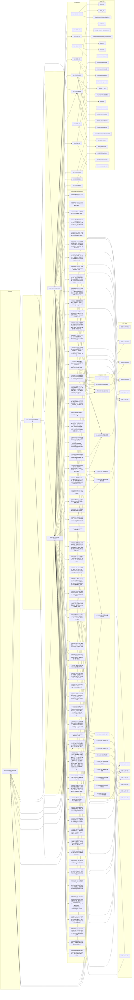

# JRN-004-ABORT マップ

```mermaid
flowchart LR
  %% JRN-004-ABORT
  subgraph JRN["Journeys"]
    N121["JRN-004-ABORT 非常中断と再開"]
  end
  subgraph ACT["Actions"]
    N1["ACT-SESSION-006 非常中断"]
  end
  subgraph SCR["Screens"]
    N122["SCR-001-HOME Home"]
    N123["SCR-006-SESSION Session"]
  end
  subgraph UI["UI Elements"]
    N124["UI-HOME-001"]
    N125["UI-HOME-002"]
    N126["UI-HOME-003"]
    N127["UI-HOME-003A"]
    N128["UI-HOME-007"]
    N129["UI-HOME-008"]
    N130["UI-HOME-009"]
    N131["UI-SESSION-001"]
    N132["UI-SESSION-002"]
    N133["UI-SESSION-003"]
    N134["UI-SESSION-005"]
    N135["UI-SESSION-006"]
  end
  subgraph FR["Functional Requirements"]
    N57["- FR-001: 複数手技テンプレート一覧を表示します。"]
    N58["- FR-002: テンプレートごとに名称、版、有効開始日を表示します。"]
    N59["- FR-003: 選択した1手技でセッションを開始します。"]
    N60["- FR-004: 手技開始通知は本アプリ対象外とし、Mac/iPhoneの時計アプリ等の外部アラームで運用します。"]
    N61["- FR-004A: ホームに「手技開始通知は外部アラーム運用」の注記を表示します。"]
    N62["- FR-005: ホームには手技開始情報に加え、当日分のみCAPD記録ノート互換表を表示します（過去分は一覧画面で表示）。"]
    N63["- FR-005A: ホームAの先頭見出しは日付と曜日を表示し、手技スロットと当日ノート表は同一パネル内に配置します。"]
    N64["- FR-006: ホームから「記録一覧」画面へ遷移できる導線を提供します。"]
    N65["- FR-007: ホームAスパイクでは、1日あたり4件の手技スロットを横並びで表示します。"]
    N66["- FR-008: 手技スロットの初期状態は「+ のみ表示」とし、+ 押下で手技設定モーダル（CSV選択、推奨実施時間）を開きます。"]
    N67["- FR-009A: 右上 ••• メニューから「確認/編集」を開きます。確認モーダルは閲覧専用とし、ここからの「開始/再開」は手順表示のみ（確認モード）とします。確認モードでは記録保存、タイマー開始、通知ジョブ生成、アラーム設定、スロット/セッション状態更新、同期対象更新を行いません。"]
    N68["- FR-009B: 手技スロットの表示状態は 未登録(+) / 未実施 / 実施中 / 実施済み とします。実施済み のカード本体タップは無効化します。"]
    N69["- FR-009C: スロット登録時は、右隣スロットほど推奨実施時間が遅くなるように検証します（左から右へ厳密昇順、同時刻不可）。"]
    N70["- FR-009D: 右側スロットの開始時は、左側スロットがすべて 実施済み であることを必須条件にします（未登録/未実施が1件でもあれば開始不可）。"]
    N71["- FR-009E: 4スロット設定は dateLocal 単位でローカル永続化し、同期時に localRevision と cloudRevision を更新します。"]
    N72["- FR-009F: 実施済み スロットは編集/削除不可とします。同一端末で進行中セッションがある間は全スロット編集を禁止します。"]
    N73["- FR-009G: 実施中 スロットをタップした場合は新規開始せず、進行中セッションを再開します。"]
    N74["- FR-009H: 記録やタイマーを伴う実運用セッション開始/再開はカード本体タップ導線で実行し、••• > 確認 導線は閲覧専用（確認モード）とします。"]
    N75["- FR-016: 当日ノート表と記録一覧の交換列は #1〜#5 の5列固定とし、列位置は *_exchange_no で決定します。"]
    N76["- FR-017: 透析液濃度欄は、取り込みCSVのタイトル（例"]
    N77["- FR-018: record_event の値は record_exchange_no で列マッピングし、drain_weight_g は排液量、bag_weight_g は注液量、drain_appearance は排液の確認に表示します。"]
    N78["- FR-019: timer_event の値は timer_exchange_no で列マッピングし、timer_segment=dwell の start/end は貯留時間、timer_segment=drain の start/end は排液時間に表示します。"]
    N79["- FR-030: 現在ステップのフェーズと状態を常時表示し、タイトルは通し番号付き（例"]
    N80["- FR-031: 必須チェック未完了時に次ステップ遷移を禁止します。"]
    N81["- FR-032: record_event 未完了時に次ステップ遷移を禁止します。"]
    N82["- FR-033: next_step_id に従い完全シリアルで遷移します。"]
    N83["- FR-034: 最終ステップ完了時にセッション完了状態へ遷移します。"]
    N84["- FR-035: セッション開始端末のみ進行更新できます。"]
    N85["- FR-036: 同時実行セッションを端末ごとに1件へ制限します。"]
    N86["- FR-037: セッション画面の手順画像は1"]
    N87["- FR-038: セッション画面は iPhoneで1カラム、Macで2カラム表示に切り替えます。"]
    N88["- FR-039: セッション画面に「戻る」操作を提供し、直前ステップへ表示遷移できます。"]
    N89["- FR-039A: セッション画面の「戻る」と「次へ」は、iPhone/Macの双方で横並び・同幅で表示します。"]
    N90["- FR-039B: 「次へ」「戻る」押下時、および Enter キーによる次ステップ遷移時は、メインパネルを左右スライドで遷移表示します。"]
    N91["- FR-039C: セッション画面のカルーセルは、左右ナビゲーションボタンを表示しません。"]
    N92["- FR-039D: セッション画面右上 ••• メニューに セッションを中断（非常用） を配置します。"]
    N93["- FR-039E: セッションを中断（非常用） は確認ダイアログを経て実行し、中断後はホームへ戻します。"]
    N94["- FR-039F: 明示中断時はセッションを aborted で終了し、対応スロットの表示状態を 未実施 へ戻します。"]
    N95["- FR-039G: ホームのスロットには 前回中断あり の表示を出しません（履歴は記録一覧で確認）。"]
    N96["- FR-042: 廃液の記録写真（drain）は任意入力です。"]
    N97["- FR-050A: 通知対象は timer_event=end の終了イベントとし、timer_segment=dwell/drain を同一ルールで扱います。"]
    N98["- FR-050B: 同一セッション内の通知ジョブは alarm_id 単位で独立管理します。"]
    N99["- FR-050C: 通知ジョブは最低限 alarm_id / segment / due_at / acked_at / attempt_no / status を保持します。"]
    N100["- FR-050D: pendingAlarm は未ACKジョブ（pending/notified/missed）から due_at 最小を優先して1件選択し、同値時は alarm_id 昇順を採用します。"]
    N101["- FR-051: 終了時刻 T0 で Mac ローカル通知（音+バナー）を発火し、同時にアプリ内未確認アラートを固定表示します。"]
    N102["- FR-052: 未確認時は段階再通知を行います。"]
    N103["- FR-052A: 再通知間隔は T+2分（iPhone補助通知1回 + Mac再通知）、T+5分以降（3分間隔でMac+iPhone再通知）とします。"]
    N104["- FR-052B: 段階再通知の対象は「貯留終了（dwell）」「廃液終了（drain）」に限定します。"]
    N105["- FR-053: ACK時は Mac/iPhone の通知ジョブをすべて停止し、acked_at を記録します。"]
    N106["- FR-054: アプリ内アラートは ACK まで継続表示し、通知再送も ACK まで継続します。"]
    N107["- FR-055: 通知チャネルは Mac主チャネル固定 + iPhone補助 とします。"]
    N108["- FR-055A: iPhone未利用かつ離席想定時は「見逃し高リスク」警告を必須表示します。"]
    N109["- FR-055B: iPhone補助通知の利用可否は Push購読状態（登録/無効化）で管理します。"]
    N110["- FR-057: 30秒テスト通知は手動実行とし、通知設定変更時・OS更新後・通知不調時に実施できること。"]
    N111["- FR-057A: 手動30秒テストに失敗した場合は、当日を「iPhone補助なし（Mac主導）」として扱います。"]
    N112["- FR-058: T+30分 未確認時は status=missed を永続化し、「見逃し状態」を表示します。"]
    N113["- FR-058A: status=missed になった後も、ACKまで3分間隔の再通知を継続します。"]
    N114["- FR-058B: status=missed は ACK 成功時に acknowledged へ遷移し、通知停止と acked_at 記録を行います。"]
    N115["- FR-071: セッション開始時は SessionProtocolSnapshot をローカル同一トランザクションで保存し、保存失敗時は開始自体を失敗させます。"]
    N116["- FR-072: スナップショットには sourceProtocol(meta)、step定義本文（通し番号/タイトル/文言/必須チェック/timer/alarm/record）、画像 assetKey、assetManifest、snapshotHash を含めます。"]
    N117["- FR-073: セッション表示/再開時は開始時スナップショットを常に優先し、現行テンプレート版へフォールバックしません。"]
    N118["- FR-074: スナップショット欠落またはハッシュ不整合は整合性エラーとして扱い、セッション表示を停止します。"]
    N119["- FR-086: 手動同期ボタンを提供し、失敗時は再試行導線を表示します。"]
    N120["- FR-088: 同期失敗時は直近同期状態（成功/失敗）を更新し、再試行導線を表示します。"]
  end
  subgraph AT["Acceptance Tests"]
    N2["AT-ALARM-001 T0通知"]
    N3["AT-ALARM-002 段階再通知"]
    N4["AT-ALARM-003 ACK停止"]
    N5["AT-ALARM-004 見逃し状態"]
    N6["AT-FLOW-001 必須チェック"]
    N7["AT-FLOW-002 記録ゲート"]
    N8["AT-FLOW-003 直列遷移"]
    N9["AT-FLOW-004 端末内同時実行制限"]
    N10["AT-FLOW-005 左優先実行"]
    N11["AT-FLOW-006 予期せぬ離脱再開"]
    N12["AT-FLOW-007 非常中断"]
    N13["AT-SYNC-005 手動同期消し込み"]
    N14["AT-SYNC-006 復帰時失敗導線"]
    N15["AT-UI-HOME-001 Home表示確認"]
    N16["AT-UI-HOME-002 Home初期状態"]
    N17["AT-UI-SESSION-001 Session表示確認"]
  end
  subgraph E2E["E2E Tests"]
    N44["E2E-ALARM-001"]
    N45["E2E-ALARM-002"]
    N46["E2E-ALARM-003"]
    N47["E2E-ALARM-004"]
    N48["E2E-FLOW-001"]
    N49["E2E-FLOW-002"]
    N50["E2E-FLOW-003"]
    N51["E2E-FLOW-004"]
    N52["E2E-FLOW-005"]
    N53["E2E-FLOW-006"]
    N54["E2E-FLOW-007"]
    N55["E2E-SYNC-002"]
    N56["E2E-SYNC-006"]
  end
  subgraph DATA["Data Paths"]
    N18["acked_at"]
    N19["alarm_ack"]
    N20["AlarmDispatchJob.pendingAlarm"]
    N21["daily_plan"]
    N22["DailyProcedurePlan.dateLocal"]
    N23["DailyProcedurePlan.slots[*].displayStatus"]
    N24["platform"]
    N25["protocol"]
    N26["ProtocolPackage"]
    N27["recommendedAtLocal"]
    N28["record_exchange_no)"]
    N29["Record(record_event"]
    N30["Record(timer_event"]
    N31["record完了状態"]
    N32["requiredChecks達成状態"]
    N33["session"]
    N34["session_progress"]
    N35["Session.currentStepId"]
    N36["Session.status=aborted"]
    N37["Session.status=active"]
    N38["SessionProtocolSnapshot.steps[*]"]
    N39["slot.status=pending"]
    N40["slots[*].protocolTitle"]
    N41["slots[n].displayStatus"]
    N42["steps[*].requiredChecks"]
    N43["timer_exchange_no)"]
  end
  N1 --> N92
  N1 --> N94
  N1 --> N122
  N1 --> N123
  N1 --> N134
  N2 --> N44
  N3 --> N45
  N4 --> N46
  N5 --> N47
  N6 --> N52
  N7 --> N53
  N8 --> N54
  N9 --> N49
  N10 --> N48
  N11 --> N50
  N12 --> N51
  N13 --> N55
  N14 --> N56
  N63 --> N15
  N65 --> N9
  N65 --> N10
  N67 --> N15
  N68 --> N15
  N70 --> N10
  N70 --> N16
  N70 --> N48
  N72 --> N9
  N72 --> N49
  N73 --> N11
  N73 --> N12
  N73 --> N50
  N79 --> N6
  N79 --> N7
  N79 --> N8
  N79 --> N17
  N80 --> N6
  N80 --> N52
  N81 --> N7
  N81 --> N53
  N82 --> N8
  N82 --> N54
  N85 --> N9
  N85 --> N49
  N87 --> N17
  N92 --> N12
  N92 --> N51
  N93 --> N12
  N93 --> N51
  N94 --> N12
  N94 --> N51
  N97 --> N2
  N97 --> N3
  N97 --> N4
  N97 --> N5
  N97 --> N44
  N101 --> N2
  N101 --> N44
  N103 --> N3
  N103 --> N45
  N104 --> N3
  N104 --> N45
  N105 --> N4
  N105 --> N46
  N106 --> N4
  N106 --> N46
  N112 --> N5
  N112 --> N47
  N113 --> N5
  N113 --> N47
  N114 --> N5
  N114 --> N47
  N119 --> N13
  N119 --> N55
  N120 --> N14
  N120 --> N56
  N121 --> N1
  N121 --> N11
  N121 --> N12
  N121 --> N50
  N121 --> N51
  N121 --> N73
  N121 --> N92
  N121 --> N93
  N121 --> N94
  N121 --> N95
  N121 --> N122
  N121 --> N123
  N122 --> N57
  N122 --> N58
  N122 --> N59
  N122 --> N60
  N122 --> N61
  N122 --> N62
  N122 --> N63
  N122 --> N64
  N122 --> N65
  N122 --> N66
  N122 --> N67
  N122 --> N68
  N122 --> N69
  N122 --> N70
  N122 --> N71
  N122 --> N72
  N122 --> N73
  N122 --> N74
  N122 --> N75
  N122 --> N76
  N122 --> N77
  N122 --> N78
  N122 --> N96
  N122 --> N119
  N122 --> N120
  N122 --> N124
  N122 --> N125
  N122 --> N126
  N122 --> N127
  N122 --> N128
  N122 --> N129
  N122 --> N130
  N123 --> N79
  N123 --> N80
  N123 --> N81
  N123 --> N82
  N123 --> N83
  N123 --> N84
  N123 --> N85
  N123 --> N86
  N123 --> N87
  N123 --> N88
  N123 --> N89
  N123 --> N90
  N123 --> N91
  N123 --> N92
  N123 --> N93
  N123 --> N94
  N123 --> N95
  N123 --> N97
  N123 --> N98
  N123 --> N99
  N123 --> N100
  N123 --> N101
  N123 --> N102
  N123 --> N103
  N123 --> N104
  N123 --> N105
  N123 --> N106
  N123 --> N107
  N123 --> N108
  N123 --> N109
  N123 --> N110
  N123 --> N111
  N123 --> N112
  N123 --> N113
  N123 --> N114
  N123 --> N115
  N123 --> N116
  N123 --> N117
  N123 --> N118
  N123 --> N131
  N123 --> N132
  N123 --> N133
  N123 --> N134
  N123 --> N135
  N124 --> N22
  N125 --> N23
  N126 --> N27
  N126 --> N40
  N127 --> N41
  N128 --> N24
  N128 --> N25
  N128 --> N26
  N129 --> N30
  N129 --> N43
  N130 --> N28
  N130 --> N29
  N131 --> N38
  N132 --> N42
  N133 --> N31
  N133 --> N32
  N133 --> N34
  N133 --> N35
  N134 --> N21
  N134 --> N33
  N134 --> N36
  N134 --> N37
  N134 --> N39
  N135 --> N18
  N135 --> N19
  N135 --> N20
```

