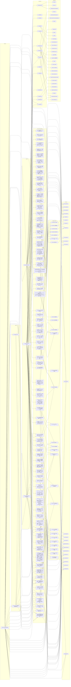

# JRN-005-SYNC マップ

```mermaid
flowchart LR
  %% JRN-005-SYNC
  subgraph JRN["Journeys"]
    N163["JRN-005-SYNC 同期と再試行"]
  end
  subgraph ACT["Actions"]
    N1["ACT-HOME-011 なし"]
    N2["ACT-SYNC-001 自動同期（起動/復帰/完了）"]
  end
  subgraph SCR["Screens"]
    N164["SCR-001-HOME Home"]
    N165["SCR-006-SESSION Session"]
    N166["SCR-011-SYNC-STATUS 同期状態表示"]
  end
  subgraph UI["UI Elements"]
    N167["UI-HOME-001"]
    N168["UI-HOME-002"]
    N169["UI-HOME-003"]
    N170["UI-HOME-003A"]
    N171["UI-HOME-007"]
    N172["UI-HOME-008"]
    N173["UI-HOME-009"]
    N174["UI-SESSION-001"]
    N175["UI-SESSION-002"]
    N176["UI-SESSION-003"]
    N177["UI-SESSION-005"]
    N178["UI-SESSION-006"]
    N179["UI-SYNC-001"]
    N180["UI-SYNC-002"]
  end
  subgraph FR["Functional Requirements"]
    N85["- FR-001: 複数手技テンプレート一覧を表示します。"]
    N86["- FR-002: テンプレートごとに名称、版、有効開始日を表示します。"]
    N87["- FR-003: 選択した1手技でセッションを開始します。"]
    N88["- FR-004: 手技開始通知は本アプリ対象外とし、Mac/iPhoneの時計アプリ等の外部アラームで運用します。"]
    N89["- FR-004A: ホームに「手技開始通知は外部アラーム運用」の注記を表示します。"]
    N90["- FR-005: ホームには手技開始情報に加え、当日分のみCAPD記録ノート互換表を表示します（過去分は一覧画面で表示）。"]
    N91["- FR-005A: ホームAの先頭見出しは日付と曜日を表示し、手技スロットと当日ノート表は同一パネル内に配置します。"]
    N92["- FR-006: ホームから「記録一覧」画面へ遷移できる導線を提供します。"]
    N93["- FR-007: ホームAスパイクでは、1日あたり4件の手技スロットを横並びで表示します。"]
    N94["- FR-008: 手技スロットの初期状態は「+ のみ表示」とし、+ 押下で手技設定モーダル（CSV選択、推奨実施時間）を開きます。"]
    N95["- FR-009A: 右上 ••• メニューから「確認/編集」を開きます。確認モーダルは閲覧専用とし、ここからの「開始/再開」は手順表示のみ（確認モード）とします。確認モードでは記録保存、タイマー開始、通知ジョブ生成、アラーム設定、スロット/セッション状態更新、同期対象更新を行いません。"]
    N96["- FR-009B: 手技スロットの表示状態は 未登録(+) / 未実施 / 実施中 / 実施済み とします。実施済み のカード本体タップは無効化します。"]
    N97["- FR-009C: スロット登録時は、右隣スロットほど推奨実施時間が遅くなるように検証します（左から右へ厳密昇順、同時刻不可）。"]
    N98["- FR-009D: 右側スロットの開始時は、左側スロットがすべて 実施済み であることを必須条件にします（未登録/未実施が1件でもあれば開始不可）。"]
    N99["- FR-009E: 4スロット設定は dateLocal 単位でローカル永続化し、同期時に localRevision と cloudRevision を更新します。"]
    N100["- FR-009F: 実施済み スロットは編集/削除不可とします。同一端末で進行中セッションがある間は全スロット編集を禁止します。"]
    N101["- FR-009G: 実施中 スロットをタップした場合は新規開始せず、進行中セッションを再開します。"]
    N102["- FR-009H: 記録やタイマーを伴う実運用セッション開始/再開はカード本体タップ導線で実行し、••• > 確認 導線は閲覧専用（確認モード）とします。"]
    N103["- FR-016: 当日ノート表と記録一覧の交換列は #1〜#5 の5列固定とし、列位置は *_exchange_no で決定します。"]
    N104["- FR-017: 透析液濃度欄は、取り込みCSVのタイトル（例"]
    N105["- FR-018: record_event の値は record_exchange_no で列マッピングし、drain_weight_g は排液量、bag_weight_g は注液量、drain_appearance は排液の確認に表示します。"]
    N106["- FR-019: timer_event の値は timer_exchange_no で列マッピングし、timer_segment=dwell の start/end は貯留時間、timer_segment=drain の start/end は排液時間に表示します。"]
    N107["- FR-030: 現在ステップのフェーズと状態を常時表示し、タイトルは通し番号付き（例"]
    N108["- FR-031: 必須チェック未完了時に次ステップ遷移を禁止します。"]
    N109["- FR-032: record_event 未完了時に次ステップ遷移を禁止します。"]
    N110["- FR-033: next_step_id に従い完全シリアルで遷移します。"]
    N111["- FR-034: 最終ステップ完了時にセッション完了状態へ遷移します。"]
    N112["- FR-035: セッション開始端末のみ進行更新できます。"]
    N113["- FR-036: 同時実行セッションを端末ごとに1件へ制限します。"]
    N114["- FR-037: セッション画面の手順画像は1"]
    N115["- FR-038: セッション画面は iPhoneで1カラム、Macで2カラム表示に切り替えます。"]
    N116["- FR-039: セッション画面に「戻る」操作を提供し、直前ステップへ表示遷移できます。"]
    N117["- FR-039A: セッション画面の「戻る」と「次へ」は、iPhone/Macの双方で横並び・同幅で表示します。"]
    N118["- FR-039B: 「次へ」「戻る」押下時、および Enter キーによる次ステップ遷移時は、メインパネルを左右スライドで遷移表示します。"]
    N119["- FR-039C: セッション画面のカルーセルは、左右ナビゲーションボタンを表示しません。"]
    N120["- FR-039D: セッション画面右上 ••• メニューに セッションを中断（非常用） を配置します。"]
    N121["- FR-039E: セッションを中断（非常用） は確認ダイアログを経て実行し、中断後はホームへ戻します。"]
    N122["- FR-039F: 明示中断時はセッションを aborted で終了し、対応スロットの表示状態を 未実施 へ戻します。"]
    N123["- FR-039G: ホームのスロットには 前回中断あり の表示を出しません（履歴は記録一覧で確認）。"]
    N124["- FR-042: 廃液の記録写真（drain）は任意入力です。"]
    N125["- FR-050A: 通知対象は timer_event=end の終了イベントとし、timer_segment=dwell/drain を同一ルールで扱います。"]
    N126["- FR-050B: 同一セッション内の通知ジョブは alarm_id 単位で独立管理します。"]
    N127["- FR-050C: 通知ジョブは最低限 alarm_id / segment / due_at / acked_at / attempt_no / status を保持します。"]
    N128["- FR-050D: pendingAlarm は未ACKジョブ（pending/notified/missed）から due_at 最小を優先して1件選択し、同値時は alarm_id 昇順を採用します。"]
    N129["- FR-051: 終了時刻 T0 で Mac ローカル通知（音+バナー）を発火し、同時にアプリ内未確認アラートを固定表示します。"]
    N130["- FR-052: 未確認時は段階再通知を行います。"]
    N131["- FR-052A: 再通知間隔は T+2分（iPhone補助通知1回 + Mac再通知）、T+5分以降（3分間隔でMac+iPhone再通知）とします。"]
    N132["- FR-052B: 段階再通知の対象は「貯留終了（dwell）」「廃液終了（drain）」に限定します。"]
    N133["- FR-053: ACK時は Mac/iPhone の通知ジョブをすべて停止し、acked_at を記録します。"]
    N134["- FR-054: アプリ内アラートは ACK まで継続表示し、通知再送も ACK まで継続します。"]
    N135["- FR-055: 通知チャネルは Mac主チャネル固定 + iPhone補助 とします。"]
    N136["- FR-055A: iPhone未利用かつ離席想定時は「見逃し高リスク」警告を必須表示します。"]
    N137["- FR-055B: iPhone補助通知の利用可否は Push購読状態（登録/無効化）で管理します。"]
    N138["- FR-057: 30秒テスト通知は手動実行とし、通知設定変更時・OS更新後・通知不調時に実施できること。"]
    N139["- FR-057A: 手動30秒テストに失敗した場合は、当日を「iPhone補助なし（Mac主導）」として扱います。"]
    N140["- FR-058: T+30分 未確認時は status=missed を永続化し、「見逃し状態」を表示します。"]
    N141["- FR-058A: status=missed になった後も、ACKまで3分間隔の再通知を継続します。"]
    N142["- FR-058B: status=missed は ACK 成功時に acknowledged へ遷移し、通知停止と acked_at 記録を行います。"]
    N143["- FR-071: セッション開始時は SessionProtocolSnapshot をローカル同一トランザクションで保存し、保存失敗時は開始自体を失敗させます。"]
    N144["- FR-072: スナップショットには sourceProtocol(meta)、step定義本文（通し番号/タイトル/文言/必須チェック/timer/alarm/record）、画像 assetKey、assetManifest、snapshotHash を含めます。"]
    N145["- FR-073: セッション表示/再開時は開始時スナップショットを常に優先し、現行テンプレート版へフォールバックしません。"]
    N146["- FR-074: スナップショット欠落またはハッシュ不整合は整合性エラーとして扱い、セッション表示を停止します。"]
    N147["- FR-080: 同期は startup / resume / session_complete / manual の4契機で実行します。"]
    N148["- FR-081: すべてのローカル更新は outbox に追記し、push成功時に消し込みます。"]
    N149["- FR-082: 差分取得は cloudRevision と dayRefs に基づき実行します。"]
    N150["- FR-082A: 公開HTTP APIは POST /sync/push と POST /sync/pull のみとし、CSV取り込みはローカルI/F（ProtocolImportService.importFromDirectory）で実行します。"]
    N151["- FR-083: 競合解決はエンティティ単位LWW（updatedAt, updatedByDeviceId, mutationId 降順）で固定します。"]
    N152["- FR-084: tombstone（削除）もLWW同一ルールで解決します。"]
    N153["- FR-085: 競合解決は内部適用のみとし、競合件数バナーや詳細一覧は提供しません。"]
    N154["- FR-086: 手動同期ボタンを提供し、失敗時は再試行導線を表示します。"]
    N155["- FR-087: IndexedDB消失検知時はクラウドからフルリストアを実行します。"]
    N156["- FR-087A: POST /sync/pull が cloudState=missing を返した場合、クラウド欠損と判定します。"]
    N157["- FR-087B: クラウド欠損判定時はローカルデータを正本として syncMode=full_reseed で全量再シードを実行し、ローカルデータは削除/初期化しません。"]
    N158["- FR-087C: 全量再シード成功後は再度 POST /sync/pull を実行し、cloudState=ok と cloudRevision 更新を確認して同期完了とします。"]
    N159["- FR-087D: 全量再シード失敗時はローカルデータを不変のまま保持し、lastSyncStatus=failed と再試行導線を表示します。"]
    N160["- FR-088: 同期失敗時は直近同期状態（成功/失敗）を更新し、再試行導線を表示します。"]
    N161["- FR-089: 120秒ポーリング は実装しません。"]
    N162["- FR-089A: session_summary.payload.exit_site_photo の更新は部分パッチ（patch_path=payload.exit_site_photo）で同期し、同一record内の他フィールドを上書きしません。"]
  end
  subgraph AT["Acceptance Tests"]
    N3["AT-ALARM-001 T0通知"]
    N4["AT-ALARM-002 段階再通知"]
    N5["AT-ALARM-003 ACK停止"]
    N6["AT-ALARM-004 見逃し状態"]
    N7["AT-API-001 公開API最小化"]
    N8["AT-API-003 CSVローカル完結"]
    N9["AT-API-004 非暗号化キー"]
    N10["AT-EXIT-009 同期反映"]
    N11["AT-EXIT-010 部分更新競合"]
    N12["AT-FLOW-001 必須チェック"]
    N13["AT-FLOW-002 記録ゲート"]
    N14["AT-FLOW-003 直列遷移"]
    N15["AT-FLOW-004 端末内同時実行制限"]
    N16["AT-FLOW-005 左優先実行"]
    N17["AT-FLOW-006 予期せぬ離脱再開"]
    N18["AT-FLOW-007 非常中断"]
    N19["AT-RECOVERY-001 DB消失復元"]
    N20["AT-RECOVERY-002 クラウド欠損再シード"]
    N21["AT-RECOVERY-003 再シード失敗時保全"]
    N22["AT-SYNC-001 起動時pull復元"]
    N23["AT-SYNC-002 完了時push反映"]
    N24["AT-SYNC-003 LWW内部適用"]
    N25["AT-SYNC-004 同日同スロット競合"]
    N26["AT-SYNC-005 手動同期消し込み"]
    N27["AT-SYNC-006 復帰時失敗導線"]
    N28["AT-UI-HOME-001 Home表示確認"]
    N29["AT-UI-HOME-002 Home初期状態"]
    N30["AT-UI-SESSION-001 Session表示確認"]
  end
  subgraph E2E["E2E Tests"]
    N61["E2E-ALARM-001"]
    N62["E2E-ALARM-002"]
    N63["E2E-ALARM-003"]
    N64["E2E-ALARM-004"]
    N65["E2E-API-001"]
    N66["E2E-API-002"]
    N67["E2E-API-004"]
    N68["E2E-EXIT-005"]
    N69["E2E-FLOW-001"]
    N70["E2E-FLOW-002"]
    N71["E2E-FLOW-003"]
    N72["E2E-FLOW-004"]
    N73["E2E-FLOW-005"]
    N74["E2E-FLOW-006"]
    N75["E2E-FLOW-007"]
    N76["E2E-RECOVERY-001"]
    N77["E2E-RECOVERY-002"]
    N78["E2E-RECOVERY-003"]
    N79["E2E-SYNC-001"]
    N80["E2E-SYNC-002"]
    N81["E2E-SYNC-003"]
    N82["E2E-SYNC-004"]
    N83["E2E-SYNC-005"]
    N84["E2E-SYNC-006"]
  end
  subgraph DATA["Data Paths"]
    N31["acked_at"]
    N32["alarm_ack"]
    N33["AlarmDispatchJob.pendingAlarm"]
    N34["daily_plan"]
    N35["DailyProcedurePlan.dateLocal"]
    N36["DailyProcedurePlan.slots[*].displayStatus"]
    N37["lastError"]
    N38["lastSyncedAt"]
    N39["platform"]
    N40["protocol"]
    N41["ProtocolPackage"]
    N42["recommendedAtLocal"]
    N43["record_exchange_no)"]
    N44["Record(record_event"]
    N45["Record(timer_event"]
    N46["record完了状態"]
    N47["requiredChecks達成状態"]
    N48["session"]
    N49["session_progress"]
    N50["Session.currentStepId"]
    N51["Session.status=aborted"]
    N52["Session.status=active"]
    N53["SessionProtocolSnapshot.steps[*]"]
    N54["slot.status=pending"]
    N55["slots[*].protocolTitle"]
    N56["slots[n].displayStatus"]
    N57["steps[*].requiredChecks"]
    N58["SyncState"]
    N59["SyncState.lastSyncStatus"]
    N60["timer_exchange_no)"]
  end
  N1 --> N154
  N1 --> N160
  N1 --> N164
  N1 --> N180
  N2 --> N147
  N2 --> N148
  N2 --> N149
  N2 --> N151
  N2 --> N152
  N2 --> N153
  N2 --> N154
  N2 --> N155
  N2 --> N160
  N2 --> N166
  N2 --> N179
  N3 --> N61
  N4 --> N62
  N5 --> N63
  N6 --> N64
  N7 --> N65
  N8 --> N66
  N9 --> N67
  N10 --> N68
  N11 --> N68
  N12 --> N73
  N13 --> N74
  N14 --> N75
  N15 --> N70
  N16 --> N69
  N17 --> N71
  N18 --> N72
  N19 --> N76
  N20 --> N77
  N21 --> N78
  N22 --> N79
  N23 --> N81
  N24 --> N82
  N25 --> N83
  N26 --> N80
  N27 --> N84
  N91 --> N28
  N93 --> N15
  N93 --> N16
  N95 --> N28
  N96 --> N28
  N98 --> N16
  N98 --> N29
  N98 --> N69
  N100 --> N15
  N100 --> N70
  N101 --> N17
  N101 --> N18
  N101 --> N71
  N107 --> N12
  N107 --> N13
  N107 --> N14
  N107 --> N30
  N108 --> N12
  N108 --> N73
  N109 --> N13
  N109 --> N74
  N110 --> N14
  N110 --> N75
  N113 --> N15
  N113 --> N70
  N115 --> N30
  N120 --> N18
  N120 --> N72
  N121 --> N18
  N121 --> N72
  N122 --> N18
  N122 --> N72
  N125 --> N3
  N125 --> N4
  N125 --> N5
  N125 --> N6
  N125 --> N61
  N129 --> N3
  N129 --> N61
  N131 --> N4
  N131 --> N62
  N132 --> N4
  N132 --> N62
  N133 --> N5
  N133 --> N63
  N134 --> N5
  N134 --> N63
  N140 --> N6
  N140 --> N64
  N141 --> N6
  N141 --> N64
  N142 --> N6
  N142 --> N64
  N147 --> N22
  N147 --> N23
  N147 --> N24
  N147 --> N25
  N147 --> N26
  N147 --> N27
  N147 --> N79
  N147 --> N81
  N148 --> N23
  N148 --> N26
  N148 --> N80
  N148 --> N81
  N149 --> N22
  N149 --> N79
  N150 --> N7
  N150 --> N8
  N150 --> N65
  N150 --> N66
  N151 --> N24
  N151 --> N25
  N151 --> N82
  N151 --> N83
  N152 --> N25
  N152 --> N83
  N154 --> N26
  N154 --> N80
  N155 --> N19
  N155 --> N20
  N155 --> N21
  N155 --> N76
  N156 --> N20
  N156 --> N77
  N157 --> N20
  N157 --> N77
  N158 --> N20
  N158 --> N77
  N159 --> N21
  N159 --> N78
  N160 --> N27
  N160 --> N84
  N162 --> N10
  N162 --> N11
  N162 --> N68
  N163 --> N1
  N163 --> N2
  N163 --> N7
  N163 --> N9
  N163 --> N22
  N163 --> N23
  N163 --> N24
  N163 --> N25
  N163 --> N26
  N163 --> N27
  N163 --> N65
  N163 --> N67
  N163 --> N79
  N163 --> N80
  N163 --> N81
  N163 --> N82
  N163 --> N83
  N163 --> N84
  N163 --> N147
  N163 --> N148
  N163 --> N149
  N163 --> N150
  N163 --> N151
  N163 --> N152
  N163 --> N153
  N163 --> N154
  N163 --> N160
  N163 --> N161
  N163 --> N162
  N163 --> N164
  N163 --> N165
  N163 --> N166
  N164 --> N85
  N164 --> N86
  N164 --> N87
  N164 --> N88
  N164 --> N89
  N164 --> N90
  N164 --> N91
  N164 --> N92
  N164 --> N93
  N164 --> N94
  N164 --> N95
  N164 --> N96
  N164 --> N97
  N164 --> N98
  N164 --> N99
  N164 --> N100
  N164 --> N101
  N164 --> N102
  N164 --> N103
  N164 --> N104
  N164 --> N105
  N164 --> N106
  N164 --> N124
  N164 --> N154
  N164 --> N160
  N164 --> N167
  N164 --> N168
  N164 --> N169
  N164 --> N170
  N164 --> N171
  N164 --> N172
  N164 --> N173
  N165 --> N107
  N165 --> N108
  N165 --> N109
  N165 --> N110
  N165 --> N111
  N165 --> N112
  N165 --> N113
  N165 --> N114
  N165 --> N115
  N165 --> N116
  N165 --> N117
  N165 --> N118
  N165 --> N119
  N165 --> N120
  N165 --> N121
  N165 --> N122
  N165 --> N123
  N165 --> N125
  N165 --> N126
  N165 --> N127
  N165 --> N128
  N165 --> N129
  N165 --> N130
  N165 --> N131
  N165 --> N132
  N165 --> N133
  N165 --> N134
  N165 --> N135
  N165 --> N136
  N165 --> N137
  N165 --> N138
  N165 --> N139
  N165 --> N140
  N165 --> N141
  N165 --> N142
  N165 --> N143
  N165 --> N144
  N165 --> N145
  N165 --> N146
  N165 --> N174
  N165 --> N175
  N165 --> N176
  N165 --> N177
  N165 --> N178
  N166 --> N147
  N166 --> N148
  N166 --> N149
  N166 --> N150
  N166 --> N151
  N166 --> N152
  N166 --> N153
  N166 --> N155
  N166 --> N156
  N166 --> N157
  N166 --> N158
  N166 --> N159
  N166 --> N161
  N166 --> N179
  N166 --> N180
  N167 --> N35
  N168 --> N36
  N169 --> N42
  N169 --> N55
  N170 --> N56
  N171 --> N39
  N171 --> N40
  N171 --> N41
  N172 --> N45
  N172 --> N60
  N173 --> N43
  N173 --> N44
  N174 --> N53
  N175 --> N57
  N176 --> N46
  N176 --> N47
  N176 --> N49
  N176 --> N50
  N177 --> N34
  N177 --> N48
  N177 --> N51
  N177 --> N52
  N177 --> N54
  N178 --> N31
  N178 --> N32
  N178 --> N33
  N179 --> N37
  N179 --> N38
  N179 --> N58
  N179 --> N59
  N180 --> N59
```

