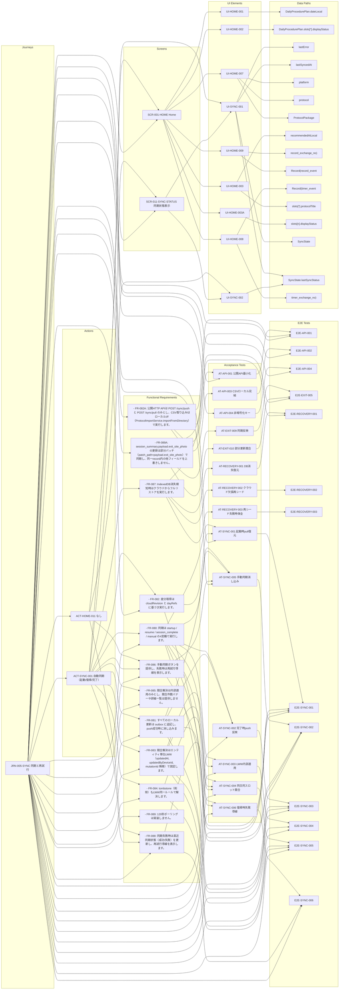

# JRN-005-SYNC マップ

```mermaid
flowchart LR
  %% JRN-005-SYNC
  subgraph JRN["Journeys"]
    N58["JRN-005-SYNC 同期と再試行"]
  end
  subgraph ACT["Actions"]
    N1["ACT-HOME-011 なし"]
    N2["ACT-SYNC-001 自動同期（起動/復帰/完了）"]
  end
  subgraph SCR["Screens"]
    N59["SCR-001-HOME Home"]
    N60["SCR-011-SYNC-STATUS 同期状態表示"]
  end
  subgraph UI["UI Elements"]
    N61["UI-HOME-001"]
    N62["UI-HOME-002"]
    N63["UI-HOME-003"]
    N64["UI-HOME-003A"]
    N65["UI-HOME-007"]
    N66["UI-HOME-008"]
    N67["UI-HOME-009"]
    N68["UI-SYNC-001"]
    N69["UI-SYNC-002"]
  end
  subgraph FR["Functional Requirements"]
    N46["- FR-080: 同期は startup / resume / session_complete / manual の4契機で実行します。"]
    N47["- FR-081: すべてのローカル更新は outbox に追記し、push成功時に消し込みます。"]
    N48["- FR-082: 差分取得は cloudRevision と dayRefs に基づき実行します。"]
    N49["- FR-082A: 公開HTTP APIは POST /sync/push と POST /sync/pull のみとし、CSV取り込みはローカルI/F（ProtocolImportService.importFromDirectory）で実行します。"]
    N50["- FR-083: 競合解決はエンティティ単位LWW（updatedAt, updatedByDeviceId, mutationId 降順）で固定します。"]
    N51["- FR-084: tombstone（削除）もLWW同一ルールで解決します。"]
    N52["- FR-085: 競合解決は内部適用のみとし、競合件数バナーや詳細一覧は提供しません。"]
    N53["- FR-086: 手動同期ボタンを提供し、失敗時は再試行導線を表示します。"]
    N54["- FR-087: IndexedDB消失検知時はクラウドからフルリストアを実行します。"]
    N55["- FR-088: 同期失敗時は直近同期状態（成功/失敗）を更新し、再試行導線を表示します。"]
    N56["- FR-089: 120秒ポーリング は実装しません。"]
    N57["- FR-089A: session_summary.payload.exit_site_photo の更新は部分パッチ（patch_path=payload.exit_site_photo）で同期し、同一record内の他フィールドを上書きしません。"]
  end
  subgraph AT["Acceptance Tests"]
    N3["AT-API-001 公開API最小化"]
    N4["AT-API-003 CSVローカル完結"]
    N5["AT-API-004 非暗号化キー"]
    N6["AT-EXIT-009 同期反映"]
    N7["AT-EXIT-010 部分更新競合"]
    N8["AT-RECOVERY-001 DB消失復元"]
    N9["AT-RECOVERY-002 クラウド欠損再シード"]
    N10["AT-RECOVERY-003 再シード失敗時保全"]
    N11["AT-SYNC-001 起動時pull復元"]
    N12["AT-SYNC-002 完了時push反映"]
    N13["AT-SYNC-003 LWW内部適用"]
    N14["AT-SYNC-004 同日同スロット競合"]
    N15["AT-SYNC-005 手動同期消し込み"]
    N16["AT-SYNC-006 復帰時失敗導線"]
  end
  subgraph E2E["E2E Tests"]
    N33["E2E-API-001"]
    N34["E2E-API-002"]
    N35["E2E-API-004"]
    N36["E2E-EXIT-005"]
    N37["E2E-RECOVERY-001"]
    N38["E2E-RECOVERY-002"]
    N39["E2E-RECOVERY-003"]
    N40["E2E-SYNC-001"]
    N41["E2E-SYNC-002"]
    N42["E2E-SYNC-003"]
    N43["E2E-SYNC-004"]
    N44["E2E-SYNC-005"]
    N45["E2E-SYNC-006"]
  end
  subgraph DATA["Data Paths"]
    N17["DailyProcedurePlan.dateLocal"]
    N18["DailyProcedurePlan.slots[*].displayStatus"]
    N19["lastError"]
    N20["lastSyncedAt"]
    N21["platform"]
    N22["protocol"]
    N23["ProtocolPackage"]
    N24["recommendedAtLocal"]
    N25["record_exchange_no)"]
    N26["Record(record_event"]
    N27["Record(timer_event"]
    N28["slots[*].protocolTitle"]
    N29["slots[n].displayStatus"]
    N30["SyncState"]
    N31["SyncState.lastSyncStatus"]
    N32["timer_exchange_no)"]
  end
  N1 --> N53
  N1 --> N55
  N1 --> N59
  N1 --> N69
  N2 --> N46
  N2 --> N47
  N2 --> N48
  N2 --> N50
  N2 --> N51
  N2 --> N52
  N2 --> N53
  N2 --> N54
  N2 --> N55
  N2 --> N60
  N2 --> N68
  N3 --> N33
  N4 --> N34
  N5 --> N35
  N6 --> N36
  N7 --> N36
  N8 --> N37
  N9 --> N38
  N10 --> N39
  N11 --> N40
  N12 --> N42
  N13 --> N43
  N14 --> N44
  N15 --> N41
  N16 --> N45
  N46 --> N11
  N46 --> N12
  N46 --> N13
  N46 --> N14
  N46 --> N15
  N46 --> N16
  N46 --> N40
  N46 --> N42
  N47 --> N12
  N47 --> N15
  N47 --> N41
  N47 --> N42
  N48 --> N11
  N48 --> N40
  N49 --> N3
  N49 --> N4
  N49 --> N33
  N49 --> N34
  N50 --> N13
  N50 --> N14
  N50 --> N43
  N50 --> N44
  N51 --> N14
  N51 --> N44
  N53 --> N15
  N53 --> N41
  N54 --> N8
  N54 --> N9
  N54 --> N10
  N54 --> N37
  N55 --> N16
  N55 --> N45
  N57 --> N6
  N57 --> N7
  N57 --> N36
  N58 --> N1
  N58 --> N2
  N58 --> N3
  N58 --> N5
  N58 --> N11
  N58 --> N12
  N58 --> N13
  N58 --> N14
  N58 --> N15
  N58 --> N16
  N58 --> N33
  N58 --> N35
  N58 --> N40
  N58 --> N41
  N58 --> N42
  N58 --> N43
  N58 --> N44
  N58 --> N45
  N58 --> N46
  N58 --> N47
  N58 --> N48
  N58 --> N49
  N58 --> N50
  N58 --> N51
  N58 --> N52
  N58 --> N53
  N58 --> N55
  N58 --> N56
  N58 --> N57
  N58 --> N59
  N58 --> N60
  N59 --> N61
  N59 --> N62
  N59 --> N63
  N59 --> N64
  N59 --> N65
  N59 --> N66
  N59 --> N67
  N60 --> N68
  N60 --> N69
  N61 --> N17
  N62 --> N18
  N63 --> N24
  N63 --> N28
  N64 --> N29
  N65 --> N21
  N65 --> N22
  N65 --> N23
  N66 --> N27
  N66 --> N32
  N67 --> N25
  N67 --> N26
  N68 --> N19
  N68 --> N20
  N68 --> N30
  N68 --> N31
  N69 --> N31
```

