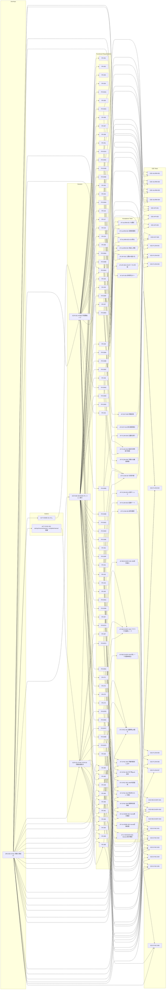

# JRN-005-SYNC マップ

```mermaid
flowchart LR
  %% JRN-005-SYNC
  subgraph JRN["Journeys"]
    N133["JRN-005-SYNC 同期と再試行"]
  end
  subgraph ACT["Actions"]
    N1["ACT-HOME-011 なし"]
    N2["ACT-SYNC-001 startup/resume/session_complete/manual 契機"]
  end
  subgraph SCR["Screens"]
    N134["SCR-001-HOME 手技開始ハブ"]
    N135["SCR-006-SESSION セッション進行"]
    N136["SCR-011-SYNC-STATUS 同期状態表示"]
  end
  subgraph FR["Functional Requirements"]
    N55["FR-001"]
    N56["FR-002"]
    N57["FR-003"]
    N58["FR-004"]
    N59["FR-004A"]
    N60["FR-005"]
    N61["FR-005A"]
    N62["FR-006"]
    N63["FR-007"]
    N64["FR-008"]
    N65["FR-009A"]
    N66["FR-009B"]
    N67["FR-009C"]
    N68["FR-009D"]
    N69["FR-009E"]
    N70["FR-009F"]
    N71["FR-009G"]
    N72["FR-009H"]
    N73["FR-016"]
    N74["FR-017"]
    N75["FR-018"]
    N76["FR-019"]
    N77["FR-030"]
    N78["FR-031"]
    N79["FR-032"]
    N80["FR-033"]
    N81["FR-034"]
    N82["FR-035"]
    N83["FR-036"]
    N84["FR-037"]
    N85["FR-038"]
    N86["FR-039"]
    N87["FR-039A"]
    N88["FR-039B"]
    N89["FR-039C"]
    N90["FR-039D"]
    N91["FR-039E"]
    N92["FR-039F"]
    N93["FR-039G"]
    N94["FR-042"]
    N95["FR-050A"]
    N96["FR-050B"]
    N97["FR-050C"]
    N98["FR-050D"]
    N99["FR-051"]
    N100["FR-052"]
    N101["FR-052A"]
    N102["FR-052B"]
    N103["FR-053"]
    N104["FR-054"]
    N105["FR-055"]
    N106["FR-055A"]
    N107["FR-055B"]
    N108["FR-057"]
    N109["FR-057A"]
    N110["FR-058"]
    N111["FR-058A"]
    N112["FR-058B"]
    N113["FR-071"]
    N114["FR-072"]
    N115["FR-073"]
    N116["FR-074"]
    N117["FR-080"]
    N118["FR-081"]
    N119["FR-082"]
    N120["FR-082A"]
    N121["FR-083"]
    N122["FR-084"]
    N123["FR-085"]
    N124["FR-086"]
    N125["FR-087"]
    N126["FR-087A"]
    N127["FR-087B"]
    N128["FR-087C"]
    N129["FR-087D"]
    N130["FR-088"]
    N131["FR-089"]
    N132["FR-089A"]
  end
  subgraph AT["Acceptance Tests"]
    N3["AT-ALARM-001 T0通知"]
    N4["AT-ALARM-002 段階再通知"]
    N5["AT-ALARM-003 ACK停止"]
    N6["AT-ALARM-004 見逃し状態"]
    N7["AT-API-001 公開API最小化"]
    N8["AT-API-003 CSVローカル完結"]
    N9["AT-API-004 非暗号化キー"]
    N10["AT-EXIT-009 同期反映"]
    N11["AT-EXIT-010 部分更新競合"]
    N12["AT-FLOW-001 必須チェック"]
    N13["AT-FLOW-002 記録ゲート"]
    N14["AT-FLOW-003 直列遷移"]
    N15["AT-FLOW-004 端末内同時実行制限"]
    N16["AT-FLOW-005 左優先実行"]
    N17["AT-FLOW-006 予期せぬ離脱再開"]
    N18["AT-FLOW-007 非常中断"]
    N19["AT-RECOVERY-001 DB消失復元"]
    N20["AT-RECOVERY-002 クラウド欠損再シード"]
    N21["AT-RECOVERY-003 再シード失敗時保全"]
    N22["AT-SYNC-001 起動時pull復元"]
    N23["AT-SYNC-002 完了時push反映"]
    N24["AT-SYNC-003 LWW内部適用"]
    N25["AT-SYNC-004 同日同スロット競合"]
    N26["AT-SYNC-005 手動同期消し込み"]
    N27["AT-SYNC-006 復帰時失敗導線"]
    N28["AT-UI-HOME-001 Home表示確認"]
    N29["AT-UI-HOME-002 Home初期状態"]
    N30["AT-UI-SESSION-001 Session表示確認"]
  end
  subgraph E2E["E2E Tests"]
    N31["E2E-ALARM-001"]
    N32["E2E-ALARM-002"]
    N33["E2E-ALARM-003"]
    N34["E2E-ALARM-004"]
    N35["E2E-API-001"]
    N36["E2E-API-002"]
    N37["E2E-API-004"]
    N38["E2E-EXIT-005"]
    N39["E2E-FLOW-001"]
    N40["E2E-FLOW-002"]
    N41["E2E-FLOW-003"]
    N42["E2E-FLOW-004"]
    N43["E2E-FLOW-005"]
    N44["E2E-FLOW-006"]
    N45["E2E-FLOW-007"]
    N46["E2E-RECOVERY-001"]
    N47["E2E-RECOVERY-002"]
    N48["E2E-RECOVERY-003"]
    N49["E2E-SYNC-001"]
    N50["E2E-SYNC-002"]
    N51["E2E-SYNC-003"]
    N52["E2E-SYNC-004"]
    N53["E2E-SYNC-005"]
    N54["E2E-SYNC-006"]
  end
  N1 --> N134
  N2 --> N136
  N3 --> N31
  N4 --> N32
  N5 --> N33
  N6 --> N34
  N7 --> N35
  N8 --> N36
  N9 --> N37
  N10 --> N38
  N11 --> N38
  N12 --> N43
  N13 --> N44
  N14 --> N45
  N15 --> N40
  N16 --> N39
  N17 --> N41
  N18 --> N42
  N19 --> N46
  N20 --> N47
  N21 --> N48
  N22 --> N49
  N23 --> N51
  N24 --> N52
  N25 --> N53
  N26 --> N50
  N27 --> N54
  N61 --> N28
  N65 --> N28
  N66 --> N28
  N68 --> N16
  N68 --> N29
  N68 --> N39
  N70 --> N15
  N70 --> N40
  N71 --> N17
  N71 --> N41
  N77 --> N30
  N78 --> N12
  N78 --> N43
  N79 --> N13
  N79 --> N44
  N80 --> N14
  N80 --> N45
  N83 --> N15
  N83 --> N40
  N85 --> N30
  N90 --> N18
  N90 --> N42
  N91 --> N18
  N91 --> N42
  N92 --> N18
  N92 --> N42
  N95 --> N3
  N95 --> N31
  N99 --> N3
  N99 --> N31
  N101 --> N4
  N101 --> N32
  N102 --> N4
  N102 --> N32
  N103 --> N5
  N103 --> N33
  N104 --> N5
  N104 --> N33
  N110 --> N6
  N110 --> N34
  N111 --> N6
  N111 --> N34
  N112 --> N6
  N112 --> N34
  N117 --> N22
  N117 --> N23
  N117 --> N49
  N117 --> N51
  N118 --> N23
  N118 --> N26
  N118 --> N50
  N118 --> N51
  N119 --> N22
  N119 --> N49
  N120 --> N7
  N120 --> N8
  N120 --> N35
  N120 --> N36
  N121 --> N24
  N121 --> N25
  N121 --> N52
  N121 --> N53
  N122 --> N25
  N122 --> N53
  N124 --> N26
  N124 --> N50
  N125 --> N19
  N125 --> N46
  N126 --> N20
  N126 --> N47
  N127 --> N20
  N127 --> N47
  N128 --> N20
  N128 --> N47
  N129 --> N21
  N129 --> N48
  N130 --> N27
  N130 --> N54
  N132 --> N10
  N132 --> N11
  N132 --> N38
  N133 --> N1
  N133 --> N2
  N133 --> N7
  N133 --> N9
  N133 --> N22
  N133 --> N23
  N133 --> N24
  N133 --> N25
  N133 --> N26
  N133 --> N27
  N133 --> N35
  N133 --> N37
  N133 --> N49
  N133 --> N50
  N133 --> N51
  N133 --> N52
  N133 --> N53
  N133 --> N54
  N133 --> N117
  N133 --> N118
  N133 --> N119
  N133 --> N120
  N133 --> N121
  N133 --> N122
  N133 --> N123
  N133 --> N124
  N133 --> N130
  N133 --> N131
  N133 --> N132
  N133 --> N134
  N133 --> N135
  N133 --> N136
  N134 --> N55
  N134 --> N56
  N134 --> N57
  N134 --> N58
  N134 --> N59
  N134 --> N60
  N134 --> N61
  N134 --> N62
  N134 --> N63
  N134 --> N64
  N134 --> N65
  N134 --> N66
  N134 --> N67
  N134 --> N68
  N134 --> N69
  N134 --> N70
  N134 --> N71
  N134 --> N72
  N134 --> N73
  N134 --> N74
  N134 --> N75
  N134 --> N76
  N134 --> N94
  N134 --> N124
  N134 --> N130
  N135 --> N77
  N135 --> N78
  N135 --> N79
  N135 --> N80
  N135 --> N81
  N135 --> N82
  N135 --> N83
  N135 --> N84
  N135 --> N85
  N135 --> N86
  N135 --> N87
  N135 --> N88
  N135 --> N89
  N135 --> N90
  N135 --> N91
  N135 --> N92
  N135 --> N93
  N135 --> N95
  N135 --> N96
  N135 --> N97
  N135 --> N98
  N135 --> N99
  N135 --> N100
  N135 --> N101
  N135 --> N102
  N135 --> N103
  N135 --> N104
  N135 --> N105
  N135 --> N106
  N135 --> N107
  N135 --> N108
  N135 --> N109
  N135 --> N110
  N135 --> N111
  N135 --> N112
  N135 --> N113
  N135 --> N114
  N135 --> N115
  N135 --> N116
  N136 --> N117
  N136 --> N118
  N136 --> N119
  N136 --> N120
  N136 --> N121
  N136 --> N122
  N136 --> N123
  N136 --> N125
  N136 --> N126
  N136 --> N127
  N136 --> N128
  N136 --> N129
  N136 --> N131
```

