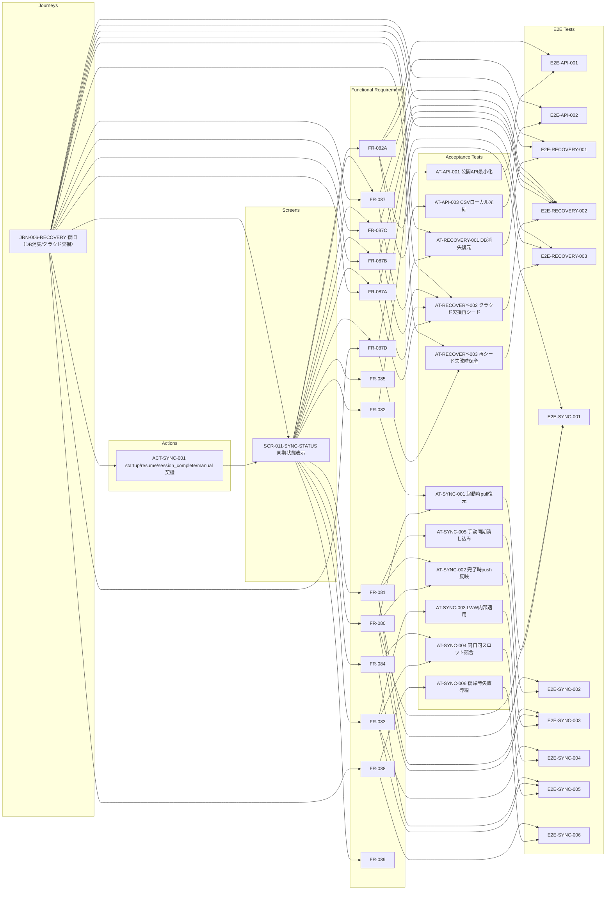

# JRN-006-RECOVERY マップ

```mermaid
flowchart LR
  %% JRN-006-RECOVERY
  subgraph JRN["Journeys"]
    N38["JRN-006-RECOVERY 復旧（DB消失/クラウド欠損）"]
  end
  subgraph ACT["Actions"]
    N1["ACT-SYNC-001 startup/resume/session_complete/manual 契機"]
  end
  subgraph SCR["Screens"]
    N39["SCR-011-SYNC-STATUS 同期状態表示"]
  end
  subgraph FR["Functional Requirements"]
    N24["FR-080"]
    N25["FR-081"]
    N26["FR-082"]
    N27["FR-082A"]
    N28["FR-083"]
    N29["FR-084"]
    N30["FR-085"]
    N31["FR-087"]
    N32["FR-087A"]
    N33["FR-087B"]
    N34["FR-087C"]
    N35["FR-087D"]
    N36["FR-088"]
    N37["FR-089"]
  end
  subgraph AT["Acceptance Tests"]
    N2["AT-API-001 公開API最小化"]
    N3["AT-API-003 CSVローカル完結"]
    N4["AT-RECOVERY-001 DB消失復元"]
    N5["AT-RECOVERY-002 クラウド欠損再シード"]
    N6["AT-RECOVERY-003 再シード失敗時保全"]
    N7["AT-SYNC-001 起動時pull復元"]
    N8["AT-SYNC-002 完了時push反映"]
    N9["AT-SYNC-003 LWW内部適用"]
    N10["AT-SYNC-004 同日同スロット競合"]
    N11["AT-SYNC-005 手動同期消し込み"]
    N12["AT-SYNC-006 復帰時失敗導線"]
  end
  subgraph E2E["E2E Tests"]
    N13["E2E-API-001"]
    N14["E2E-API-002"]
    N15["E2E-RECOVERY-001"]
    N16["E2E-RECOVERY-002"]
    N17["E2E-RECOVERY-003"]
    N18["E2E-SYNC-001"]
    N19["E2E-SYNC-002"]
    N20["E2E-SYNC-003"]
    N21["E2E-SYNC-004"]
    N22["E2E-SYNC-005"]
    N23["E2E-SYNC-006"]
  end
  N1 --> N39
  N2 --> N13
  N3 --> N14
  N4 --> N15
  N5 --> N16
  N6 --> N17
  N7 --> N18
  N8 --> N20
  N9 --> N21
  N10 --> N22
  N11 --> N19
  N12 --> N23
  N24 --> N7
  N24 --> N8
  N24 --> N18
  N24 --> N20
  N25 --> N8
  N25 --> N11
  N25 --> N19
  N25 --> N20
  N26 --> N7
  N26 --> N18
  N27 --> N2
  N27 --> N3
  N27 --> N13
  N27 --> N14
  N28 --> N9
  N28 --> N10
  N28 --> N21
  N28 --> N22
  N29 --> N10
  N29 --> N22
  N31 --> N4
  N31 --> N15
  N32 --> N5
  N32 --> N16
  N33 --> N5
  N33 --> N16
  N34 --> N5
  N34 --> N16
  N35 --> N6
  N35 --> N17
  N36 --> N12
  N36 --> N23
  N38 --> N1
  N38 --> N4
  N38 --> N5
  N38 --> N6
  N38 --> N15
  N38 --> N16
  N38 --> N17
  N38 --> N31
  N38 --> N32
  N38 --> N33
  N38 --> N34
  N38 --> N35
  N38 --> N36
  N38 --> N39
  N39 --> N24
  N39 --> N25
  N39 --> N26
  N39 --> N27
  N39 --> N28
  N39 --> N29
  N39 --> N30
  N39 --> N31
  N39 --> N32
  N39 --> N33
  N39 --> N34
  N39 --> N35
  N39 --> N37
```

