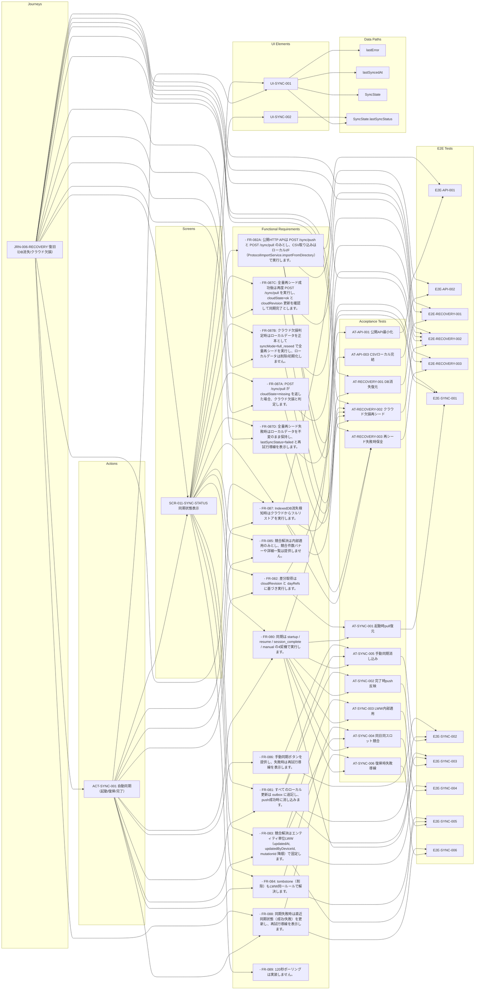

# JRN-006-RECOVERY マップ

```mermaid
flowchart LR
  %% JRN-006-RECOVERY
  subgraph JRN["Journeys"]
    N43["JRN-006-RECOVERY 復旧（DB消失/クラウド欠損）"]
  end
  subgraph ACT["Actions"]
    N1["ACT-SYNC-001 自動同期（起動/復帰/完了）"]
  end
  subgraph SCR["Screens"]
    N44["SCR-011-SYNC-STATUS 同期状態表示"]
  end
  subgraph UI["UI Elements"]
    N45["UI-SYNC-001"]
    N46["UI-SYNC-002"]
  end
  subgraph FR["Functional Requirements"]
    N28["- FR-080: 同期は startup / resume / session_complete / manual の4契機で実行します。"]
    N29["- FR-081: すべてのローカル更新は outbox に追記し、push成功時に消し込みます。"]
    N30["- FR-082: 差分取得は cloudRevision と dayRefs に基づき実行します。"]
    N31["- FR-082A: 公開HTTP APIは POST /sync/push と POST /sync/pull のみとし、CSV取り込みはローカルI/F（ProtocolImportService.importFromDirectory）で実行します。"]
    N32["- FR-083: 競合解決はエンティティ単位LWW（updatedAt, updatedByDeviceId, mutationId 降順）で固定します。"]
    N33["- FR-084: tombstone（削除）もLWW同一ルールで解決します。"]
    N34["- FR-085: 競合解決は内部適用のみとし、競合件数バナーや詳細一覧は提供しません。"]
    N35["- FR-086: 手動同期ボタンを提供し、失敗時は再試行導線を表示します。"]
    N36["- FR-087: IndexedDB消失検知時はクラウドからフルリストアを実行します。"]
    N37["- FR-087A: POST /sync/pull が cloudState=missing を返した場合、クラウド欠損と判定します。"]
    N38["- FR-087B: クラウド欠損判定時はローカルデータを正本として syncMode=full_reseed で全量再シードを実行し、ローカルデータは削除/初期化しません。"]
    N39["- FR-087C: 全量再シード成功後は再度 POST /sync/pull を実行し、cloudState=ok と cloudRevision 更新を確認して同期完了とします。"]
    N40["- FR-087D: 全量再シード失敗時はローカルデータを不変のまま保持し、lastSyncStatus=failed と再試行導線を表示します。"]
    N41["- FR-088: 同期失敗時は直近同期状態（成功/失敗）を更新し、再試行導線を表示します。"]
    N42["- FR-089: 120秒ポーリング は実装しません。"]
  end
  subgraph AT["Acceptance Tests"]
    N2["AT-API-001 公開API最小化"]
    N3["AT-API-003 CSVローカル完結"]
    N4["AT-RECOVERY-001 DB消失復元"]
    N5["AT-RECOVERY-002 クラウド欠損再シード"]
    N6["AT-RECOVERY-003 再シード失敗時保全"]
    N7["AT-SYNC-001 起動時pull復元"]
    N8["AT-SYNC-002 完了時push反映"]
    N9["AT-SYNC-003 LWW内部適用"]
    N10["AT-SYNC-004 同日同スロット競合"]
    N11["AT-SYNC-005 手動同期消し込み"]
    N12["AT-SYNC-006 復帰時失敗導線"]
  end
  subgraph E2E["E2E Tests"]
    N17["E2E-API-001"]
    N18["E2E-API-002"]
    N19["E2E-RECOVERY-001"]
    N20["E2E-RECOVERY-002"]
    N21["E2E-RECOVERY-003"]
    N22["E2E-SYNC-001"]
    N23["E2E-SYNC-002"]
    N24["E2E-SYNC-003"]
    N25["E2E-SYNC-004"]
    N26["E2E-SYNC-005"]
    N27["E2E-SYNC-006"]
  end
  subgraph DATA["Data Paths"]
    N13["lastError"]
    N14["lastSyncedAt"]
    N15["SyncState"]
    N16["SyncState.lastSyncStatus"]
  end
  N1 --> N28
  N1 --> N29
  N1 --> N30
  N1 --> N32
  N1 --> N33
  N1 --> N34
  N1 --> N35
  N1 --> N36
  N1 --> N41
  N1 --> N44
  N1 --> N45
  N2 --> N17
  N3 --> N18
  N4 --> N19
  N5 --> N20
  N6 --> N21
  N7 --> N22
  N8 --> N24
  N9 --> N25
  N10 --> N26
  N11 --> N23
  N12 --> N27
  N28 --> N7
  N28 --> N8
  N28 --> N9
  N28 --> N10
  N28 --> N11
  N28 --> N12
  N28 --> N22
  N28 --> N24
  N29 --> N8
  N29 --> N11
  N29 --> N23
  N29 --> N24
  N30 --> N7
  N30 --> N22
  N31 --> N2
  N31 --> N3
  N31 --> N17
  N31 --> N18
  N32 --> N9
  N32 --> N10
  N32 --> N25
  N32 --> N26
  N33 --> N10
  N33 --> N26
  N35 --> N11
  N35 --> N23
  N36 --> N4
  N36 --> N5
  N36 --> N6
  N36 --> N19
  N37 --> N5
  N37 --> N20
  N38 --> N5
  N38 --> N20
  N39 --> N5
  N39 --> N20
  N40 --> N6
  N40 --> N21
  N41 --> N12
  N41 --> N27
  N43 --> N1
  N43 --> N4
  N43 --> N5
  N43 --> N6
  N43 --> N19
  N43 --> N20
  N43 --> N21
  N43 --> N36
  N43 --> N37
  N43 --> N38
  N43 --> N39
  N43 --> N40
  N43 --> N41
  N43 --> N44
  N44 --> N28
  N44 --> N29
  N44 --> N30
  N44 --> N31
  N44 --> N32
  N44 --> N33
  N44 --> N34
  N44 --> N36
  N44 --> N37
  N44 --> N38
  N44 --> N39
  N44 --> N40
  N44 --> N42
  N44 --> N45
  N44 --> N46
  N45 --> N13
  N45 --> N14
  N45 --> N15
  N45 --> N16
  N46 --> N16
```

