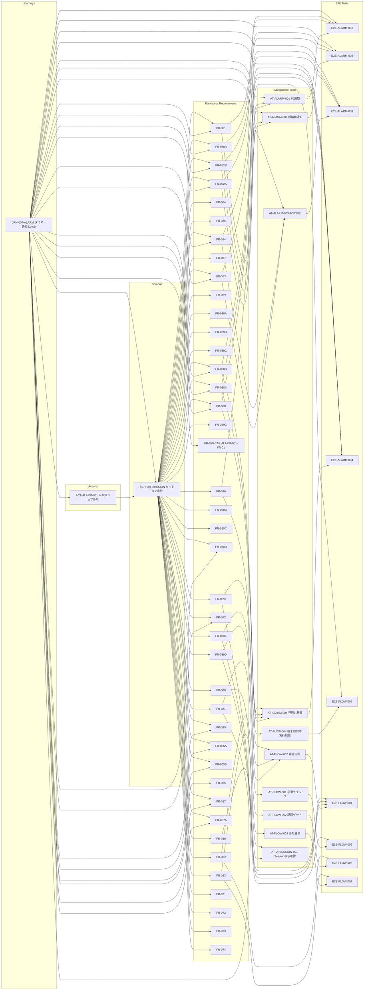

# JRN-007-ALARM マップ

```mermaid
flowchart LR
  %% JRN-007-ALARM
  subgraph JRN["Journeys"]
    N62["JRN-007-ALARM タイマー通知とACK"]
  end
  subgraph ACT["Actions"]
    N1["ACT-ALARM-001 未ACKジョブあり"]
  end
  subgraph SCR["Screens"]
    N63["SCR-006-SESSION セッション進行"]
  end
  subgraph FR["Functional Requirements"]
    N21["FR-030"]
    N22["FR-031"]
    N23["FR-032"]
    N24["FR-033"]
    N25["FR-034"]
    N26["FR-035"]
    N27["FR-036"]
    N28["FR-037"]
    N29["FR-038"]
    N30["FR-039"]
    N31["FR-039A"]
    N32["FR-039B"]
    N33["FR-039C"]
    N34["FR-039D"]
    N35["FR-039E"]
    N36["FR-039F"]
    N37["FR-039G"]
    N38["FR-050 CAP-ALARM-001-FR-01"]
    N39["FR-050A"]
    N40["FR-050B"]
    N41["FR-050C"]
    N42["FR-050D"]
    N43["FR-051"]
    N44["FR-052"]
    N45["FR-052A"]
    N46["FR-052B"]
    N47["FR-053"]
    N48["FR-054"]
    N49["FR-055"]
    N50["FR-055A"]
    N51["FR-055B"]
    N52["FR-056"]
    N53["FR-057"]
    N54["FR-057A"]
    N55["FR-058"]
    N56["FR-058A"]
    N57["FR-058B"]
    N58["FR-071"]
    N59["FR-072"]
    N60["FR-073"]
    N61["FR-074"]
  end
  subgraph AT["Acceptance Tests"]
    N2["AT-ALARM-001 T0通知"]
    N3["AT-ALARM-002 段階再通知"]
    N4["AT-ALARM-003 ACK停止"]
    N5["AT-ALARM-004 見逃し状態"]
    N6["AT-FLOW-001 必須チェック"]
    N7["AT-FLOW-002 記録ゲート"]
    N8["AT-FLOW-003 直列遷移"]
    N9["AT-FLOW-004 端末内同時実行制限"]
    N10["AT-FLOW-007 非常中断"]
    N11["AT-UI-SESSION-001 Session表示確認"]
  end
  subgraph E2E["E2E Tests"]
    N12["E2E-ALARM-001"]
    N13["E2E-ALARM-002"]
    N14["E2E-ALARM-003"]
    N15["E2E-ALARM-004"]
    N16["E2E-FLOW-002"]
    N17["E2E-FLOW-004"]
    N18["E2E-FLOW-005"]
    N19["E2E-FLOW-006"]
    N20["E2E-FLOW-007"]
  end
  N1 --> N63
  N2 --> N12
  N3 --> N13
  N4 --> N14
  N5 --> N15
  N6 --> N18
  N7 --> N19
  N8 --> N20
  N9 --> N16
  N10 --> N17
  N21 --> N11
  N22 --> N6
  N22 --> N18
  N23 --> N7
  N23 --> N19
  N24 --> N8
  N24 --> N20
  N27 --> N9
  N27 --> N16
  N29 --> N11
  N34 --> N10
  N34 --> N17
  N35 --> N10
  N35 --> N17
  N36 --> N10
  N36 --> N17
  N39 --> N2
  N39 --> N12
  N43 --> N2
  N43 --> N12
  N45 --> N3
  N45 --> N13
  N46 --> N3
  N46 --> N13
  N47 --> N4
  N47 --> N14
  N48 --> N4
  N48 --> N14
  N55 --> N5
  N55 --> N15
  N56 --> N5
  N56 --> N15
  N57 --> N5
  N57 --> N15
  N62 --> N1
  N62 --> N2
  N62 --> N3
  N62 --> N4
  N62 --> N5
  N62 --> N12
  N62 --> N13
  N62 --> N14
  N62 --> N15
  N62 --> N38
  N62 --> N39
  N62 --> N42
  N62 --> N43
  N62 --> N44
  N62 --> N45
  N62 --> N46
  N62 --> N47
  N62 --> N48
  N62 --> N49
  N62 --> N50
  N62 --> N51
  N62 --> N52
  N62 --> N53
  N62 --> N54
  N62 --> N55
  N62 --> N56
  N62 --> N57
  N62 --> N63
  N63 --> N21
  N63 --> N22
  N63 --> N23
  N63 --> N24
  N63 --> N25
  N63 --> N26
  N63 --> N27
  N63 --> N28
  N63 --> N29
  N63 --> N30
  N63 --> N31
  N63 --> N32
  N63 --> N33
  N63 --> N34
  N63 --> N35
  N63 --> N36
  N63 --> N37
  N63 --> N39
  N63 --> N40
  N63 --> N41
  N63 --> N42
  N63 --> N43
  N63 --> N44
  N63 --> N45
  N63 --> N46
  N63 --> N47
  N63 --> N48
  N63 --> N49
  N63 --> N50
  N63 --> N51
  N63 --> N53
  N63 --> N54
  N63 --> N55
  N63 --> N56
  N63 --> N57
  N63 --> N58
  N63 --> N59
  N63 --> N60
  N63 --> N61
```

