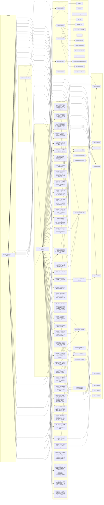

# JRN-007-ALARM マップ

```mermaid
flowchart LR
  %% JRN-007-ALARM
  subgraph JRN["Journeys"]
    N76["JRN-007-ALARM タイマー通知とACK"]
  end
  subgraph ACT["Actions"]
    N1["ACT-ALARM-001 ACK"]
  end
  subgraph SCR["Screens"]
    N77["SCR-006-SESSION Session"]
  end
  subgraph UI["UI Elements"]
    N78["UI-SESSION-001"]
    N79["UI-SESSION-002"]
    N80["UI-SESSION-003"]
    N81["UI-SESSION-005"]
    N82["UI-SESSION-006"]
  end
  subgraph FR["Functional Requirements"]
    N35["- FR-030: 現在ステップのフェーズと状態を常時表示し、タイトルは通し番号付き（例"]
    N36["- FR-031: 必須チェック未完了時に次ステップ遷移を禁止します。"]
    N37["- FR-032: record_event 未完了時に次ステップ遷移を禁止します。"]
    N38["- FR-033: next_step_id に従い完全シリアルで遷移します。"]
    N39["- FR-034: 最終ステップ完了時にセッション完了状態へ遷移します。"]
    N40["- FR-035: セッション開始端末のみ進行更新できます。"]
    N41["- FR-036: 同時実行セッションを端末ごとに1件へ制限します。"]
    N42["- FR-037: セッション画面の手順画像は1"]
    N43["- FR-038: セッション画面は iPhoneで1カラム、Macで2カラム表示に切り替えます。"]
    N44["- FR-039: セッション画面に「戻る」操作を提供し、直前ステップへ表示遷移できます。"]
    N45["- FR-039A: セッション画面の「戻る」と「次へ」は、iPhone/Macの双方で横並び・同幅で表示します。"]
    N46["- FR-039B: 「次へ」「戻る」押下時、および Enter キーによる次ステップ遷移時は、メインパネルを左右スライドで遷移表示します。"]
    N47["- FR-039C: セッション画面のカルーセルは、左右ナビゲーションボタンを表示しません。"]
    N48["- FR-039D: セッション画面右上 ••• メニューに セッションを中断（非常用） を配置します。"]
    N49["- FR-039E: セッションを中断（非常用） は確認ダイアログを経て実行し、中断後はホームへ戻します。"]
    N50["- FR-039F: 明示中断時はセッションを aborted で終了し、対応スロットの表示状態を 未実施 へ戻します。"]
    N51["- FR-039G: ホームのスロットには 前回中断あり の表示を出しません（履歴は記録一覧で確認）。"]
    N52["FR-050 CAP-ALARM-001-FR-01"]
    N53["- FR-050A: 通知対象は timer_event=end の終了イベントとし、timer_segment=dwell/drain を同一ルールで扱います。"]
    N54["- FR-050B: 同一セッション内の通知ジョブは alarm_id 単位で独立管理します。"]
    N55["- FR-050C: 通知ジョブは最低限 alarm_id / segment / due_at / acked_at / attempt_no / status を保持します。"]
    N56["- FR-050D: pendingAlarm は未ACKジョブ（pending/notified/missed）から due_at 最小を優先して1件選択し、同値時は alarm_id 昇順を採用します。"]
    N57["- FR-051: 終了時刻 T0 で Mac ローカル通知（音+バナー）を発火し、同時にアプリ内未確認アラートを固定表示します。"]
    N58["- FR-052: 未確認時は段階再通知を行います。"]
    N59["- FR-052A: 再通知間隔は T+2分（iPhone補助通知1回 + Mac再通知）、T+5分以降（3分間隔でMac+iPhone再通知）とします。"]
    N60["- FR-052B: 段階再通知の対象は「貯留終了（dwell）」「廃液終了（drain）」に限定します。"]
    N61["- FR-053: ACK時は Mac/iPhone の通知ジョブをすべて停止し、acked_at を記録します。"]
    N62["- FR-054: アプリ内アラートは ACK まで継続表示し、通知再送も ACK まで継続します。"]
    N63["- FR-055: 通知チャネルは Mac主チャネル固定 + iPhone補助 とします。"]
    N64["- FR-055A: iPhone未利用かつ離席想定時は「見逃し高リスク」警告を必須表示します。"]
    N65["- FR-055B: iPhone補助通知の利用可否は Push購読状態（登録/無効化）で管理します。"]
    N66["- FR-056: 「戻る」操作、過去ステップ再表示、アプリ再開、通信リトライでは、timer_event(start/end)・record_event・通知ジョブ生成を再発火しません。"]
    N67["- FR-057: 30秒テスト通知は手動実行とし、通知設定変更時・OS更新後・通知不調時に実施できること。"]
    N68["- FR-057A: 手動30秒テストに失敗した場合は、当日を「iPhone補助なし（Mac主導）」として扱います。"]
    N69["- FR-058: T+30分 未確認時は status=missed を永続化し、「見逃し状態」を表示します。"]
    N70["- FR-058A: status=missed になった後も、ACKまで3分間隔の再通知を継続します。"]
    N71["- FR-058B: status=missed は ACK 成功時に acknowledged へ遷移し、通知停止と acked_at 記録を行います。"]
    N72["- FR-071: セッション開始時は SessionProtocolSnapshot をローカル同一トランザクションで保存し、保存失敗時は開始自体を失敗させます。"]
    N73["- FR-072: スナップショットには sourceProtocol(meta)、step定義本文（通し番号/タイトル/文言/必須チェック/timer/alarm/record）、画像 assetKey、assetManifest、snapshotHash を含めます。"]
    N74["- FR-073: セッション表示/再開時は開始時スナップショットを常に優先し、現行テンプレート版へフォールバックしません。"]
    N75["- FR-074: スナップショット欠落またはハッシュ不整合は整合性エラーとして扱い、セッション表示を停止します。"]
  end
  subgraph AT["Acceptance Tests"]
    N2["AT-ALARM-001 T0通知"]
    N3["AT-ALARM-002 段階再通知"]
    N4["AT-ALARM-003 ACK停止"]
    N5["AT-ALARM-004 見逃し状態"]
    N6["AT-FLOW-001 必須チェック"]
    N7["AT-FLOW-002 記録ゲート"]
    N8["AT-FLOW-003 直列遷移"]
    N9["AT-FLOW-004 端末内同時実行制限"]
    N10["AT-FLOW-007 非常中断"]
    N11["AT-UI-SESSION-001 Session表示確認"]
  end
  subgraph E2E["E2E Tests"]
    N26["E2E-ALARM-001"]
    N27["E2E-ALARM-002"]
    N28["E2E-ALARM-003"]
    N29["E2E-ALARM-004"]
    N30["E2E-FLOW-002"]
    N31["E2E-FLOW-004"]
    N32["E2E-FLOW-005"]
    N33["E2E-FLOW-006"]
    N34["E2E-FLOW-007"]
  end
  subgraph DATA["Data Paths"]
    N12["acked_at"]
    N13["alarm_ack"]
    N14["AlarmDispatchJob.pendingAlarm"]
    N15["daily_plan"]
    N16["record完了状態"]
    N17["requiredChecks達成状態"]
    N18["session"]
    N19["session_progress"]
    N20["Session.currentStepId"]
    N21["Session.status=aborted"]
    N22["Session.status=active"]
    N23["SessionProtocolSnapshot.steps[*]"]
    N24["slot.status=pending"]
    N25["steps[*].requiredChecks"]
  end
  N1 --> N61
  N1 --> N62
  N1 --> N77
  N1 --> N82
  N2 --> N26
  N3 --> N27
  N4 --> N28
  N5 --> N29
  N6 --> N32
  N7 --> N33
  N8 --> N34
  N9 --> N30
  N10 --> N31
  N35 --> N6
  N35 --> N7
  N35 --> N8
  N35 --> N11
  N36 --> N6
  N36 --> N32
  N37 --> N7
  N37 --> N33
  N38 --> N8
  N38 --> N34
  N41 --> N9
  N41 --> N30
  N43 --> N11
  N48 --> N10
  N48 --> N31
  N49 --> N10
  N49 --> N31
  N50 --> N10
  N50 --> N31
  N53 --> N2
  N53 --> N3
  N53 --> N4
  N53 --> N5
  N53 --> N26
  N57 --> N2
  N57 --> N26
  N59 --> N3
  N59 --> N27
  N60 --> N3
  N60 --> N27
  N61 --> N4
  N61 --> N28
  N62 --> N4
  N62 --> N28
  N69 --> N5
  N69 --> N29
  N70 --> N5
  N70 --> N29
  N71 --> N5
  N71 --> N29
  N76 --> N1
  N76 --> N2
  N76 --> N3
  N76 --> N4
  N76 --> N5
  N76 --> N26
  N76 --> N27
  N76 --> N28
  N76 --> N29
  N76 --> N52
  N76 --> N53
  N76 --> N56
  N76 --> N57
  N76 --> N58
  N76 --> N59
  N76 --> N60
  N76 --> N61
  N76 --> N62
  N76 --> N63
  N76 --> N64
  N76 --> N65
  N76 --> N66
  N76 --> N67
  N76 --> N68
  N76 --> N69
  N76 --> N70
  N76 --> N71
  N76 --> N77
  N77 --> N35
  N77 --> N36
  N77 --> N37
  N77 --> N38
  N77 --> N39
  N77 --> N40
  N77 --> N41
  N77 --> N42
  N77 --> N43
  N77 --> N44
  N77 --> N45
  N77 --> N46
  N77 --> N47
  N77 --> N48
  N77 --> N49
  N77 --> N50
  N77 --> N51
  N77 --> N53
  N77 --> N54
  N77 --> N55
  N77 --> N56
  N77 --> N57
  N77 --> N58
  N77 --> N59
  N77 --> N60
  N77 --> N61
  N77 --> N62
  N77 --> N63
  N77 --> N64
  N77 --> N65
  N77 --> N67
  N77 --> N68
  N77 --> N69
  N77 --> N70
  N77 --> N71
  N77 --> N72
  N77 --> N73
  N77 --> N74
  N77 --> N75
  N77 --> N78
  N77 --> N79
  N77 --> N80
  N77 --> N81
  N77 --> N82
  N78 --> N23
  N79 --> N25
  N80 --> N16
  N80 --> N17
  N80 --> N19
  N80 --> N20
  N81 --> N15
  N81 --> N18
  N81 --> N21
  N81 --> N22
  N81 --> N24
  N82 --> N12
  N82 --> N13
  N82 --> N14
```

