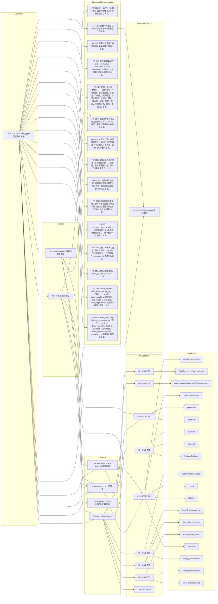

# JRN-008-HISTORY マップ

```mermaid
flowchart LR
  %% JRN-008-HISTORY
  subgraph JRN["Journeys"]
    N38["JRN-008-HISTORY 記録一覧閲覧と編集"]
  end
  subgraph ACT["Actions"]
    N1["ACT-HISTORY-001 写真詳細を開く"]
    N2["ACT-HOME-010 なし"]
  end
  subgraph SCR["Screens"]
    N39["SCR-001-HOME Home"]
    N40["SCR-008-HISTORY 記録一覧"]
    N41["SCR-009-HISTORY-DETAIL 記録詳細"]
    N42["SCR-010-HISTORY-PHOTO 写真詳細"]
  end
  subgraph UI["UI Elements"]
    N43["UI-HISTORY-001"]
    N44["UI-HISTORY-002"]
    N45["UI-HOME-001"]
    N46["UI-HOME-002"]
    N47["UI-HOME-003"]
    N48["UI-HOME-003A"]
    N49["UI-HOME-007"]
    N50["UI-HOME-008"]
    N51["UI-HOME-009"]
  end
  subgraph FR["Functional Requirements"]
    N23["- FR-006: ホームから「記録一覧」画面へ遷移できる導線を提供します。"]
    N24["- FR-010: 記録一覧画面で日々の手技記録を一覧表示します。"]
    N25["- FR-011: 記録一覧画面で詳細表示と編集導線を提供します。"]
    N26["- FR-012: 記録編集はLWWメタ（updatedAt, updatedByDeviceId, mutationId）を保持して競合解決可能な状態にします。"]
    N27["- FR-013: 記録一覧にはCAPDノート準拠項目（貯留時間、透析液濃度、排液量、注液量、排液時間、排液の確認、除水量、尿量、飲水量、体重、排便、血圧、出口部状態、備考）を表示します。"]
    N28["- FR-014: 写真はサムネイル固定表示ではなく、リンク押下で写真詳細画面へ遷移します。"]
    N29["- FR-014A: 記録一覧には既存写真列とは別に 出口部写真 列を追加し、未登録 / 表示 を切り替えます。"]
    N30["- FR-015: 交換ごとの除水量と1日の総除水量は、排液量 - 前回注液量 の差し引きで自動計算表示します。"]
    N31["- FR-015A: 初回交換（#1列）は前回注液量が存在しないため、除水量は 未計算 表示とします。"]
    N32["- FR-015B: 1日の総除水量は、計算可能な交換（#2列以降で前回注液量が存在する交換）のみを合算します。"]
    N33["- FR-015C: opening_infuse_weight_g（初期注液量）は v1 では空欄許容とし、除水量計算に使用しません。"]
    N34["- FR-016: 当日ノート表と記録一覧の交換列は #1〜#5 の5列固定とし、列位置は *_exchange_no で決定します。"]
    N35["- FR-017: 透析液濃度欄は、取り込みCSVのタイトル（例"]
    N36["- FR-018: record_event の値は record_exchange_no で列マッピングし、drain_weight_g は排液量、bag_weight_g は注液量、drain_appearance は排液の確認に表示します。"]
    N37["- FR-019: timer_event の値は timer_exchange_no で列マッピングし、timer_segment=dwell の start/end は貯留時間、timer_segment=drain の start/end は排液時間に表示します。"]
  end
  subgraph AT["Acceptance Tests"]
    N3["AT-UI-HOME-001 Home表示確認"]
  end
  subgraph DATA["Data Paths"]
    N4["dailyProcedurePlan"]
    N5["DailyProcedurePlan.dateLocal"]
    N6["DailyProcedurePlan.slots[*].displayStatus"]
    N7["DayBundle.records"]
    N8["photoRefs"]
    N9["photos/*"]
    N10["platform"]
    N11["protocol"]
    N12["ProtocolPackage"]
    N13["recommendedAtLocal"]
    N14["record"]
    N15["Record"]
    N16["record_exchange_no)"]
    N17["Record(record_event"]
    N18["Record(timer_event"]
    N19["sessions"]
    N20["slots[*].protocolTitle"]
    N21["slots[n].displayStatus"]
    N22["timer_exchange_no)"]
  end
  N1 --> N28
  N1 --> N40
  N1 --> N42
  N1 --> N44
  N2 --> N23
  N2 --> N39
  N2 --> N40
  N2 --> N43
  N24 --> N3
  N38 --> N1
  N38 --> N2
  N38 --> N3
  N38 --> N24
  N38 --> N25
  N38 --> N26
  N38 --> N27
  N38 --> N28
  N38 --> N29
  N38 --> N30
  N38 --> N31
  N38 --> N32
  N38 --> N33
  N38 --> N34
  N38 --> N35
  N38 --> N36
  N38 --> N37
  N38 --> N39
  N38 --> N40
  N38 --> N41
  N38 --> N42
  N39 --> N45
  N39 --> N46
  N39 --> N47
  N39 --> N48
  N39 --> N49
  N39 --> N50
  N39 --> N51
  N40 --> N43
  N42 --> N44
  N43 --> N4
  N43 --> N7
  N43 --> N14
  N43 --> N15
  N43 --> N19
  N44 --> N8
  N44 --> N9
  N45 --> N5
  N46 --> N6
  N47 --> N13
  N47 --> N20
  N48 --> N21
  N49 --> N10
  N49 --> N11
  N49 --> N12
  N50 --> N18
  N50 --> N22
  N51 --> N16
  N51 --> N17
```

