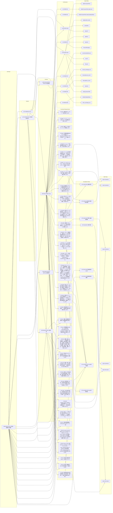

# JRN-008-HISTORY マップ

```mermaid
flowchart LR
  %% JRN-008-HISTORY
  subgraph JRN["Journeys"]
    N71["JRN-008-HISTORY 記録一覧閲覧と編集"]
  end
  subgraph ACT["Actions"]
    N1["ACT-HISTORY-001 写真詳細を開く"]
    N2["ACT-HOME-010 なし"]
  end
  subgraph SCR["Screens"]
    N72["SCR-001-HOME Home"]
    N73["SCR-008-HISTORY 記録一覧"]
    N74["SCR-009-HISTORY-DETAIL 記録詳細"]
    N75["SCR-010-HISTORY-PHOTO 写真詳細"]
  end
  subgraph UI["UI Elements"]
    N76["UI-HISTORY-001"]
    N77["UI-HISTORY-002"]
    N78["UI-HOME-001"]
    N79["UI-HOME-002"]
    N80["UI-HOME-003"]
    N81["UI-HOME-003A"]
    N82["UI-HOME-007"]
    N83["UI-HOME-008"]
    N84["UI-HOME-009"]
  end
  subgraph FR["Functional Requirements"]
    N36["- FR-001: 複数手技テンプレート一覧を表示します。"]
    N37["- FR-002: テンプレートごとに名称、版、有効開始日を表示します。"]
    N38["- FR-003: 選択した1手技でセッションを開始します。"]
    N39["- FR-004: 手技開始通知は本アプリ対象外とし、Mac/iPhoneの時計アプリ等の外部アラームで運用します。"]
    N40["- FR-004A: ホームに「手技開始通知は外部アラーム運用」の注記を表示します。"]
    N41["- FR-005: ホームには手技開始情報に加え、当日分のみCAPD記録ノート互換表を表示します（過去分は一覧画面で表示）。"]
    N42["- FR-005A: ホームAの先頭見出しは日付と曜日を表示し、手技スロットと当日ノート表は同一パネル内に配置します。"]
    N43["- FR-006: ホームから「記録一覧」画面へ遷移できる導線を提供します。"]
    N44["- FR-007: ホームAスパイクでは、1日あたり4件の手技スロットを横並びで表示します。"]
    N45["- FR-008: 手技スロットの初期状態は「+ のみ表示」とし、+ 押下で手技設定モーダル（CSV選択、推奨実施時間）を開きます。"]
    N46["- FR-009A: 右上 ••• メニューから「確認/編集」を開きます。確認モーダルは閲覧専用とし、ここからの「開始/再開」は手順表示のみ（確認モード）とします。確認モードでは記録保存、タイマー開始、通知ジョブ生成、アラーム設定、スロット/セッション状態更新、同期対象更新を行いません。"]
    N47["- FR-009B: 手技スロットの表示状態は 未登録(+) / 未実施 / 実施中 / 実施済み とします。実施済み のカード本体タップは無効化します。"]
    N48["- FR-009C: スロット登録時は、右隣スロットほど推奨実施時間が遅くなるように検証します（左から右へ厳密昇順、同時刻不可）。"]
    N49["- FR-009D: 右側スロットの開始時は、左側スロットがすべて 実施済み であることを必須条件にします（未登録/未実施が1件でもあれば開始不可）。"]
    N50["- FR-009E: 4スロット設定は dateLocal 単位でローカル永続化し、同期時に localRevision と cloudRevision を更新します。"]
    N51["- FR-009F: 実施済み スロットは編集/削除不可とします。同一端末で進行中セッションがある間は全スロット編集を禁止します。"]
    N52["- FR-009G: 実施中 スロットをタップした場合は新規開始せず、進行中セッションを再開します。"]
    N53["- FR-009H: 記録やタイマーを伴う実運用セッション開始/再開はカード本体タップ導線で実行し、••• > 確認 導線は閲覧専用（確認モード）とします。"]
    N54["- FR-010: 記録一覧画面で日々の手技記録を一覧表示します。"]
    N55["- FR-011: 記録一覧画面で詳細表示と編集導線を提供します。"]
    N56["- FR-012: 記録編集はLWWメタ（updatedAt, updatedByDeviceId, mutationId）を保持して競合解決可能な状態にします。"]
    N57["- FR-013: 記録一覧にはCAPDノート準拠項目（貯留時間、透析液濃度、排液量、注液量、排液時間、排液の確認、除水量、尿量、飲水量、体重、排便、血圧、出口部状態、備考）を表示します。"]
    N58["- FR-014: 写真はサムネイル固定表示ではなく、リンク押下で写真詳細画面へ遷移します。"]
    N59["- FR-014A: 記録一覧には既存写真列とは別に 出口部写真 列を追加し、未登録 / 表示 を切り替えます。"]
    N60["- FR-015: 交換ごとの除水量と1日の総除水量は、排液量 - 前回注液量 の差し引きで自動計算表示します。"]
    N61["- FR-015A: 初回交換（#1列）は前回注液量が存在しないため、除水量は 未計算 表示とします。"]
    N62["- FR-015B: 1日の総除水量は、計算可能な交換（#2列以降で前回注液量が存在する交換）のみを合算します。"]
    N63["- FR-015C: opening_infuse_weight_g（初期注液量）は v1 では空欄許容とし、除水量計算に使用しません。"]
    N64["- FR-016: 当日ノート表と記録一覧の交換列は #1〜#5 の5列固定とし、列位置は *_exchange_no で決定します。"]
    N65["- FR-017: 透析液濃度欄は、取り込みCSVのタイトル（例"]
    N66["- FR-018: record_event の値は record_exchange_no で列マッピングし、drain_weight_g は排液量、bag_weight_g は注液量、drain_appearance は排液の確認に表示します。"]
    N67["- FR-019: timer_event の値は timer_exchange_no で列マッピングし、timer_segment=dwell の start/end は貯留時間、timer_segment=drain の start/end は排液時間に表示します。"]
    N68["- FR-042: 廃液の記録写真（drain）は任意入力です。"]
    N69["- FR-086: 手動同期ボタンを提供し、失敗時は再試行導線を表示します。"]
    N70["- FR-088: 同期失敗時は直近同期状態（成功/失敗）を更新し、再試行導線を表示します。"]
  end
  subgraph AT["Acceptance Tests"]
    N3["AT-FLOW-004 端末内同時実行制限"]
    N4["AT-FLOW-005 左優先実行"]
    N5["AT-FLOW-006 予期せぬ離脱再開"]
    N6["AT-FLOW-007 非常中断"]
    N7["AT-SYNC-005 手動同期消し込み"]
    N8["AT-SYNC-006 復帰時失敗導線"]
    N9["AT-UI-HOME-001 Home表示確認"]
    N10["AT-UI-HOME-002 Home初期状態"]
  end
  subgraph E2E["E2E Tests"]
    N30["E2E-FLOW-001"]
    N31["E2E-FLOW-002"]
    N32["E2E-FLOW-003"]
    N33["E2E-FLOW-004"]
    N34["E2E-SYNC-002"]
    N35["E2E-SYNC-006"]
  end
  subgraph DATA["Data Paths"]
    N11["dailyProcedurePlan"]
    N12["DailyProcedurePlan.dateLocal"]
    N13["DailyProcedurePlan.slots[*].displayStatus"]
    N14["DayBundle.records"]
    N15["photoRefs"]
    N16["photos/*"]
    N17["platform"]
    N18["protocol"]
    N19["ProtocolPackage"]
    N20["recommendedAtLocal"]
    N21["record"]
    N22["Record"]
    N23["record_exchange_no)"]
    N24["Record(record_event"]
    N25["Record(timer_event"]
    N26["sessions"]
    N27["slots[*].protocolTitle"]
    N28["slots[n].displayStatus"]
    N29["timer_exchange_no)"]
  end
  N1 --> N58
  N1 --> N73
  N1 --> N75
  N1 --> N77
  N2 --> N43
  N2 --> N72
  N2 --> N73
  N2 --> N76
  N3 --> N31
  N4 --> N30
  N5 --> N32
  N6 --> N33
  N7 --> N34
  N8 --> N35
  N42 --> N9
  N44 --> N3
  N44 --> N4
  N46 --> N9
  N47 --> N9
  N49 --> N4
  N49 --> N10
  N49 --> N30
  N51 --> N3
  N51 --> N31
  N52 --> N5
  N52 --> N6
  N52 --> N32
  N54 --> N9
  N69 --> N7
  N69 --> N34
  N70 --> N8
  N70 --> N35
  N71 --> N1
  N71 --> N2
  N71 --> N9
  N71 --> N54
  N71 --> N55
  N71 --> N56
  N71 --> N57
  N71 --> N58
  N71 --> N59
  N71 --> N60
  N71 --> N61
  N71 --> N62
  N71 --> N63
  N71 --> N64
  N71 --> N65
  N71 --> N66
  N71 --> N67
  N71 --> N72
  N71 --> N73
  N71 --> N74
  N71 --> N75
  N72 --> N36
  N72 --> N37
  N72 --> N38
  N72 --> N39
  N72 --> N40
  N72 --> N41
  N72 --> N42
  N72 --> N43
  N72 --> N44
  N72 --> N45
  N72 --> N46
  N72 --> N47
  N72 --> N48
  N72 --> N49
  N72 --> N50
  N72 --> N51
  N72 --> N52
  N72 --> N53
  N72 --> N64
  N72 --> N65
  N72 --> N66
  N72 --> N67
  N72 --> N68
  N72 --> N69
  N72 --> N70
  N72 --> N78
  N72 --> N79
  N72 --> N80
  N72 --> N81
  N72 --> N82
  N72 --> N83
  N72 --> N84
  N73 --> N54
  N73 --> N55
  N73 --> N56
  N73 --> N57
  N73 --> N58
  N73 --> N63
  N73 --> N76
  N75 --> N77
  N76 --> N11
  N76 --> N14
  N76 --> N21
  N76 --> N22
  N76 --> N26
  N77 --> N15
  N77 --> N16
  N78 --> N12
  N79 --> N13
  N80 --> N20
  N80 --> N27
  N81 --> N28
  N82 --> N17
  N82 --> N18
  N82 --> N19
  N83 --> N25
  N83 --> N29
  N84 --> N23
  N84 --> N24
```

