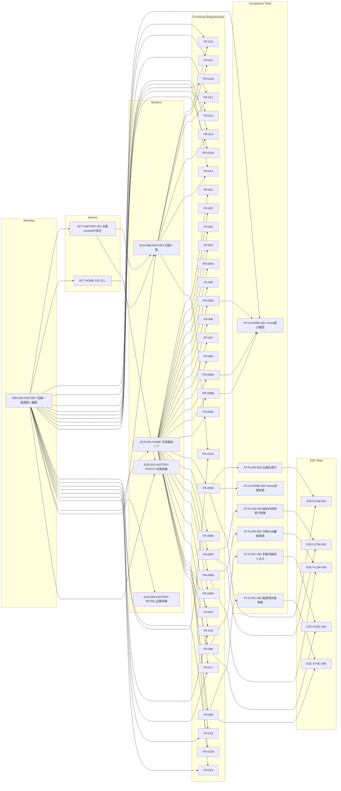

# JRN-008-HISTORY マップ

```mermaid
flowchart LR
  %% JRN-008-HISTORY
  subgraph JRN["Journeys"]
    N50["JRN-008-HISTORY 記録一覧閲覧と編集"]
  end
  subgraph ACT["Actions"]
    N1["ACT-HISTORY-001 対象photoIdが存在"]
    N2["ACT-HOME-010 なし"]
  end
  subgraph SCR["Screens"]
    N51["SCR-001-HOME 手技開始ハブ"]
    N52["SCR-008-HISTORY 記録一覧"]
    N53["SCR-009-HISTORY-DETAIL 記録詳細"]
    N54["SCR-010-HISTORY-PHOTO 写真詳細"]
  end
  subgraph FR["Functional Requirements"]
    N15["FR-001"]
    N16["FR-002"]
    N17["FR-003"]
    N18["FR-004"]
    N19["FR-004A"]
    N20["FR-005"]
    N21["FR-005A"]
    N22["FR-006"]
    N23["FR-007"]
    N24["FR-008"]
    N25["FR-009A"]
    N26["FR-009B"]
    N27["FR-009C"]
    N28["FR-009D"]
    N29["FR-009E"]
    N30["FR-009F"]
    N31["FR-009G"]
    N32["FR-009H"]
    N33["FR-010"]
    N34["FR-011"]
    N35["FR-012"]
    N36["FR-013"]
    N37["FR-014"]
    N38["FR-014A"]
    N39["FR-015"]
    N40["FR-015A"]
    N41["FR-015B"]
    N42["FR-015C"]
    N43["FR-016"]
    N44["FR-017"]
    N45["FR-018"]
    N46["FR-019"]
    N47["FR-042"]
    N48["FR-086"]
    N49["FR-088"]
  end
  subgraph AT["Acceptance Tests"]
    N3["AT-FLOW-004 端末内同時実行制限"]
    N4["AT-FLOW-005 左優先実行"]
    N5["AT-FLOW-006 予期せぬ離脱再開"]
    N6["AT-SYNC-005 手動同期消し込み"]
    N7["AT-SYNC-006 復帰時失敗導線"]
    N8["AT-UI-HOME-001 Home表示確認"]
    N9["AT-UI-HOME-002 Home初期状態"]
  end
  subgraph E2E["E2E Tests"]
    N10["E2E-FLOW-001"]
    N11["E2E-FLOW-002"]
    N12["E2E-FLOW-003"]
    N13["E2E-SYNC-002"]
    N14["E2E-SYNC-006"]
  end
  N1 --> N52
  N1 --> N54
  N2 --> N52
  N3 --> N11
  N4 --> N10
  N5 --> N12
  N6 --> N13
  N7 --> N14
  N21 --> N8
  N25 --> N8
  N26 --> N8
  N28 --> N4
  N28 --> N9
  N28 --> N10
  N30 --> N3
  N30 --> N11
  N31 --> N5
  N31 --> N12
  N48 --> N6
  N48 --> N13
  N49 --> N7
  N49 --> N14
  N50 --> N1
  N50 --> N2
  N50 --> N8
  N50 --> N33
  N50 --> N34
  N50 --> N35
  N50 --> N36
  N50 --> N37
  N50 --> N38
  N50 --> N39
  N50 --> N40
  N50 --> N41
  N50 --> N42
  N50 --> N43
  N50 --> N44
  N50 --> N45
  N50 --> N46
  N50 --> N51
  N50 --> N52
  N50 --> N53
  N50 --> N54
  N51 --> N15
  N51 --> N16
  N51 --> N17
  N51 --> N18
  N51 --> N19
  N51 --> N20
  N51 --> N21
  N51 --> N22
  N51 --> N23
  N51 --> N24
  N51 --> N25
  N51 --> N26
  N51 --> N27
  N51 --> N28
  N51 --> N29
  N51 --> N30
  N51 --> N31
  N51 --> N32
  N51 --> N43
  N51 --> N44
  N51 --> N45
  N51 --> N46
  N51 --> N47
  N51 --> N48
  N51 --> N49
  N52 --> N33
  N52 --> N34
  N52 --> N35
  N52 --> N36
  N52 --> N37
  N52 --> N42
```

