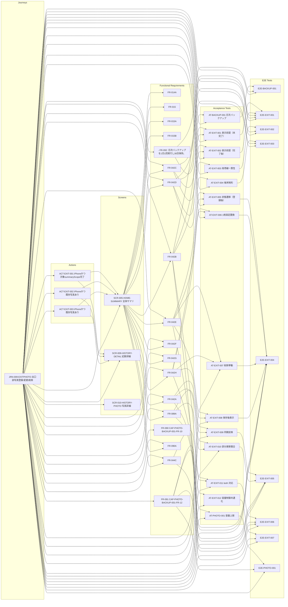

# JRN-009-EXITPHOTO マップ

```mermaid
flowchart LR
  %% JRN-009-EXITPHOTO
  subgraph JRN["Journeys"]
    N45["JRN-009-EXITPHOTO 出口部写真登録/変更/削除"]
  end
  subgraph ACT["Actions"]
    N1["ACT-EXIT-001 iPhoneかつ対象summaryScope完了"]
    N2["ACT-EXIT-002 iPhoneかつ既存写真あり"]
    N3["ACT-EXIT-003 iPhoneかつ既存写真あり"]
  end
  subgraph SCR["Screens"]
    N46["SCR-005-HOME-SUMMARY 全体サマリ"]
    N47["SCR-009-HISTORY-DETAIL 記録詳細"]
    N48["SCR-010-HISTORY-PHOTO 写真詳細"]
  end
  subgraph FR["Functional Requirements"]
    N27["FR-014A"]
    N28["FR-015"]
    N29["FR-015A"]
    N30["FR-015B"]
    N31["FR-042A"]
    N32["FR-042B"]
    N33["FR-042C"]
    N34["FR-042D"]
    N35["FR-042E"]
    N36["FR-042F"]
    N37["FR-042G"]
    N38["FR-042H"]
    N39["FR-044C"]
    N40["FR-089A"]
    N41["FR-090 CAP-PHOTO-BACKUP-001-FR-10"]
    N42["FR-090A"]
    N43["FR-091 CAP-PHOTO-BACKUP-001-FR-12"]
    N44["- FR-092: 日次バックアップを1日1回実行し30日保持。"]
  end
  subgraph AT["Acceptance Tests"]
    N4["AT-BACKUP-001 日次バックアップ"]
    N5["AT-EXIT-001 表示前提（未完了）"]
    N6["AT-EXIT-002 表示前提（完了後）"]
    N7["AT-EXIT-003 両導線一貫性"]
    N8["AT-EXIT-004 端末制約"]
    N9["AT-EXIT-005 状態遷移（登録後）"]
    N10["AT-EXIT-006 1枚固定置換"]
    N11["AT-EXIT-007 削除挙動"]
    N12["AT-EXIT-008 保存後表示"]
    N13["AT-EXIT-009 同期反映"]
    N14["AT-EXIT-010 部分更新競合"]
    N15["AT-EXIT-011 both 対応"]
    N16["AT-EXIT-012 容量制御共通化"]
    N17["AT-PHOTO-001 容量上限"]
  end
  subgraph E2E["E2E Tests"]
    N18["E2E-BACKUP-001"]
    N19["E2E-EXIT-001"]
    N20["E2E-EXIT-002"]
    N21["E2E-EXIT-003"]
    N22["E2E-EXIT-004"]
    N23["E2E-EXIT-005"]
    N24["E2E-EXIT-006"]
    N25["E2E-EXIT-007"]
    N26["E2E-PHOTO-001"]
  end
  N1 --> N46
  N1 --> N47
  N2 --> N46
  N2 --> N47
  N3 --> N46
  N3 --> N47
  N4 --> N18
  N5 --> N19
  N6 --> N19
  N7 --> N20
  N8 --> N21
  N9 --> N22
  N10 --> N22
  N11 --> N22
  N12 --> N22
  N13 --> N23
  N14 --> N23
  N15 --> N24
  N16 --> N25
  N17 --> N26
  N31 --> N13
  N31 --> N14
  N31 --> N23
  N32 --> N5
  N32 --> N6
  N32 --> N15
  N32 --> N19
  N32 --> N24
  N33 --> N5
  N33 --> N6
  N33 --> N19
  N34 --> N7
  N34 --> N8
  N34 --> N20
  N34 --> N21
  N35 --> N9
  N35 --> N10
  N35 --> N11
  N35 --> N12
  N35 --> N22
  N38 --> N9
  N38 --> N10
  N38 --> N11
  N38 --> N12
  N38 --> N22
  N39 --> N15
  N39 --> N24
  N40 --> N13
  N40 --> N14
  N40 --> N23
  N43 --> N16
  N43 --> N17
  N43 --> N25
  N43 --> N26
  N44 --> N4
  N44 --> N18
  N45 --> N1
  N45 --> N2
  N45 --> N3
  N45 --> N4
  N45 --> N5
  N45 --> N6
  N45 --> N7
  N45 --> N8
  N45 --> N9
  N45 --> N10
  N45 --> N11
  N45 --> N12
  N45 --> N13
  N45 --> N14
  N45 --> N15
  N45 --> N16
  N45 --> N17
  N45 --> N18
  N45 --> N19
  N45 --> N20
  N45 --> N21
  N45 --> N22
  N45 --> N23
  N45 --> N24
  N45 --> N25
  N45 --> N26
  N45 --> N31
  N45 --> N32
  N45 --> N33
  N45 --> N34
  N45 --> N35
  N45 --> N36
  N45 --> N37
  N45 --> N38
  N45 --> N39
  N45 --> N40
  N45 --> N41
  N45 --> N42
  N45 --> N43
  N45 --> N44
  N45 --> N46
  N45 --> N47
  N45 --> N48
  N46 --> N27
  N46 --> N28
  N46 --> N29
  N46 --> N30
  N46 --> N31
  N46 --> N32
  N46 --> N33
  N46 --> N34
  N46 --> N35
  N46 --> N36
  N46 --> N37
  N46 --> N38
  N46 --> N39
  N46 --> N40
  N46 --> N42
```

