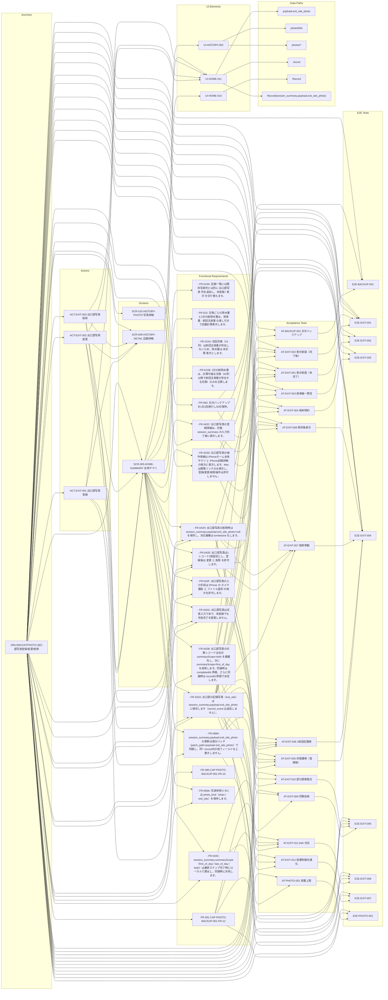

# JRN-009-EXITPHOTO マップ

```mermaid
flowchart LR
  %% JRN-009-EXITPHOTO
  subgraph JRN["Journeys"]
    N51["JRN-009-EXITPHOTO 出口部写真登録/変更/削除"]
  end
  subgraph ACT["Actions"]
    N1["ACT-EXIT-001 出口部写真登録"]
    N2["ACT-EXIT-002 出口部写真変更"]
    N3["ACT-EXIT-003 出口部写真削除"]
  end
  subgraph SCR["Screens"]
    N52["SCR-005-HOME-SUMMARY 全体サマリ"]
    N53["SCR-009-HISTORY-DETAIL 記録詳細"]
    N54["SCR-010-HISTORY-PHOTO 写真詳細"]
  end
  subgraph UI["UI Elements"]
    N55["UI-HISTORY-002"]
    N56["UI-HOME-010"]
    N57["UI-HOME-011"]
  end
  subgraph FR["Functional Requirements"]
    N33["- FR-014A: 記録一覧には既存写真列とは別に 出口部写真 列を追加し、未登録 / 表示 を切り替えます。"]
    N34["- FR-015: 交換ごとの除水量と1日の総除水量は、排液量 - 前回注液量 の差し引きで自動計算表示します。"]
    N35["- FR-015A: 初回交換（#1列）は前回注液量が存在しないため、除水量は 未計算 表示とします。"]
    N36["- FR-015B: 1日の総除水量は、計算可能な交換（#2列以降で前回注液量が存在する交換）のみを合算します。"]
    N37["- FR-042A: 出口部の記録写真（exit_site）は session_summary.payload.exit_site_photo に保存します（record_event は追加しません）。"]
    N38["- FR-042B: 出口部写真の対象レコードは当日 summaryScope=both を最優先し、次に summaryScope=first_of_day を採用します。同値時は completedAt 昇順、さらに同値時は recordId 昇順で決定します。"]
    N39["- FR-042C: 出口部写真の登録導線は、対象 session_summary の入力完了後に表示します。"]
    N40["- FR-042D: 出口部写真の操作導線は iPhoneホーム全体サマリ と iPhone記録詳細 の両方に表示します。Macは閲覧リンクのみ表示し、登録/変更/削除操作は許可しません。"]
    N41["- FR-042E: 出口部写真は1レコード1枚固定とし、登録後は 変更 と 削除 を許可します。"]
    N42["- FR-042F: 出口部写真の入力手段は iPhone の カメラ撮影 と ファイル選択 の両方を許可します。"]
    N43["- FR-042G: 出口部写真は任意入力であり、未登録でも手技完了を阻害しません。"]
    N44["- FR-042H: 出口部写真の削除時は session_summary.payload.exit_site_photo=null を保存し、対応画像は tombstone 化します。"]
    N45["- FR-044C: session_summary.summaryScope（first_of_day / last_of_day / both）は最終ステップ完了時にローカルで算出し、同期時に共有します。"]
    N46["- FR-089A: session_summary.payload.exit_site_photo の更新は部分パッチ（patch_path=payload.exit_site_photo）で同期し、同一record内の他フィールドを上書きしません。"]
    N47["FR-090 CAP-PHOTO-BACKUP-001-FR-10"]
    N48["- FR-090A: 写真参照メタには photo_kind（drain / exit_site）を保持します。"]
    N49["FR-091 CAP-PHOTO-BACKUP-001-FR-12"]
    N50["- FR-092: 日次バックアップを1日1回実行し30日保持。"]
  end
  subgraph AT["Acceptance Tests"]
    N4["AT-BACKUP-001 日次バックアップ"]
    N5["AT-EXIT-001 表示前提（未完了）"]
    N6["AT-EXIT-002 表示前提（完了後）"]
    N7["AT-EXIT-003 両導線一貫性"]
    N8["AT-EXIT-004 端末制約"]
    N9["AT-EXIT-005 状態遷移（登録後）"]
    N10["AT-EXIT-006 1枚固定置換"]
    N11["AT-EXIT-007 削除挙動"]
    N12["AT-EXIT-008 保存後表示"]
    N13["AT-EXIT-009 同期反映"]
    N14["AT-EXIT-010 部分更新競合"]
    N15["AT-EXIT-011 both 対応"]
    N16["AT-EXIT-012 容量制御共通化"]
    N17["AT-PHOTO-001 容量上限"]
  end
  subgraph E2E["E2E Tests"]
    N24["E2E-BACKUP-001"]
    N25["E2E-EXIT-001"]
    N26["E2E-EXIT-002"]
    N27["E2E-EXIT-003"]
    N28["E2E-EXIT-004"]
    N29["E2E-EXIT-005"]
    N30["E2E-EXIT-006"]
    N31["E2E-EXIT-007"]
    N32["E2E-PHOTO-001"]
  end
  subgraph DATA["Data Paths"]
    N18["payload.exit_site_photo"]
    N19["photoRefs"]
    N20["photos/*"]
    N21["record"]
    N22["Record"]
    N23["Record(session_summary.payload.exit_site_photo)"]
  end
  N1 --> N37
  N1 --> N43
  N1 --> N52
  N1 --> N53
  N1 --> N57
  N2 --> N41
  N2 --> N52
  N2 --> N53
  N2 --> N57
  N3 --> N44
  N3 --> N52
  N3 --> N53
  N3 --> N57
  N4 --> N24
  N5 --> N25
  N6 --> N25
  N7 --> N26
  N8 --> N27
  N9 --> N28
  N10 --> N28
  N11 --> N28
  N12 --> N28
  N13 --> N29
  N14 --> N29
  N15 --> N30
  N16 --> N31
  N17 --> N32
  N37 --> N5
  N37 --> N6
  N37 --> N7
  N37 --> N8
  N37 --> N9
  N37 --> N10
  N37 --> N11
  N37 --> N12
  N37 --> N13
  N37 --> N14
  N37 --> N15
  N37 --> N16
  N37 --> N29
  N38 --> N5
  N38 --> N6
  N38 --> N15
  N38 --> N25
  N38 --> N30
  N39 --> N5
  N39 --> N6
  N39 --> N25
  N40 --> N7
  N40 --> N8
  N40 --> N26
  N40 --> N27
  N41 --> N9
  N41 --> N10
  N41 --> N11
  N41 --> N12
  N41 --> N28
  N44 --> N9
  N44 --> N10
  N44 --> N11
  N44 --> N12
  N44 --> N28
  N45 --> N15
  N45 --> N30
  N46 --> N13
  N46 --> N14
  N46 --> N29
  N49 --> N16
  N49 --> N17
  N49 --> N31
  N49 --> N32
  N50 --> N4
  N50 --> N24
  N51 --> N1
  N51 --> N2
  N51 --> N3
  N51 --> N4
  N51 --> N5
  N51 --> N6
  N51 --> N7
  N51 --> N8
  N51 --> N9
  N51 --> N10
  N51 --> N11
  N51 --> N12
  N51 --> N13
  N51 --> N14
  N51 --> N15
  N51 --> N16
  N51 --> N17
  N51 --> N24
  N51 --> N25
  N51 --> N26
  N51 --> N27
  N51 --> N28
  N51 --> N29
  N51 --> N30
  N51 --> N31
  N51 --> N32
  N51 --> N37
  N51 --> N38
  N51 --> N39
  N51 --> N40
  N51 --> N41
  N51 --> N42
  N51 --> N43
  N51 --> N44
  N51 --> N45
  N51 --> N46
  N51 --> N47
  N51 --> N48
  N51 --> N49
  N51 --> N50
  N51 --> N52
  N51 --> N53
  N51 --> N54
  N52 --> N33
  N52 --> N34
  N52 --> N35
  N52 --> N36
  N52 --> N37
  N52 --> N38
  N52 --> N39
  N52 --> N40
  N52 --> N41
  N52 --> N42
  N52 --> N43
  N52 --> N44
  N52 --> N45
  N52 --> N46
  N52 --> N48
  N52 --> N56
  N52 --> N57
  N54 --> N55
  N55 --> N19
  N55 --> N20
  N56 --> N22
  N57 --> N18
  N57 --> N21
  N57 --> N23
```

