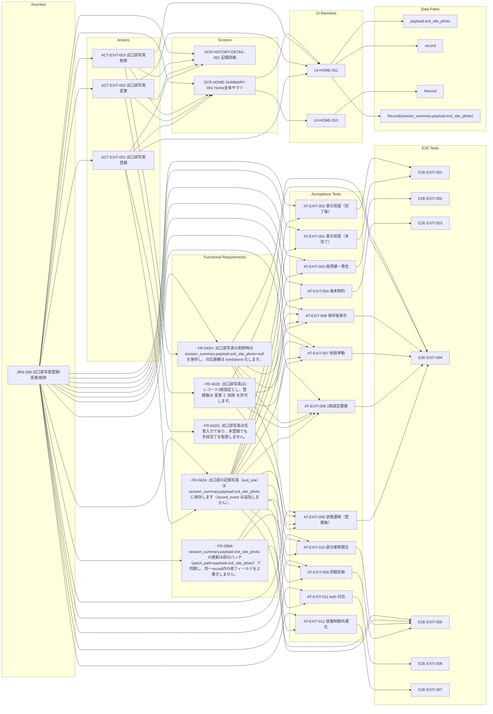

# JRN-009 マップ

```mermaid
flowchart LR
  %% JRN-009
  subgraph JRN["Journeys"]
    N32["JRN-009 出口部写真登録/変更/削除"]
  end
  subgraph ACT["Actions"]
    N1["ACT-EXIT-001 出口部写真登録"]
    N2["ACT-EXIT-002 出口部写真変更"]
    N3["ACT-EXIT-003 出口部写真削除"]
  end
  subgraph SCR["Screens"]
    N33["SCR-HISTORY-DETAIL-001 記録詳細"]
    N34["SCR-HOME-SUMMARY-001 Home全体サマリ"]
  end
  subgraph UI["UI Elements"]
    N35["UI-HOME-010"]
    N36["UI-HOME-011"]
  end
  subgraph FR["Functional Requirements"]
    N27["- FR-042A: 出口部の記録写真（exit_site）は session_summary.payload.exit_site_photo に保存します（record_event は追加しません）。"]
    N28["- FR-042E: 出口部写真は1レコード1枚固定とし、登録後は 変更 と 削除 を許可します。"]
    N29["- FR-042G: 出口部写真は任意入力であり、未登録でも手技完了を阻害しません。"]
    N30["- FR-042H: 出口部写真の削除時は session_summary.payload.exit_site_photo=null を保存し、対応画像は tombstone 化します。"]
    N31["- FR-089A: session_summary.payload.exit_site_photo の更新は部分パッチ（patch_path=payload.exit_site_photo）で同期し、同一record内の他フィールドを上書きしません。"]
  end
  subgraph AT["Acceptance Tests"]
    N4["AT-EXIT-001 表示前提（未完了）"]
    N5["AT-EXIT-002 表示前提（完了後）"]
    N6["AT-EXIT-003 両導線一貫性"]
    N7["AT-EXIT-004 端末制約"]
    N8["AT-EXIT-005 状態遷移（登録後）"]
    N9["AT-EXIT-006 1枚固定置換"]
    N10["AT-EXIT-007 削除挙動"]
    N11["AT-EXIT-008 保存後表示"]
    N12["AT-EXIT-009 同期反映"]
    N13["AT-EXIT-010 部分更新競合"]
    N14["AT-EXIT-011 both 対応"]
    N15["AT-EXIT-012 容量制御共通化"]
  end
  subgraph E2E["E2E Tests"]
    N20["E2E-EXIT-001"]
    N21["E2E-EXIT-002"]
    N22["E2E-EXIT-003"]
    N23["E2E-EXIT-004"]
    N24["E2E-EXIT-005"]
    N25["E2E-EXIT-006"]
    N26["E2E-EXIT-007"]
  end
  subgraph DATA["Data Paths"]
    N16["payload.exit_site_photo"]
    N17["record"]
    N18["Record"]
    N19["Record(session_summary.payload.exit_site_photo)"]
  end
  N1 --> N27
  N1 --> N29
  N1 --> N33
  N1 --> N34
  N1 --> N36
  N2 --> N28
  N2 --> N33
  N2 --> N34
  N2 --> N36
  N3 --> N30
  N3 --> N33
  N3 --> N34
  N3 --> N36
  N4 --> N20
  N5 --> N20
  N6 --> N21
  N7 --> N22
  N8 --> N23
  N9 --> N23
  N10 --> N23
  N11 --> N23
  N12 --> N24
  N13 --> N24
  N14 --> N25
  N15 --> N26
  N27 --> N4
  N27 --> N5
  N27 --> N6
  N27 --> N7
  N27 --> N8
  N27 --> N9
  N27 --> N10
  N27 --> N11
  N27 --> N12
  N27 --> N13
  N27 --> N14
  N27 --> N15
  N27 --> N24
  N28 --> N8
  N28 --> N9
  N28 --> N10
  N28 --> N11
  N28 --> N23
  N30 --> N8
  N30 --> N9
  N30 --> N10
  N30 --> N11
  N30 --> N23
  N31 --> N12
  N31 --> N13
  N31 --> N24
  N32 --> N1
  N32 --> N2
  N32 --> N3
  N32 --> N4
  N32 --> N5
  N32 --> N6
  N32 --> N7
  N32 --> N8
  N32 --> N9
  N32 --> N10
  N32 --> N11
  N32 --> N12
  N32 --> N13
  N32 --> N14
  N32 --> N15
  N32 --> N27
  N32 --> N30
  N32 --> N31
  N32 --> N33
  N32 --> N34
  N34 --> N35
  N34 --> N36
  N35 --> N18
  N36 --> N16
  N36 --> N17
  N36 --> N19
```

