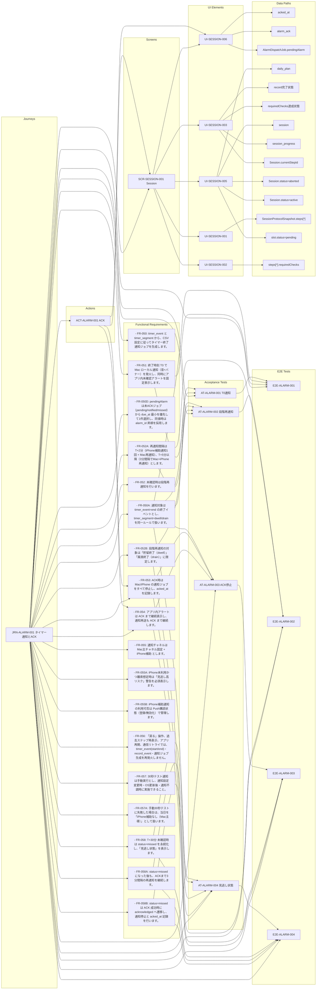

# JRN-ALARM-001 マップ

```mermaid
flowchart LR
  %% JRN-ALARM-001
  subgraph JRN["Journeys"]
    N42["JRN-ALARM-001 タイマー通知とACK"]
  end
  subgraph ACT["Actions"]
    N1["ACT-ALARM-001 ACK"]
  end
  subgraph SCR["Screens"]
    N43["SCR-SESSION-001 Session"]
  end
  subgraph UI["UI Elements"]
    N44["UI-SESSION-001"]
    N45["UI-SESSION-002"]
    N46["UI-SESSION-003"]
    N47["UI-SESSION-005"]
    N48["UI-SESSION-006"]
  end
  subgraph FR["Functional Requirements"]
    N24["- FR-050: timer_event と timer_segment から、CSV設定に従ってタイマー終了通知ジョブを生成します。"]
    N25["- FR-050A: 通知対象は timer_event=end の終了イベントとし、timer_segment=dwell/drain を同一ルールで扱います。"]
    N26["- FR-050D: pendingAlarm は未ACKジョブ（pending/notified/missed）から due_at 最小を優先して1件選択し、同値時は alarm_id 昇順を採用します。"]
    N27["- FR-051: 終了時刻 T0 で Mac ローカル通知（音+バナー）を発火し、同時にアプリ内未確認アラートを固定表示します。"]
    N28["- FR-052: 未確認時は段階再通知を行います。"]
    N29["- FR-052A: 再通知間隔は T+2分（iPhone補助通知1回 + Mac再通知）、T+5分以降（3分間隔でMac+iPhone再通知）とします。"]
    N30["- FR-052B: 段階再通知の対象は「貯留終了（dwell）」「廃液終了（drain）」に限定します。"]
    N31["- FR-053: ACK時は Mac/iPhone の通知ジョブをすべて停止し、acked_at を記録します。"]
    N32["- FR-054: アプリ内アラートは ACK まで継続表示し、通知再送も ACK まで継続します。"]
    N33["- FR-055: 通知チャネルは Mac主チャネル固定 + iPhone補助 とします。"]
    N34["- FR-055A: iPhone未利用かつ離席想定時は「見逃し高リスク」警告を必須表示します。"]
    N35["- FR-055B: iPhone補助通知の利用可否は Push購読状態（登録/無効化）で管理します。"]
    N36["- FR-056: 「戻る」操作、過去ステップ再表示、アプリ再開、通信リトライでは、timer_event(start/end)・record_event・通知ジョブ生成を再発火しません。"]
    N37["- FR-057: 30秒テスト通知は手動実行とし、通知設定変更時・OS更新後・通知不調時に実施できること。"]
    N38["- FR-057A: 手動30秒テストに失敗した場合は、当日を「iPhone補助なし（Mac主導）」として扱います。"]
    N39["- FR-058: T+30分 未確認時は status=missed を永続化し、「見逃し状態」を表示します。"]
    N40["- FR-058A: status=missed になった後も、ACKまで3分間隔の再通知を継続します。"]
    N41["- FR-058B: status=missed は ACK 成功時に acknowledged へ遷移し、通知停止と acked_at 記録を行います。"]
  end
  subgraph AT["Acceptance Tests"]
    N2["AT-ALARM-001 T0通知"]
    N3["AT-ALARM-002 段階再通知"]
    N4["AT-ALARM-003 ACK停止"]
    N5["AT-ALARM-004 見逃し状態"]
  end
  subgraph E2E["E2E Tests"]
    N20["E2E-ALARM-001"]
    N21["E2E-ALARM-002"]
    N22["E2E-ALARM-003"]
    N23["E2E-ALARM-004"]
  end
  subgraph DATA["Data Paths"]
    N6["acked_at"]
    N7["alarm_ack"]
    N8["AlarmDispatchJob.pendingAlarm"]
    N9["daily_plan"]
    N10["record完了状態"]
    N11["requiredChecks達成状態"]
    N12["session"]
    N13["session_progress"]
    N14["Session.currentStepId"]
    N15["Session.status=aborted"]
    N16["Session.status=active"]
    N17["SessionProtocolSnapshot.steps[*]"]
    N18["slot.status=pending"]
    N19["steps[*].requiredChecks"]
  end
  N1 --> N31
  N1 --> N32
  N1 --> N43
  N1 --> N48
  N2 --> N20
  N3 --> N21
  N4 --> N22
  N5 --> N23
  N25 --> N2
  N25 --> N3
  N25 --> N4
  N25 --> N5
  N25 --> N20
  N27 --> N2
  N27 --> N20
  N29 --> N3
  N29 --> N21
  N30 --> N3
  N30 --> N21
  N31 --> N4
  N31 --> N22
  N32 --> N4
  N32 --> N22
  N39 --> N5
  N39 --> N23
  N40 --> N5
  N40 --> N23
  N41 --> N5
  N41 --> N23
  N42 --> N1
  N42 --> N2
  N42 --> N3
  N42 --> N4
  N42 --> N5
  N42 --> N20
  N42 --> N21
  N42 --> N22
  N42 --> N23
  N42 --> N24
  N42 --> N25
  N42 --> N26
  N42 --> N27
  N42 --> N28
  N42 --> N29
  N42 --> N30
  N42 --> N31
  N42 --> N32
  N42 --> N33
  N42 --> N34
  N42 --> N35
  N42 --> N36
  N42 --> N37
  N42 --> N38
  N42 --> N39
  N42 --> N40
  N42 --> N41
  N42 --> N43
  N43 --> N44
  N43 --> N45
  N43 --> N46
  N43 --> N47
  N43 --> N48
  N44 --> N17
  N45 --> N19
  N46 --> N10
  N46 --> N11
  N46 --> N13
  N46 --> N14
  N47 --> N9
  N47 --> N12
  N47 --> N15
  N47 --> N16
  N47 --> N18
  N48 --> N6
  N48 --> N7
  N48 --> N8
```

