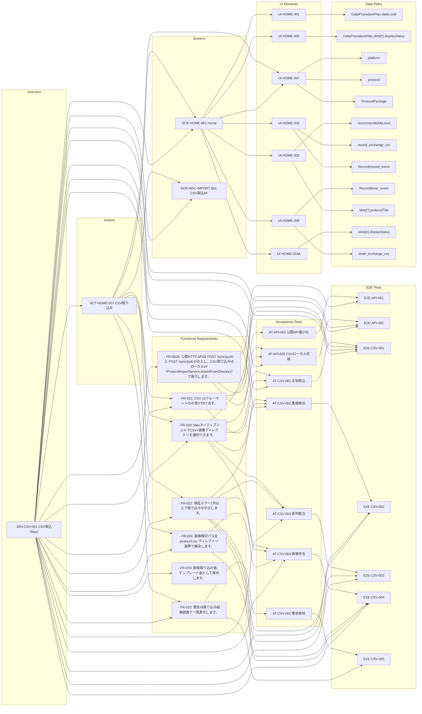

# JRN-CSV-001 マップ

```mermaid
flowchart LR
  %% JRN-CSV-001
  subgraph JRN["Journeys"]
    N35["JRN-CSV-001 CSV取込（Mac）"]
  end
  subgraph ACT["Actions"]
    N1["ACT-HOME-007 CSV取り込み"]
  end
  subgraph SCR["Screens"]
    N36["SCR-HOME-001 Home"]
    N37["SCR-MAC-IMPORT-001 CSV取込I/F"]
  end
  subgraph UI["UI Elements"]
    N38["UI-HOME-001"]
    N39["UI-HOME-002"]
    N40["UI-HOME-003"]
    N41["UI-HOME-003A"]
    N42["UI-HOME-007"]
    N43["UI-HOME-008"]
    N44["UI-HOME-009"]
  end
  subgraph FR["Functional Requirements"]
    N28["- FR-020: MacネイティブシェルでCSV+画像ディレクトリを選択できます。"]
    N29["- FR-021: CSV v3フォーマットのみ受け付けます。"]
    N30["- FR-022: 検証エラー1件以上で取り込みを中止します。"]
    N31["- FR-023: 警告は取り込み結果画面で一覧表示します。"]
    N32["- FR-024: 画像相対パスを protocol.csv ディレクトリ基準で解決します。"]
    N33["- FR-070: 新版取り込み後、テンプレート版として保存します。"]
    N34["- FR-082A: 公開HTTP APIは POST /sync/push と POST /sync/pull のみとし、CSV取り込みはローカルI/F（ProtocolImportService.importFromDirectory）で実行します。"]
  end
  subgraph AT["Acceptance Tests"]
    N2["AT-API-001 公開API最小化"]
    N3["AT-API-003 CSVローカル完結"]
    N4["AT-CSV-001 正常取込"]
    N5["AT-CSV-002 重複検出"]
    N6["AT-CSV-003 直列整合"]
    N7["AT-CSV-004 画像存在"]
    N8["AT-CSV-005 警告検知"]
  end
  subgraph E2E["E2E Tests"]
    N21["E2E-API-001"]
    N22["E2E-API-002"]
    N23["E2E-CSV-001"]
    N24["E2E-CSV-002"]
    N25["E2E-CSV-003"]
    N26["E2E-CSV-004"]
    N27["E2E-CSV-005"]
  end
  subgraph DATA["Data Paths"]
    N9["DailyProcedurePlan.dateLocal"]
    N10["DailyProcedurePlan.slots[*].displayStatus"]
    N11["platform"]
    N12["protocol"]
    N13["ProtocolPackage"]
    N14["recommendedAtLocal"]
    N15["record_exchange_no)"]
    N16["Record(record_event"]
    N17["Record(timer_event"]
    N18["slots[*].protocolTitle"]
    N19["slots[n].displayStatus"]
    N20["timer_exchange_no)"]
  end
  N1 --> N28
  N1 --> N29
  N1 --> N30
  N1 --> N31
  N1 --> N32
  N1 --> N36
  N1 --> N37
  N1 --> N42
  N2 --> N21
  N3 --> N22
  N4 --> N23
  N5 --> N24
  N6 --> N25
  N7 --> N26
  N8 --> N27
  N28 --> N3
  N28 --> N4
  N28 --> N5
  N28 --> N6
  N28 --> N7
  N28 --> N23
  N29 --> N4
  N29 --> N23
  N30 --> N5
  N30 --> N6
  N30 --> N7
  N30 --> N24
  N30 --> N25
  N30 --> N26
  N31 --> N8
  N31 --> N27
  N32 --> N7
  N32 --> N26
  N34 --> N2
  N34 --> N3
  N34 --> N21
  N34 --> N22
  N35 --> N1
  N35 --> N3
  N35 --> N4
  N35 --> N5
  N35 --> N6
  N35 --> N7
  N35 --> N22
  N35 --> N23
  N35 --> N24
  N35 --> N25
  N35 --> N26
  N35 --> N28
  N35 --> N29
  N35 --> N30
  N35 --> N31
  N35 --> N32
  N35 --> N33
  N35 --> N34
  N35 --> N36
  N35 --> N37
  N36 --> N38
  N36 --> N39
  N36 --> N40
  N36 --> N41
  N36 --> N42
  N36 --> N43
  N36 --> N44
  N38 --> N9
  N39 --> N10
  N40 --> N14
  N40 --> N18
  N41 --> N19
  N42 --> N11
  N42 --> N12
  N42 --> N13
  N43 --> N17
  N43 --> N20
  N44 --> N15
  N44 --> N16
```

