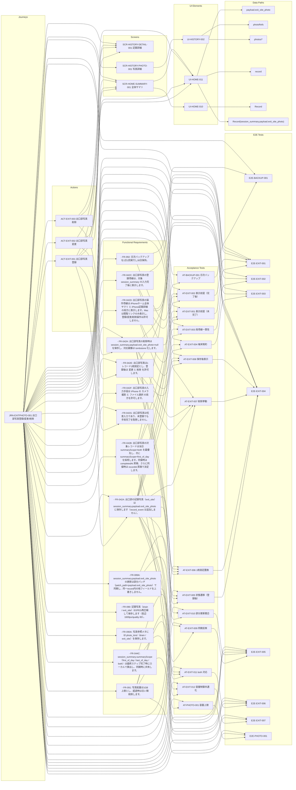

# JRN-EXITPHOTO-001 マップ

```mermaid
flowchart LR
  %% JRN-EXITPHOTO-001
  subgraph JRN["Journeys"]
    N47["JRN-EXITPHOTO-001 出口部写真登録/変更/削除"]
  end
  subgraph ACT["Actions"]
    N1["ACT-EXIT-001 出口部写真登録"]
    N2["ACT-EXIT-002 出口部写真変更"]
    N3["ACT-EXIT-003 出口部写真削除"]
  end
  subgraph SCR["Screens"]
    N48["SCR-HISTORY-DETAIL-001 記録詳細"]
    N49["SCR-HISTORY-PHOTO-001 写真詳細"]
    N50["SCR-HOME-SUMMARY-001 全体サマリ"]
  end
  subgraph UI["UI Elements"]
    N51["UI-HISTORY-002"]
    N52["UI-HOME-010"]
    N53["UI-HOME-011"]
  end
  subgraph FR["Functional Requirements"]
    N33["- FR-042A: 出口部の記録写真（exit_site）は session_summary.payload.exit_site_photo に保存します（record_event は追加しません）。"]
    N34["- FR-042B: 出口部写真の対象レコードは当日 summaryScope=both を最優先し、次に summaryScope=first_of_day を採用します。同値時は completedAt 昇順、さらに同値時は recordId 昇順で決定します。"]
    N35["- FR-042C: 出口部写真の登録導線は、対象 session_summary の入力完了後に表示します。"]
    N36["- FR-042D: 出口部写真の操作導線は iPhoneホーム全体サマリ と iPhone記録詳細 の両方に表示します。Macは閲覧リンクのみ表示し、登録/変更/削除操作は許可しません。"]
    N37["- FR-042E: 出口部写真は1レコード1枚固定とし、登録後は 変更 と 削除 を許可します。"]
    N38["- FR-042F: 出口部写真の入力手段は iPhone の カメラ撮影 と ファイル選択 の両方を許可します。"]
    N39["- FR-042G: 出口部写真は任意入力であり、未登録でも手技完了を阻害しません。"]
    N40["- FR-042H: 出口部写真の削除時は session_summary.payload.exit_site_photo=null を保存し、対応画像は tombstone 化します。"]
    N41["- FR-044C: session_summary.summaryScope（first_of_day / last_of_day / both）は最終ステップ完了時にローカルで算出し、同期時に共有します。"]
    N42["- FR-089A: session_summary.payload.exit_site_photo の更新は部分パッチ（patch_path=payload.exit_site_photo）で同期し、同一record内の他フィールドを上書きしません。"]
    N43["- FR-090: 記録写真（drain / exit_site）はJPEG再圧縮して保存します（長辺1600px/quality 85）。"]
    N44["- FR-090A: 写真参照メタには photo_kind（drain / exit_site）を保持します。"]
    N45["- FR-091: 写真総量は1GB上限とし、超過時は古い順削除します。"]
    N46["- FR-092: 日次バックアップを1日1回実行し30日保持。"]
  end
  subgraph AT["Acceptance Tests"]
    N4["AT-BACKUP-001 日次バックアップ"]
    N5["AT-EXIT-001 表示前提（未完了）"]
    N6["AT-EXIT-002 表示前提（完了後）"]
    N7["AT-EXIT-003 両導線一貫性"]
    N8["AT-EXIT-004 端末制約"]
    N9["AT-EXIT-005 状態遷移（登録後）"]
    N10["AT-EXIT-006 1枚固定置換"]
    N11["AT-EXIT-007 削除挙動"]
    N12["AT-EXIT-008 保存後表示"]
    N13["AT-EXIT-009 同期反映"]
    N14["AT-EXIT-010 部分更新競合"]
    N15["AT-EXIT-011 both 対応"]
    N16["AT-EXIT-012 容量制御共通化"]
    N17["AT-PHOTO-001 容量上限"]
  end
  subgraph E2E["E2E Tests"]
    N24["E2E-BACKUP-001"]
    N25["E2E-EXIT-001"]
    N26["E2E-EXIT-002"]
    N27["E2E-EXIT-003"]
    N28["E2E-EXIT-004"]
    N29["E2E-EXIT-005"]
    N30["E2E-EXIT-006"]
    N31["E2E-EXIT-007"]
    N32["E2E-PHOTO-001"]
  end
  subgraph DATA["Data Paths"]
    N18["payload.exit_site_photo"]
    N19["photoRefs"]
    N20["photos/*"]
    N21["record"]
    N22["Record"]
    N23["Record(session_summary.payload.exit_site_photo)"]
  end
  N1 --> N33
  N1 --> N39
  N1 --> N48
  N1 --> N50
  N1 --> N53
  N2 --> N37
  N2 --> N48
  N2 --> N50
  N2 --> N53
  N3 --> N40
  N3 --> N48
  N3 --> N50
  N3 --> N53
  N4 --> N24
  N5 --> N25
  N6 --> N25
  N7 --> N26
  N8 --> N27
  N9 --> N28
  N10 --> N28
  N11 --> N28
  N12 --> N28
  N13 --> N29
  N14 --> N29
  N15 --> N30
  N16 --> N31
  N17 --> N32
  N33 --> N5
  N33 --> N6
  N33 --> N7
  N33 --> N8
  N33 --> N9
  N33 --> N10
  N33 --> N11
  N33 --> N12
  N33 --> N13
  N33 --> N14
  N33 --> N15
  N33 --> N16
  N33 --> N29
  N34 --> N5
  N34 --> N6
  N34 --> N15
  N34 --> N25
  N34 --> N30
  N35 --> N5
  N35 --> N6
  N35 --> N25
  N36 --> N7
  N36 --> N8
  N36 --> N26
  N36 --> N27
  N37 --> N9
  N37 --> N10
  N37 --> N11
  N37 --> N12
  N37 --> N28
  N40 --> N9
  N40 --> N10
  N40 --> N11
  N40 --> N12
  N40 --> N28
  N41 --> N15
  N41 --> N30
  N42 --> N13
  N42 --> N14
  N42 --> N29
  N45 --> N16
  N45 --> N17
  N45 --> N31
  N45 --> N32
  N46 --> N4
  N46 --> N24
  N47 --> N1
  N47 --> N2
  N47 --> N3
  N47 --> N4
  N47 --> N5
  N47 --> N6
  N47 --> N7
  N47 --> N8
  N47 --> N9
  N47 --> N10
  N47 --> N11
  N47 --> N12
  N47 --> N13
  N47 --> N14
  N47 --> N15
  N47 --> N16
  N47 --> N17
  N47 --> N24
  N47 --> N25
  N47 --> N26
  N47 --> N27
  N47 --> N28
  N47 --> N29
  N47 --> N30
  N47 --> N31
  N47 --> N32
  N47 --> N33
  N47 --> N34
  N47 --> N35
  N47 --> N36
  N47 --> N37
  N47 --> N38
  N47 --> N39
  N47 --> N40
  N47 --> N41
  N47 --> N42
  N47 --> N43
  N47 --> N44
  N47 --> N45
  N47 --> N46
  N47 --> N48
  N47 --> N49
  N47 --> N50
  N49 --> N51
  N50 --> N52
  N50 --> N53
  N51 --> N19
  N51 --> N20
  N52 --> N22
  N53 --> N18
  N53 --> N21
  N53 --> N23
```

