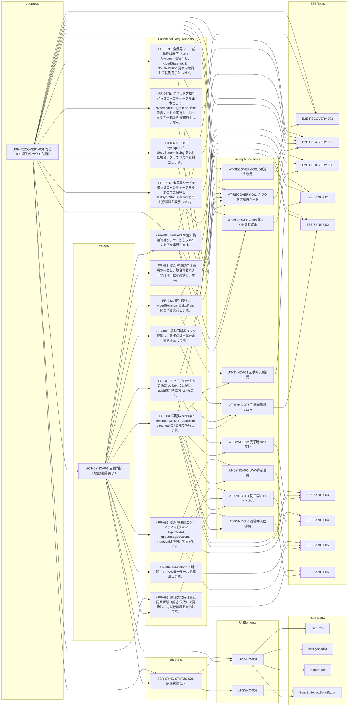

# JRN-RECOVERY-001 マップ

```mermaid
flowchart LR
  %% JRN-RECOVERY-001
  subgraph JRN["Journeys"]
    N37["JRN-RECOVERY-001 復旧（DB消失/クラウド欠損）"]
  end
  subgraph ACT["Actions"]
    N1["ACT-SYNC-001 自動同期（起動/復帰/完了）"]
  end
  subgraph SCR["Screens"]
    N38["SCR-SYNC-STATUS-001 同期状態表示"]
  end
  subgraph UI["UI Elements"]
    N39["UI-SYNC-001"]
    N40["UI-SYNC-002"]
  end
  subgraph FR["Functional Requirements"]
    N24["- FR-080: 同期は startup / resume / session_complete / manual の4契機で実行します。"]
    N25["- FR-081: すべてのローカル更新は outbox に追記し、push成功時に消し込みます。"]
    N26["- FR-082: 差分取得は cloudRevision と dayRefs に基づき実行します。"]
    N27["- FR-083: 競合解決はエンティティ単位LWW（updatedAt, updatedByDeviceId, mutationId 降順）で固定します。"]
    N28["- FR-084: tombstone（削除）もLWW同一ルールで解決します。"]
    N29["- FR-085: 競合解決は内部適用のみとし、競合件数バナーや詳細一覧は提供しません。"]
    N30["- FR-086: 手動同期ボタンを提供し、失敗時は再試行導線を表示します。"]
    N31["- FR-087: IndexedDB消失検知時はクラウドからフルリストアを実行します。"]
    N32["- FR-087A: POST /sync/pull が cloudState=missing を返した場合、クラウド欠損と判定します。"]
    N33["- FR-087B: クラウド欠損判定時はローカルデータを正本として syncMode=full_reseed で全量再シードを実行し、ローカルデータは削除/初期化しません。"]
    N34["- FR-087C: 全量再シード成功後は再度 POST /sync/pull を実行し、cloudState=ok と cloudRevision 更新を確認して同期完了とします。"]
    N35["- FR-087D: 全量再シード失敗時はローカルデータを不変のまま保持し、lastSyncStatus=failed と再試行導線を表示します。"]
    N36["- FR-088: 同期失敗時は直近同期状態（成功/失敗）を更新し、再試行導線を表示します。"]
  end
  subgraph AT["Acceptance Tests"]
    N2["AT-RECOVERY-001 DB消失復元"]
    N3["AT-RECOVERY-002 クラウド欠損再シード"]
    N4["AT-RECOVERY-003 再シード失敗時保全"]
    N5["AT-SYNC-001 起動時pull復元"]
    N6["AT-SYNC-002 完了時push反映"]
    N7["AT-SYNC-003 LWW内部適用"]
    N8["AT-SYNC-004 同日同スロット競合"]
    N9["AT-SYNC-005 手動同期消し込み"]
    N10["AT-SYNC-006 復帰時失敗導線"]
  end
  subgraph E2E["E2E Tests"]
    N15["E2E-RECOVERY-001"]
    N16["E2E-RECOVERY-002"]
    N17["E2E-RECOVERY-003"]
    N18["E2E-SYNC-001"]
    N19["E2E-SYNC-002"]
    N20["E2E-SYNC-003"]
    N21["E2E-SYNC-004"]
    N22["E2E-SYNC-005"]
    N23["E2E-SYNC-006"]
  end
  subgraph DATA["Data Paths"]
    N11["lastError"]
    N12["lastSyncedAt"]
    N13["SyncState"]
    N14["SyncState.lastSyncStatus"]
  end
  N1 --> N24
  N1 --> N25
  N1 --> N26
  N1 --> N27
  N1 --> N28
  N1 --> N29
  N1 --> N30
  N1 --> N31
  N1 --> N36
  N1 --> N38
  N1 --> N39
  N2 --> N15
  N3 --> N16
  N4 --> N17
  N5 --> N18
  N6 --> N20
  N7 --> N21
  N8 --> N22
  N9 --> N19
  N10 --> N23
  N24 --> N5
  N24 --> N6
  N24 --> N7
  N24 --> N8
  N24 --> N9
  N24 --> N10
  N24 --> N18
  N24 --> N20
  N25 --> N6
  N25 --> N9
  N25 --> N19
  N25 --> N20
  N26 --> N5
  N26 --> N18
  N27 --> N7
  N27 --> N8
  N27 --> N21
  N27 --> N22
  N28 --> N8
  N28 --> N22
  N30 --> N9
  N30 --> N19
  N31 --> N2
  N31 --> N3
  N31 --> N4
  N31 --> N15
  N32 --> N3
  N32 --> N16
  N33 --> N3
  N33 --> N16
  N34 --> N3
  N34 --> N16
  N35 --> N4
  N35 --> N17
  N36 --> N10
  N36 --> N23
  N37 --> N1
  N37 --> N2
  N37 --> N3
  N37 --> N4
  N37 --> N15
  N37 --> N16
  N37 --> N17
  N37 --> N31
  N37 --> N32
  N37 --> N33
  N37 --> N34
  N37 --> N35
  N37 --> N36
  N37 --> N38
  N38 --> N39
  N38 --> N40
  N39 --> N11
  N39 --> N12
  N39 --> N13
  N39 --> N14
  N40 --> N14
```

