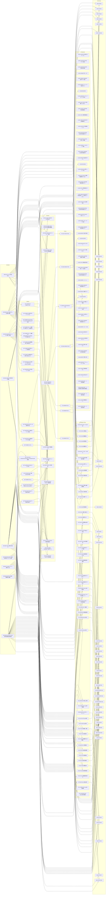

# 全体マップ

```mermaid
flowchart LR
  %% Journey -> Action -> Screen -> Form -> AT -> E2E
  subgraph JRN["Journeys"]
    N119["JRN-001-CSV CSV取込（Mac）"]
    N120["JRN-002-SLOT 当日スロット登録と開始"]
    N121["JRN-003-SESSION セッション進行と記録"]
    N122["JRN-004-ABORT 非常中断と再開"]
    N123["JRN-005-SYNC 同期と再試行"]
    N124["JRN-006-RECOVERY 復旧（DB消失/クラウド欠損）"]
    N125["JRN-007-ALARM タイマー通知とACK"]
    N126["JRN-008-HISTORY 記録一覧閲覧と編集"]
    N127["JRN-009-EXITPHOTO 出口部写真登録/変更/削除"]
  end
  subgraph ACT["Actions"]
    N1["ACT-ALARM-001 未ACKジョブあり"]
    N2["ACT-EXIT-001 iPhoneかつ対象summaryScope完了"]
    N3["ACT-EXIT-002 iPhoneかつ既存写真あり"]
    N4["ACT-EXIT-003 iPhoneかつ既存写真あり"]
    N5["ACT-HISTORY-001 対象photoIdが存在"]
    N6["ACT-HOME-001 進行中セッションなし"]
    N7["ACT-HOME-002 protocolId と recommendedAtLocal が妥当"]
    N8["ACT-HOME-003 ••• > 確認 かつ対象スロット登録済み"]
    N9["ACT-HOME-004 ••• > 編集 かつdisplayStatus!=completed かつ進行中なし"]
    N10["ACT-HOME-005 右側開始時に左側全完了"]
    N11["ACT-HOME-006 対象スロット登録済み"]
    N12["ACT-HOME-007 platform=mac"]
    N13["ACT-HOME-008 開始不可条件に該当しない"]
    N14["ACT-HOME-010 なし"]
    N15["ACT-HOME-011 なし"]
    N16["ACT-SESSION-001 必須チェック完了かつrecord_event完了"]
    N17["ACT-SESSION-002 先頭ステップ以外"]
    N18["ACT-SESSION-003 FC-* 必須条件充足"]
    N19["ACT-SESSION-004 最終ステップ到達"]
    N20["ACT-SESSION-006 確認ダイアログ承認"]
    N21["ACT-SYNC-001 startup/resume/session_complete/manual 契機"]
  end
  subgraph SCR["Screens"]
    N128["SCR-001-HOME 手技開始ハブ"]
    N129["SCR-002-HOME-SETUP スロット設定"]
    N130["SCR-003-HOME-START-CONFIRM 開始確認"]
    N131["SCR-004-HOME-VIEW-CONFIRM 閲覧専用確認"]
    N132["SCR-005-HOME-SUMMARY 全体サマリ"]
    N133["SCR-006-SESSION セッション進行"]
    N134["SCR-007-SESSION-RECORD 記録入力"]
    N135["SCR-008-HISTORY 記録一覧"]
    N136["SCR-009-HISTORY-DETAIL 記録詳細"]
    N137["SCR-010-HISTORY-PHOTO 写真詳細"]
    N138["SCR-011-SYNC-STATUS 同期状態表示"]
    N139["SCR-012-MAC-IMPORT CSV取込I/F"]
  end
  subgraph FC["Forms"]
    N112["FC-BAG-WEIGHT-001"]
    N113["FC-DRAIN-APPEARANCE-001"]
    N114["FC-DRAIN-WEIGHT-001"]
    N115["FC-SLOT-SETUP-001"]
    N116["FC-SUMMARY-001"]
    N117["FC-SUMMARY-002"]
    N118["FC-SUMMARY-003"]
  end
  subgraph UI["UI Elements"]
    N140["UI-001-HISTORY 記録一覧テーブル"]
    N141["UI-001-HISTORY-DETAIL サマリ詳細"]
    N142["UI-001-HISTORY-PHOTO 写真表示領域"]
    N143["UI-001-HOME 日付ヘッダ"]
    N144["UI-001-HOME-SUMMARY 全体サマリ表示"]
    N145["UI-001-IMPORT ディレクトリ選択ボタン"]
    N146["UI-001-RECORD"]
    N147["UI-001-SESSION ステップタイトル/本文"]
    N148["UI-001-SLOT-SETUP 手技選択（Select）"]
    N149["UI-001-START-CONFIRM 手技情報表示"]
    N150["UI-001-SYNC 同期状態表示"]
    N151["UI-001-VIEW-CONFIRM 手技情報表示"]
    N152["UI-002-HISTORY 写真詳細リンク"]
    N153["UI-002-HISTORY-DETAIL 出口部写真登録ボタン"]
    N154["UI-002-HISTORY-PHOTO 写真メタ情報"]
    N155["UI-002-HOME #1〜#4スロット状態"]
    N156["UI-002-HOME-SUMMARY 出口部写真操作行"]
    N157["UI-002-IMPORT 取込実行ボタン"]
    N158["UI-002-RECORD"]
    N159["UI-002-SESSION 必須チェック一覧"]
    N160["UI-002-SLOT-SETUP 推奨実施時間（Time）"]
    N161["UI-002-START-CONFIRM 開始/再開ボタン"]
    N162["UI-002-SYNC 手動再試行ボタン"]
    N163["UI-002-VIEW-CONFIRM 手順を確認（データ保存なし）ボタン"]
    N164["UI-003-HISTORY 出口部写真列"]
    N165["UI-003-HISTORY-DETAIL 出口部写真変更ボタン"]
    N166["UI-003-HISTORY-PHOTO 戻るリンク"]
    N167["UI-003-HOME スロットカード本体"]
    N168["UI-003-HOME-SUMMARY 写真登録ボタン"]
    N169["UI-003-IMPORT 実行中表示"]
    N170["UI-003-RECORD"]
    N171["UI-003-SESSION 次へボタン"]
    N172["UI-003-SLOT-SETUP 保存ボタン"]
    N173["UI-003-START-CONFIRM 開始不可理由"]
    N174["UI-003-SYNC 復旧進行表示"]
    N175["UI-003-VIEW-CONFIRM 確認モード注意文"]
    N176["UI-004-HISTORY-DETAIL 出口部写真削除ボタン"]
    N177["UI-004-HOME ••• メニュー"]
    N178["UI-004-HOME-SUMMARY 写真変更ボタン"]
    N179["UI-004-IMPORT 結果サマリ"]
    N180["UI-004-RECORD"]
    N181["UI-004-SESSION 記録入力導線"]
    N182["UI-004-SLOT-SETUP エラー表示"]
    N183["UI-005-HOME CSV取り込みボタン"]
    N184["UI-005-HOME-SUMMARY 写真削除ボタン"]
    N185["UI-005-IMPORT エラー一覧"]
    N186["UI-005-RECORD 保存ボタン"]
    N187["UI-005-SESSION 非常中断メニュー"]
    N188["UI-006-HOME 記録一覧ボタン"]
    N189["UI-006-HOME-SUMMARY 1日の総除水量"]
    N190["UI-006-IMPORT 警告一覧"]
    N191["UI-006-SESSION アラームバナー/ACK"]
    N192["UI-007-HOME 手動同期ボタン"]
    N193["UI-007-SESSION 戻るボタン"]
    N194["UI-008-HOME 当日ノート（貯留時間）"]
    N195["UI-009-HOME 当日ノート（排液量/注液量/排液確認）"]
    N196["UI-010-HOME 当日ノート（総除水量）"]
    N197["UI-011-HOME 同期失敗バナー"]
    N198["UI-012-HOME 当日ノート（排液写真）"]
  end
  subgraph AT["Acceptance Tests"]
    N22["AT-ALARM-001 T0通知"]
    N23["AT-ALARM-002 段階再通知"]
    N24["AT-ALARM-003 ACK停止"]
    N25["AT-ALARM-004 見逃し状態"]
    N26["AT-API-001 公開API最小化"]
    N27["AT-API-002 エクスポート廃止"]
    N28["AT-API-003 CSVローカル完結"]
    N29["AT-API-004 非暗号化キー"]
    N30["AT-BACKUP-001 日次バックアップ"]
    N31["AT-CSV-001 正常取込"]
    N32["AT-CSV-002 重複検出"]
    N33["AT-CSV-003 直列整合"]
    N34["AT-CSV-004 画像存在"]
    N35["AT-CSV-005 警告検知"]
    N36["AT-EXIT-001 表示前提（未完了）"]
    N37["AT-EXIT-002 表示前提（完了後）"]
    N38["AT-EXIT-003 両導線一貫性"]
    N39["AT-EXIT-004 端末制約"]
    N40["AT-EXIT-005 状態遷移（登録後）"]
    N41["AT-EXIT-006 1枚固定置換"]
    N42["AT-EXIT-007 削除挙動"]
    N43["AT-EXIT-008 保存後表示"]
    N44["AT-EXIT-009 同期反映"]
    N45["AT-EXIT-010 部分更新競合"]
    N46["AT-EXIT-011 both 対応"]
    N47["AT-EXIT-012 容量制御共通化"]
    N48["AT-FLOW-001 必須チェック"]
    N49["AT-FLOW-002 記録ゲート"]
    N50["AT-FLOW-003 直列遷移"]
    N51["AT-FLOW-004 端末内同時実行制限"]
    N52["AT-FLOW-005 左優先実行"]
    N53["AT-FLOW-006 予期せぬ離脱再開"]
    N54["AT-FLOW-007 非常中断"]
    N55["AT-PHOTO-001 容量上限"]
    N56["AT-PLAT-001 iPhone利用"]
    N57["AT-PLAT-002 Mac利用"]
    N58["AT-RECOVERY-001 DB消失復元"]
    N59["AT-RECOVERY-002 クラウド欠損再シード"]
    N60["AT-RECOVERY-003 再シード失敗時保全"]
    N61["AT-SLEEP-001 状態表示"]
    N62["AT-SYNC-001 起動時pull復元"]
    N63["AT-SYNC-002 完了時push反映"]
    N64["AT-SYNC-003 LWW内部適用"]
    N65["AT-SYNC-004 同日同スロット競合"]
    N66["AT-SYNC-005 手動同期消し込み"]
    N67["AT-SYNC-006 復帰時失敗導線"]
    N68["AT-UI-HOME-001 Home表示確認"]
    N69["AT-UI-HOME-002 Home初期状態"]
    N70["AT-UI-SESSION-001 Session表示確認"]
  end
  subgraph E2E["E2E Tests"]
    N71["E2E-ALARM-001"]
    N72["E2E-ALARM-002"]
    N73["E2E-ALARM-003"]
    N74["E2E-ALARM-004"]
    N75["E2E-API-001"]
    N76["E2E-API-002"]
    N77["E2E-API-003"]
    N78["E2E-API-004"]
    N79["E2E-BACKUP-001"]
    N80["E2E-CSV-001"]
    N81["E2E-CSV-002"]
    N82["E2E-CSV-003"]
    N83["E2E-CSV-004"]
    N84["E2E-CSV-005"]
    N85["E2E-EXIT-001"]
    N86["E2E-EXIT-002"]
    N87["E2E-EXIT-003"]
    N88["E2E-EXIT-004"]
    N89["E2E-EXIT-005"]
    N90["E2E-EXIT-006"]
    N91["E2E-EXIT-007"]
    N92["E2E-FLOW-001"]
    N93["E2E-FLOW-002"]
    N94["E2E-FLOW-003"]
    N95["E2E-FLOW-004"]
    N96["E2E-FLOW-005"]
    N97["E2E-FLOW-006"]
    N98["E2E-FLOW-007"]
    N99["E2E-PHOTO-001"]
    N100["E2E-PLAT-001"]
    N101["E2E-PLAT-002"]
    N102["E2E-RECOVERY-001"]
    N103["E2E-RECOVERY-002"]
    N104["E2E-RECOVERY-003"]
    N105["E2E-SLEEP-001"]
    N106["E2E-SYNC-001"]
    N107["E2E-SYNC-002"]
    N108["E2E-SYNC-003"]
    N109["E2E-SYNC-004"]
    N110["E2E-SYNC-005"]
    N111["E2E-SYNC-006"]
  end
  N1 --> N133
  N2 --> N132
  N2 --> N136
  N3 --> N132
  N3 --> N136
  N4 --> N132
  N4 --> N136
  N5 --> N135
  N5 --> N137
  N6 --> N129
  N7 --> N128
  N8 --> N131
  N9 --> N129
  N10 --> N130
  N11 --> N133
  N12 --> N128
  N12 --> N139
  N13 --> N133
  N14 --> N135
  N15 --> N128
  N16 --> N133
  N17 --> N133
  N18 --> N133
  N18 --> N134
  N19 --> N128
  N20 --> N128
  N21 --> N138
  N22 --> N71
  N23 --> N72
  N24 --> N73
  N25 --> N74
  N26 --> N75
  N27 --> N77
  N28 --> N76
  N29 --> N78
  N30 --> N79
  N31 --> N80
  N32 --> N81
  N33 --> N82
  N34 --> N83
  N35 --> N84
  N36 --> N85
  N37 --> N85
  N38 --> N86
  N39 --> N87
  N40 --> N88
  N41 --> N88
  N42 --> N88
  N43 --> N88
  N44 --> N89
  N45 --> N89
  N46 --> N90
  N47 --> N91
  N48 --> N96
  N49 --> N97
  N50 --> N98
  N51 --> N93
  N52 --> N92
  N53 --> N94
  N54 --> N95
  N55 --> N99
  N56 --> N100
  N57 --> N101
  N58 --> N102
  N59 --> N103
  N60 --> N104
  N61 --> N105
  N62 --> N106
  N63 --> N108
  N64 --> N109
  N65 --> N110
  N66 --> N107
  N67 --> N111
  N112 --> N49
  N112 --> N170
  N113 --> N49
  N113 --> N146
  N114 --> N49
  N114 --> N158
  N115 --> N52
  N116 --> N37
  N116 --> N180
  N117 --> N36
  N117 --> N180
  N118 --> N46
  N118 --> N180
  N119 --> N12
  N119 --> N28
  N119 --> N31
  N119 --> N32
  N119 --> N33
  N119 --> N34
  N119 --> N76
  N119 --> N80
  N119 --> N81
  N119 --> N82
  N119 --> N83
  N119 --> N128
  N119 --> N139
  N120 --> N6
  N120 --> N7
  N120 --> N8
  N120 --> N9
  N120 --> N10
  N120 --> N11
  N120 --> N13
  N120 --> N51
  N120 --> N52
  N120 --> N92
  N120 --> N93
  N120 --> N128
  N120 --> N129
  N120 --> N130
  N120 --> N131
  N121 --> N16
  N121 --> N17
  N121 --> N18
  N121 --> N19
  N121 --> N48
  N121 --> N49
  N121 --> N50
  N121 --> N96
  N121 --> N97
  N121 --> N98
  N121 --> N133
  N121 --> N134
  N121 --> N136
  N122 --> N20
  N122 --> N53
  N122 --> N54
  N122 --> N94
  N122 --> N95
  N122 --> N128
  N122 --> N133
  N123 --> N15
  N123 --> N21
  N123 --> N26
  N123 --> N29
  N123 --> N62
  N123 --> N63
  N123 --> N64
  N123 --> N65
  N123 --> N66
  N123 --> N67
  N123 --> N75
  N123 --> N78
  N123 --> N106
  N123 --> N107
  N123 --> N108
  N123 --> N109
  N123 --> N110
  N123 --> N111
  N123 --> N128
  N123 --> N133
  N123 --> N138
  N124 --> N21
  N124 --> N58
  N124 --> N59
  N124 --> N60
  N124 --> N102
  N124 --> N103
  N124 --> N104
  N124 --> N138
  N125 --> N1
  N125 --> N22
  N125 --> N23
  N125 --> N24
  N125 --> N25
  N125 --> N71
  N125 --> N72
  N125 --> N73
  N125 --> N74
  N125 --> N133
  N126 --> N5
  N126 --> N14
  N126 --> N68
  N126 --> N128
  N126 --> N135
  N126 --> N136
  N126 --> N137
  N127 --> N2
  N127 --> N3
  N127 --> N4
  N127 --> N30
  N127 --> N36
  N127 --> N37
  N127 --> N38
  N127 --> N39
  N127 --> N40
  N127 --> N41
  N127 --> N42
  N127 --> N43
  N127 --> N44
  N127 --> N45
  N127 --> N46
  N127 --> N47
  N127 --> N55
  N127 --> N79
  N127 --> N85
  N127 --> N86
  N127 --> N87
  N127 --> N88
  N127 --> N89
  N127 --> N90
  N127 --> N91
  N127 --> N99
  N127 --> N132
  N127 --> N136
  N127 --> N137
  N129 --> N115
  N134 --> N112
  N134 --> N113
  N134 --> N114
  N134 --> N116
  N134 --> N117
  N134 --> N118
```

