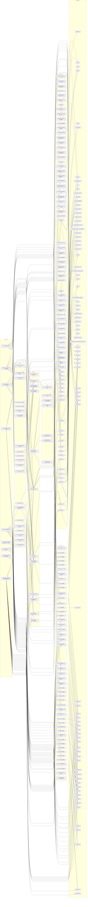

# 全体マップ

```mermaid
flowchart LR
  %% Journey -> Action -> Screen -> Form -> AT -> E2E
  subgraph JRN["Journeys"]
    N162["JRN-001-CSV CSV取込（Mac）"]
    N163["JRN-002-SLOT 当日スロット登録と開始"]
    N164["JRN-003-SESSION セッション進行と記録"]
    N165["JRN-004-ABORT 非常中断と再開"]
    N166["JRN-005-SYNC 同期と再試行"]
    N167["JRN-006-RECOVERY 復旧（DB消失/クラウド欠損）"]
    N168["JRN-007-ALARM タイマー通知とACK"]
    N169["JRN-008-HISTORY 記録一覧閲覧と編集"]
    N170["JRN-009-EXITPHOTO 出口部写真登録/変更/削除"]
  end
  subgraph ACT["Actions"]
    N1["ACT-ALARM-001 ACK"]
    N2["ACT-EXIT-001 出口部写真登録"]
    N3["ACT-EXIT-002 出口部写真変更"]
    N4["ACT-EXIT-003 出口部写真削除"]
    N5["ACT-HISTORY-001 写真詳細を開く"]
    N6["ACT-HOME-001 + で手技設定を開く"]
    N7["ACT-HOME-002 手技設定を保存"]
    N8["ACT-HOME-003 ••• > 確認"]
    N9["ACT-HOME-004 ••• > 編集"]
    N10["ACT-HOME-005 カード本体タップ"]
    N11["ACT-HOME-006 確認モードで手順表示"]
    N12["ACT-HOME-007 CSV取り込み"]
    N13["ACT-HOME-008 開始/再開を確定"]
    N14["ACT-HOME-010 なし"]
    N15["ACT-HOME-011 なし"]
    N16["ACT-SESSION-001 次へ"]
    N17["ACT-SESSION-002 戻る"]
    N18["ACT-SESSION-003 記録保存"]
    N19["ACT-SESSION-004 最終ステップ完了"]
    N20["ACT-SESSION-006 非常中断"]
    N21["ACT-SYNC-001 自動同期（起動/復帰/完了）"]
  end
  subgraph SCR["Screens"]
    N171["SCR-001-HOME Home"]
    N172["SCR-002-HOME-SETUP スロット設定"]
    N173["SCR-003-HOME-START-CONFIRM 開始確認"]
    N174["SCR-004-HOME-VIEW-CONFIRM 閲覧専用確認"]
    N175["SCR-005-HOME-SUMMARY 全体サマリ"]
    N176["SCR-006-SESSION Session"]
    N177["SCR-007-SESSION-RECORD 記録入力"]
    N178["SCR-008-HISTORY 記録一覧"]
    N179["SCR-009-HISTORY-DETAIL 記録詳細"]
    N180["SCR-010-HISTORY-PHOTO 写真詳細"]
    N181["SCR-011-SYNC-STATUS 同期状態表示"]
    N182["SCR-012-MAC-IMPORT CSV取込I/F"]
  end
  subgraph FC["Forms"]
    N155["FC-BAG-WEIGHT-001 注液量"]
    N156["FC-DRAIN-APPEARANCE-001 排液の確認"]
    N157["FC-DRAIN-WEIGHT-001 排液量"]
    N158["FC-SLOT-SETUP-001 手技設定"]
    N159["FC-SUMMARY-001 summaryScope=first_of_day"]
    N160["FC-SUMMARY-002 summaryScope=last_of_day"]
    N161["FC-SUMMARY-003 summaryScope=both"]
  end
  subgraph UI["UI Elements"]
    N183["UI-001-HISTORY 記録一覧テーブル"]
    N184["UI-001-HISTORY-DETAIL サマリ詳細"]
    N185["UI-001-HISTORY-PHOTO 写真表示領域"]
    N186["UI-001-HOME 日付ヘッダ"]
    N187["UI-001-HOME-SUMMARY 全体サマリ表示"]
    N188["UI-001-IMPORT ディレクトリ選択ボタン"]
    N189["UI-001-RECORD"]
    N190["UI-001-SESSION ステップタイトル/本文"]
    N191["UI-001-SLOT-SETUP 手技選択（Select）"]
    N192["UI-001-START-CONFIRM 手技情報表示"]
    N193["UI-001-SYNC 同期状態表示"]
    N194["UI-001-VIEW-CONFIRM 手技情報表示"]
    N195["UI-002-HISTORY 写真詳細リンク"]
    N196["UI-002-HISTORY-DETAIL 出口部写真登録ボタン"]
    N197["UI-002-HISTORY-PHOTO 写真メタ情報"]
    N198["UI-002-HOME #1〜#4スロット状態"]
    N199["UI-002-HOME-SUMMARY 出口部写真操作行"]
    N200["UI-002-IMPORT 取込実行ボタン"]
    N201["UI-002-RECORD"]
    N202["UI-002-SESSION 必須チェック一覧"]
    N203["UI-002-SLOT-SETUP 推奨実施時間（Time）"]
    N204["UI-002-START-CONFIRM 開始/再開ボタン"]
    N205["UI-002-SYNC 手動再試行ボタン"]
    N206["UI-002-VIEW-CONFIRM 手順を表示（保存なし）ボタン"]
    N207["UI-003-HISTORY 出口部写真列"]
    N208["UI-003-HISTORY-DETAIL 出口部写真変更ボタン"]
    N209["UI-003-HISTORY-PHOTO 戻るリンク"]
    N210["UI-003-HOME スロットカード本体"]
    N211["UI-003-HOME-SUMMARY 写真登録ボタン"]
    N212["UI-003-IMPORT 実行中表示"]
    N213["UI-003-RECORD"]
    N214["UI-003-SESSION 次へボタン"]
    N215["UI-003-SLOT-SETUP 保存ボタン"]
    N216["UI-003-START-CONFIRM 開始不可理由"]
    N217["UI-003-SYNC 復旧進行表示"]
    N218["UI-003-VIEW-CONFIRM 確認モード注意文"]
    N219["UI-004-HISTORY-DETAIL 出口部写真削除ボタン"]
    N220["UI-004-HOME ••• メニュー"]
    N221["UI-004-HOME-SUMMARY 写真変更ボタン"]
    N222["UI-004-IMPORT 結果サマリ"]
    N223["UI-004-RECORD"]
    N224["UI-004-SESSION 記録入力導線"]
    N225["UI-004-SLOT-SETUP エラー表示"]
    N226["UI-005-HOME CSV取り込みボタン"]
    N227["UI-005-HOME-SUMMARY 写真削除ボタン"]
    N228["UI-005-IMPORT エラー一覧"]
    N229["UI-005-RECORD 保存ボタン"]
    N230["UI-005-SESSION 非常中断メニュー"]
    N231["UI-006-HOME 記録一覧ボタン"]
    N232["UI-006-IMPORT 警告一覧"]
    N233["UI-006-SESSION アラームバナー/ACK"]
    N234["UI-007-HOME 手動同期ボタン"]
    N235["UI-007-SESSION 戻るボタン"]
    N236["UI-008-HOME 当日ノート（貯留時間）"]
    N237["UI-009-HOME 当日ノート（排液量/注液量/排液確認）"]
    N238["UI-010-HOME 当日ノート（総除水量）"]
    N239["UI-011-HOME 同期失敗バナー"]
    N240["UI-HISTORY-001"]
    N241["UI-HISTORY-002"]
    N242["UI-HOME-001"]
    N243["UI-HOME-002"]
    N244["UI-HOME-003"]
    N245["UI-HOME-003A"]
    N246["UI-HOME-004"]
    N247["UI-HOME-005"]
    N248["UI-HOME-006"]
    N249["UI-HOME-007"]
    N250["UI-HOME-008"]
    N251["UI-HOME-009"]
    N252["UI-HOME-010"]
    N253["UI-HOME-011"]
    N254["UI-SESSION-001"]
    N255["UI-SESSION-002"]
    N256["UI-SESSION-003"]
    N257["UI-SESSION-004"]
    N258["UI-SESSION-005"]
    N259["UI-SESSION-006"]
    N260["UI-SYNC-001"]
    N261["UI-SYNC-002"]
  end
  subgraph AT["Acceptance Tests"]
    N22["AT-ALARM-001 T0通知"]
    N23["AT-ALARM-002 段階再通知"]
    N24["AT-ALARM-003 ACK停止"]
    N25["AT-ALARM-004 見逃し状態"]
    N26["AT-API-001 公開API最小化"]
    N27["AT-API-002 エクスポート廃止"]
    N28["AT-API-003 CSVローカル完結"]
    N29["AT-API-004 非暗号化キー"]
    N30["AT-BACKUP-001 日次バックアップ"]
    N31["AT-CSV-001 正常取込"]
    N32["AT-CSV-002 重複検出"]
    N33["AT-CSV-003 直列整合"]
    N34["AT-CSV-004 画像存在"]
    N35["AT-CSV-005 警告検知"]
    N36["AT-EXIT-001 表示前提（未完了）"]
    N37["AT-EXIT-002 表示前提（完了後）"]
    N38["AT-EXIT-003 両導線一貫性"]
    N39["AT-EXIT-004 端末制約"]
    N40["AT-EXIT-005 状態遷移（登録後）"]
    N41["AT-EXIT-006 1枚固定置換"]
    N42["AT-EXIT-007 削除挙動"]
    N43["AT-EXIT-008 保存後表示"]
    N44["AT-EXIT-009 同期反映"]
    N45["AT-EXIT-010 部分更新競合"]
    N46["AT-EXIT-011 both 対応"]
    N47["AT-EXIT-012 容量制御共通化"]
    N48["AT-FLOW-001 必須チェック"]
    N49["AT-FLOW-002 記録ゲート"]
    N50["AT-FLOW-003 直列遷移"]
    N51["AT-FLOW-004 端末内同時実行制限"]
    N52["AT-FLOW-005 左優先実行"]
    N53["AT-FLOW-006 予期せぬ離脱再開"]
    N54["AT-FLOW-007 非常中断"]
    N55["AT-PHOTO-001 容量上限"]
    N56["AT-PLAT-001 iPhone利用"]
    N57["AT-PLAT-002 Mac利用"]
    N58["AT-RECOVERY-001 DB消失復元"]
    N59["AT-RECOVERY-002 クラウド欠損再シード"]
    N60["AT-RECOVERY-003 再シード失敗時保全"]
    N61["AT-SLEEP-001 状態表示"]
    N62["AT-SYNC-001 起動時pull復元"]
    N63["AT-SYNC-002 完了時push反映"]
    N64["AT-SYNC-003 LWW内部適用"]
    N65["AT-SYNC-004 同日同スロット競合"]
    N66["AT-SYNC-005 手動同期消し込み"]
    N67["AT-SYNC-006 復帰時失敗導線"]
    N68["AT-UI-HOME-001 Home表示確認"]
    N69["AT-UI-HOME-002 Home初期状態"]
    N70["AT-UI-SESSION-001 Session表示確認"]
  end
  subgraph E2E["E2E Tests"]
    N114["E2E-ALARM-001"]
    N115["E2E-ALARM-002"]
    N116["E2E-ALARM-003"]
    N117["E2E-ALARM-004"]
    N118["E2E-API-001"]
    N119["E2E-API-002"]
    N120["E2E-API-003"]
    N121["E2E-API-004"]
    N122["E2E-BACKUP-001"]
    N123["E2E-CSV-001"]
    N124["E2E-CSV-002"]
    N125["E2E-CSV-003"]
    N126["E2E-CSV-004"]
    N127["E2E-CSV-005"]
    N128["E2E-EXIT-001"]
    N129["E2E-EXIT-002"]
    N130["E2E-EXIT-003"]
    N131["E2E-EXIT-004"]
    N132["E2E-EXIT-005"]
    N133["E2E-EXIT-006"]
    N134["E2E-EXIT-007"]
    N135["E2E-FLOW-001"]
    N136["E2E-FLOW-002"]
    N137["E2E-FLOW-003"]
    N138["E2E-FLOW-004"]
    N139["E2E-FLOW-005"]
    N140["E2E-FLOW-006"]
    N141["E2E-FLOW-007"]
    N142["E2E-PHOTO-001"]
    N143["E2E-PLAT-001"]
    N144["E2E-PLAT-002"]
    N145["E2E-RECOVERY-001"]
    N146["E2E-RECOVERY-002"]
    N147["E2E-RECOVERY-003"]
    N148["E2E-SLEEP-001"]
    N149["E2E-SYNC-001"]
    N150["E2E-SYNC-002"]
    N151["E2E-SYNC-003"]
    N152["E2E-SYNC-004"]
    N153["E2E-SYNC-005"]
    N154["E2E-SYNC-006"]
  end
  subgraph DATA["Data Paths"]
    N71["acked_at"]
    N72["activeSession"]
    N73["alarm_ack"]
    N74["AlarmDispatchJob.pendingAlarm"]
    N75["daily_plan"]
    N76["dailyProcedurePlan"]
    N77["DailyProcedurePlan.dateLocal"]
    N78["DailyProcedurePlan.slots[*].displayStatus"]
    N79["DayBundle.records"]
    N80["FC-*"]
    N81["lastError"]
    N82["lastSyncedAt"]
    N83["payload.exit_site_photo"]
    N84["photoRefs"]
    N85["photos/*"]
    N86["platform"]
    N87["protocol"]
    N88["ProtocolPackage"]
    N89["recommendedAtLocal"]
    N90["record"]
    N91["Record"]
    N92["record_exchange_no)"]
    N93["Record(record_event"]
    N94["Record(session_summary.payload.exit_site_photo)"]
    N95["Record(timer_event"]
    N96["record完了状態"]
    N97["requiredChecks達成状態"]
    N98["session"]
    N99["Session"]
    N100["session_progress"]
    N101["Session.currentStepId"]
    N102["Session.status=aborted"]
    N103["Session.status=active"]
    N104["SessionProtocolSnapshot.steps[*]"]
    N105["sessions"]
    N106["slot.status=pending"]
    N107["slots[*].protocolTitle"]
    N108["slots[n]"]
    N109["slots[n].displayStatus"]
    N110["steps[*].requiredChecks"]
    N111["SyncState"]
    N112["SyncState.lastSyncStatus"]
    N113["timer_exchange_no)"]
  end
  N1 --> N176
  N1 --> N259
  N2 --> N175
  N2 --> N179
  N2 --> N253
  N3 --> N175
  N3 --> N179
  N3 --> N253
  N4 --> N175
  N4 --> N179
  N4 --> N253
  N5 --> N178
  N5 --> N180
  N5 --> N241
  N6 --> N171
  N6 --> N172
  N7 --> N171
  N7 --> N172
  N7 --> N246
  N8 --> N171
  N8 --> N174
  N9 --> N171
  N9 --> N172
  N10 --> N171
  N10 --> N173
  N10 --> N245
  N11 --> N174
  N11 --> N176
  N11 --> N248
  N12 --> N171
  N12 --> N182
  N12 --> N249
  N13 --> N173
  N13 --> N176
  N13 --> N247
  N14 --> N171
  N14 --> N178
  N14 --> N240
  N15 --> N171
  N15 --> N261
  N16 --> N176
  N16 --> N255
  N16 --> N256
  N17 --> N176
  N18 --> N176
  N18 --> N177
  N18 --> N257
  N19 --> N171
  N19 --> N176
  N20 --> N171
  N20 --> N176
  N20 --> N258
  N21 --> N181
  N21 --> N260
  N22 --> N114
  N23 --> N115
  N24 --> N116
  N25 --> N117
  N26 --> N118
  N27 --> N120
  N28 --> N119
  N29 --> N121
  N30 --> N122
  N31 --> N123
  N32 --> N124
  N33 --> N125
  N34 --> N126
  N35 --> N127
  N36 --> N128
  N37 --> N128
  N38 --> N129
  N39 --> N130
  N40 --> N131
  N41 --> N131
  N42 --> N131
  N43 --> N131
  N44 --> N132
  N45 --> N132
  N46 --> N133
  N47 --> N134
  N48 --> N139
  N49 --> N140
  N50 --> N141
  N51 --> N136
  N52 --> N135
  N53 --> N137
  N54 --> N138
  N55 --> N142
  N56 --> N143
  N57 --> N144
  N58 --> N145
  N59 --> N146
  N60 --> N147
  N61 --> N148
  N62 --> N149
  N63 --> N151
  N64 --> N152
  N65 --> N153
  N66 --> N150
  N67 --> N154
  N155 --> N49
  N155 --> N213
  N156 --> N49
  N156 --> N189
  N157 --> N49
  N157 --> N201
  N158 --> N52
  N159 --> N37
  N159 --> N223
  N160 --> N36
  N160 --> N223
  N161 --> N46
  N161 --> N223
  N162 --> N12
  N162 --> N28
  N162 --> N31
  N162 --> N32
  N162 --> N33
  N162 --> N34
  N162 --> N119
  N162 --> N123
  N162 --> N124
  N162 --> N125
  N162 --> N126
  N162 --> N171
  N162 --> N182
  N163 --> N6
  N163 --> N7
  N163 --> N8
  N163 --> N9
  N163 --> N10
  N163 --> N11
  N163 --> N13
  N163 --> N51
  N163 --> N52
  N163 --> N135
  N163 --> N136
  N163 --> N171
  N163 --> N172
  N163 --> N173
  N163 --> N174
  N164 --> N16
  N164 --> N17
  N164 --> N18
  N164 --> N19
  N164 --> N48
  N164 --> N49
  N164 --> N50
  N164 --> N139
  N164 --> N140
  N164 --> N141
  N164 --> N176
  N164 --> N177
  N164 --> N179
  N165 --> N20
  N165 --> N53
  N165 --> N54
  N165 --> N137
  N165 --> N138
  N165 --> N171
  N165 --> N176
  N166 --> N15
  N166 --> N21
  N166 --> N26
  N166 --> N29
  N166 --> N62
  N166 --> N63
  N166 --> N64
  N166 --> N65
  N166 --> N66
  N166 --> N67
  N166 --> N118
  N166 --> N121
  N166 --> N149
  N166 --> N150
  N166 --> N151
  N166 --> N152
  N166 --> N153
  N166 --> N154
  N166 --> N171
  N166 --> N181
  N167 --> N21
  N167 --> N58
  N167 --> N59
  N167 --> N60
  N167 --> N145
  N167 --> N146
  N167 --> N147
  N167 --> N181
  N168 --> N1
  N168 --> N22
  N168 --> N23
  N168 --> N24
  N168 --> N25
  N168 --> N114
  N168 --> N115
  N168 --> N116
  N168 --> N117
  N168 --> N176
  N169 --> N5
  N169 --> N14
  N169 --> N68
  N169 --> N171
  N169 --> N178
  N169 --> N179
  N169 --> N180
  N170 --> N2
  N170 --> N3
  N170 --> N4
  N170 --> N30
  N170 --> N36
  N170 --> N37
  N170 --> N38
  N170 --> N39
  N170 --> N40
  N170 --> N41
  N170 --> N42
  N170 --> N43
  N170 --> N44
  N170 --> N45
  N170 --> N46
  N170 --> N47
  N170 --> N55
  N170 --> N122
  N170 --> N128
  N170 --> N129
  N170 --> N130
  N170 --> N131
  N170 --> N132
  N170 --> N133
  N170 --> N134
  N170 --> N142
  N170 --> N175
  N170 --> N179
  N170 --> N180
  N171 --> N242
  N171 --> N243
  N171 --> N244
  N171 --> N245
  N171 --> N249
  N171 --> N250
  N171 --> N251
  N172 --> N158
  N172 --> N246
  N173 --> N247
  N174 --> N248
  N175 --> N252
  N175 --> N253
  N176 --> N254
  N176 --> N255
  N176 --> N256
  N176 --> N258
  N176 --> N259
  N177 --> N155
  N177 --> N156
  N177 --> N157
  N177 --> N159
  N177 --> N160
  N177 --> N161
  N177 --> N257
  N178 --> N240
  N180 --> N241
  N181 --> N260
  N181 --> N261
  N240 --> N76
  N240 --> N79
  N240 --> N90
  N240 --> N91
  N240 --> N105
  N241 --> N84
  N241 --> N85
  N242 --> N77
  N243 --> N78
  N244 --> N89
  N244 --> N107
  N245 --> N109
  N246 --> N75
  N246 --> N108
  N247 --> N72
  N247 --> N98
  N247 --> N99
  N247 --> N108
  N248 --> N108
  N249 --> N86
  N249 --> N87
  N249 --> N88
  N250 --> N95
  N250 --> N113
  N251 --> N92
  N251 --> N93
  N252 --> N91
  N253 --> N83
  N253 --> N90
  N253 --> N94
  N254 --> N104
  N255 --> N110
  N256 --> N96
  N256 --> N97
  N256 --> N100
  N256 --> N101
  N257 --> N80
  N257 --> N90
  N257 --> N91
  N258 --> N75
  N258 --> N98
  N258 --> N102
  N258 --> N103
  N258 --> N106
  N259 --> N71
  N259 --> N73
  N259 --> N74
  N260 --> N81
  N260 --> N82
  N260 --> N111
  N260 --> N112
  N261 --> N112
```

