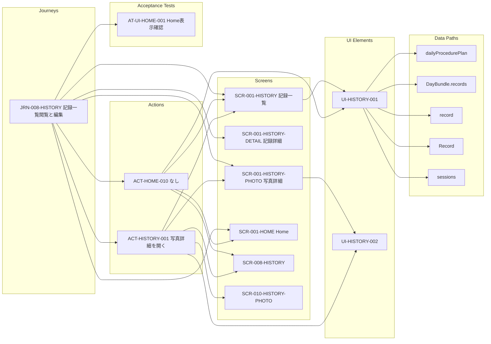

# SCR-001-HISTORY マップ

```mermaid
flowchart LR
  %% SCR-001-HISTORY
  subgraph JRN["Journeys"]
    N9["JRN-008-HISTORY 記録一覧閲覧と編集"]
  end
  subgraph ACT["Actions"]
    N1["ACT-HISTORY-001 写真詳細を開く"]
    N2["ACT-HOME-010 なし"]
  end
  subgraph SCR["Screens"]
    N10["SCR-001-HISTORY 記録一覧"]
    N11["SCR-001-HISTORY-DETAIL 記録詳細"]
    N12["SCR-001-HISTORY-PHOTO 写真詳細"]
    N13["SCR-001-HOME Home"]
    N14["SCR-008-HISTORY"]
    N15["SCR-010-HISTORY-PHOTO"]
  end
  subgraph UI["UI Elements"]
    N16["UI-HISTORY-001"]
    N17["UI-HISTORY-002"]
  end
  subgraph AT["Acceptance Tests"]
    N3["AT-UI-HOME-001 Home表示確認"]
  end
  subgraph DATA["Data Paths"]
    N4["dailyProcedurePlan"]
    N5["DayBundle.records"]
    N6["record"]
    N7["Record"]
    N8["sessions"]
  end
  N1 --> N10
  N1 --> N12
  N1 --> N14
  N1 --> N15
  N1 --> N17
  N2 --> N10
  N2 --> N13
  N2 --> N14
  N2 --> N16
  N9 --> N1
  N9 --> N2
  N9 --> N3
  N9 --> N10
  N9 --> N11
  N9 --> N12
  N9 --> N13
  N10 --> N16
  N12 --> N17
  N16 --> N4
  N16 --> N5
  N16 --> N6
  N16 --> N7
  N16 --> N8
```

