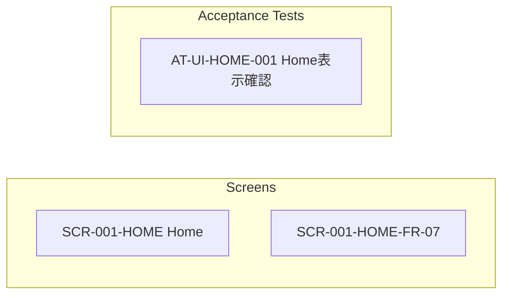

# SCR-001-HOME-FR-07 マップ

```mermaid
flowchart LR
  %% SCR-001-HOME-FR-07
  subgraph SCR["Screens"]
    N2["SCR-001-HOME Home"]
    N3["SCR-001-HOME-FR-07"]
  end
  subgraph AT["Acceptance Tests"]
    N1["AT-UI-HOME-001 Home表示確認"]
  end
```

