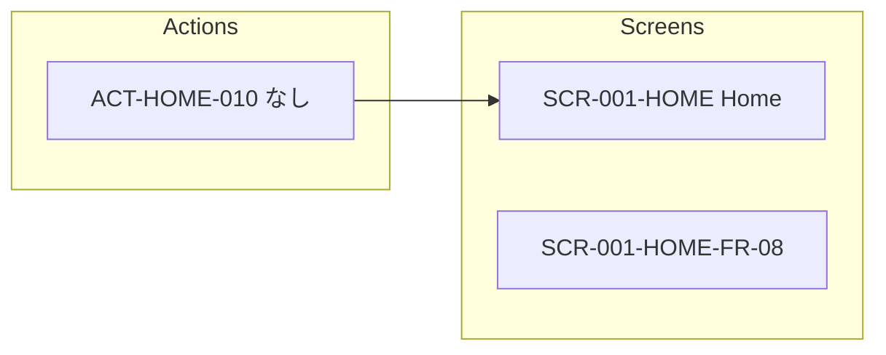

# SCR-001-HOME-FR-08 マップ

```mermaid
flowchart LR
  %% SCR-001-HOME-FR-08
  subgraph ACT["Actions"]
    N1["ACT-HOME-010 なし"]
  end
  subgraph SCR["Screens"]
    N2["SCR-001-HOME Home"]
    N3["SCR-001-HOME-FR-08"]
  end
  N1 --> N2
```

