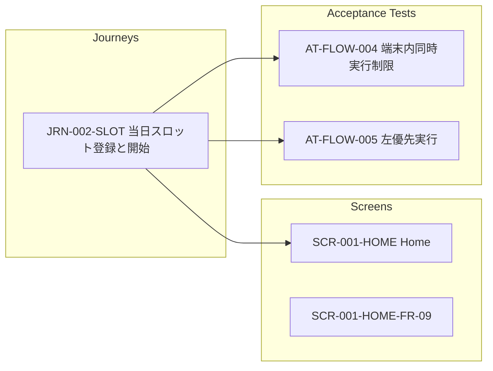

# SCR-001-HOME-FR-09 マップ

```mermaid
flowchart LR
  %% SCR-001-HOME-FR-09
  subgraph JRN["Journeys"]
    N3["JRN-002-SLOT 当日スロット登録と開始"]
  end
  subgraph SCR["Screens"]
    N4["SCR-001-HOME Home"]
    N5["SCR-001-HOME-FR-09"]
  end
  subgraph AT["Acceptance Tests"]
    N1["AT-FLOW-004 端末内同時実行制限"]
    N2["AT-FLOW-005 左優先実行"]
  end
  N3 --> N1
  N3 --> N2
  N3 --> N4
```

