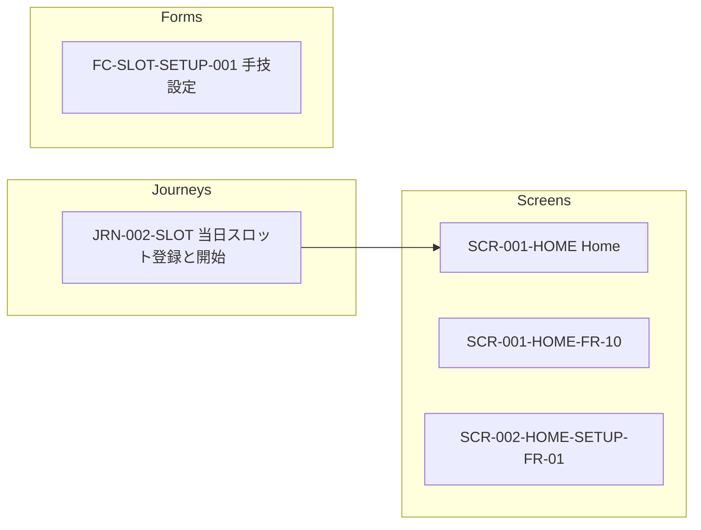

# SCR-001-HOME-FR-10 マップ

```mermaid
flowchart LR
  %% SCR-001-HOME-FR-10
  subgraph JRN["Journeys"]
    N2["JRN-002-SLOT 当日スロット登録と開始"]
  end
  subgraph SCR["Screens"]
    N3["SCR-001-HOME Home"]
    N4["SCR-001-HOME-FR-10"]
    N5["SCR-002-HOME-SETUP-FR-01"]
  end
  subgraph FC["Forms"]
    N1["FC-SLOT-SETUP-001 手技設定"]
  end
  N2 --> N3
```

