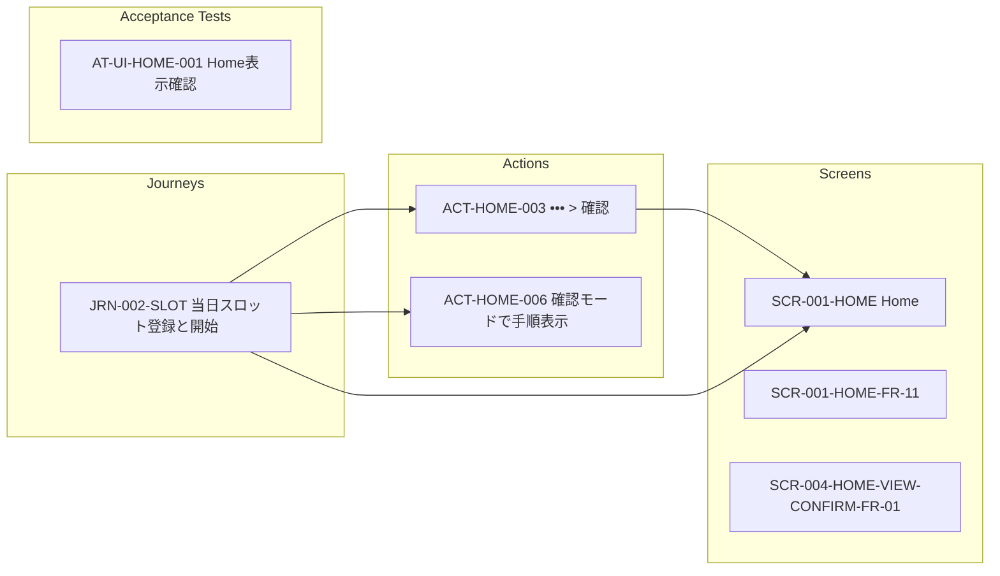

# SCR-001-HOME-FR-11 マップ

```mermaid
flowchart LR
  %% SCR-001-HOME-FR-11
  subgraph JRN["Journeys"]
    N4["JRN-002-SLOT 当日スロット登録と開始"]
  end
  subgraph ACT["Actions"]
    N1["ACT-HOME-003 ••• > 確認"]
    N2["ACT-HOME-006 確認モードで手順表示"]
  end
  subgraph SCR["Screens"]
    N5["SCR-001-HOME Home"]
    N6["SCR-001-HOME-FR-11"]
    N7["SCR-004-HOME-VIEW-CONFIRM-FR-01"]
  end
  subgraph AT["Acceptance Tests"]
    N3["AT-UI-HOME-001 Home表示確認"]
  end
  N1 --> N5
  N4 --> N1
  N4 --> N2
  N4 --> N5
```

