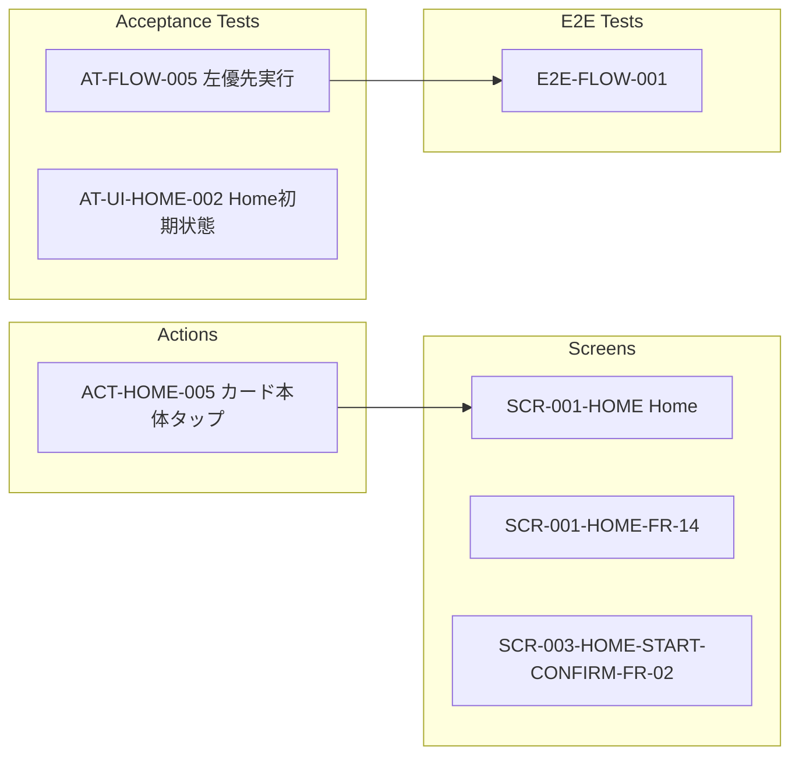

# SCR-001-HOME-FR-14 マップ

```mermaid
flowchart LR
  %% SCR-001-HOME-FR-14
  subgraph ACT["Actions"]
    N1["ACT-HOME-005 カード本体タップ"]
  end
  subgraph SCR["Screens"]
    N5["SCR-001-HOME Home"]
    N6["SCR-001-HOME-FR-14"]
    N7["SCR-003-HOME-START-CONFIRM-FR-02"]
  end
  subgraph AT["Acceptance Tests"]
    N2["AT-FLOW-005 左優先実行"]
    N3["AT-UI-HOME-002 Home初期状態"]
  end
  subgraph E2E["E2E Tests"]
    N4["E2E-FLOW-001"]
  end
  N1 --> N5
  N2 --> N4
```

