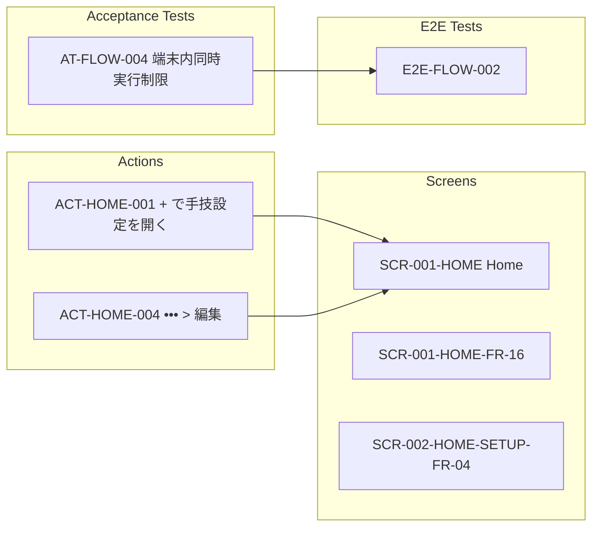

# SCR-001-HOME-FR-16 マップ

```mermaid
flowchart LR
  %% SCR-001-HOME-FR-16
  subgraph ACT["Actions"]
    N1["ACT-HOME-001 + で手技設定を開く"]
    N2["ACT-HOME-004 ••• > 編集"]
  end
  subgraph SCR["Screens"]
    N5["SCR-001-HOME Home"]
    N6["SCR-001-HOME-FR-16"]
    N7["SCR-002-HOME-SETUP-FR-04"]
  end
  subgraph AT["Acceptance Tests"]
    N3["AT-FLOW-004 端末内同時実行制限"]
  end
  subgraph E2E["E2E Tests"]
    N4["E2E-FLOW-002"]
  end
  N1 --> N5
  N2 --> N5
  N3 --> N4
```

