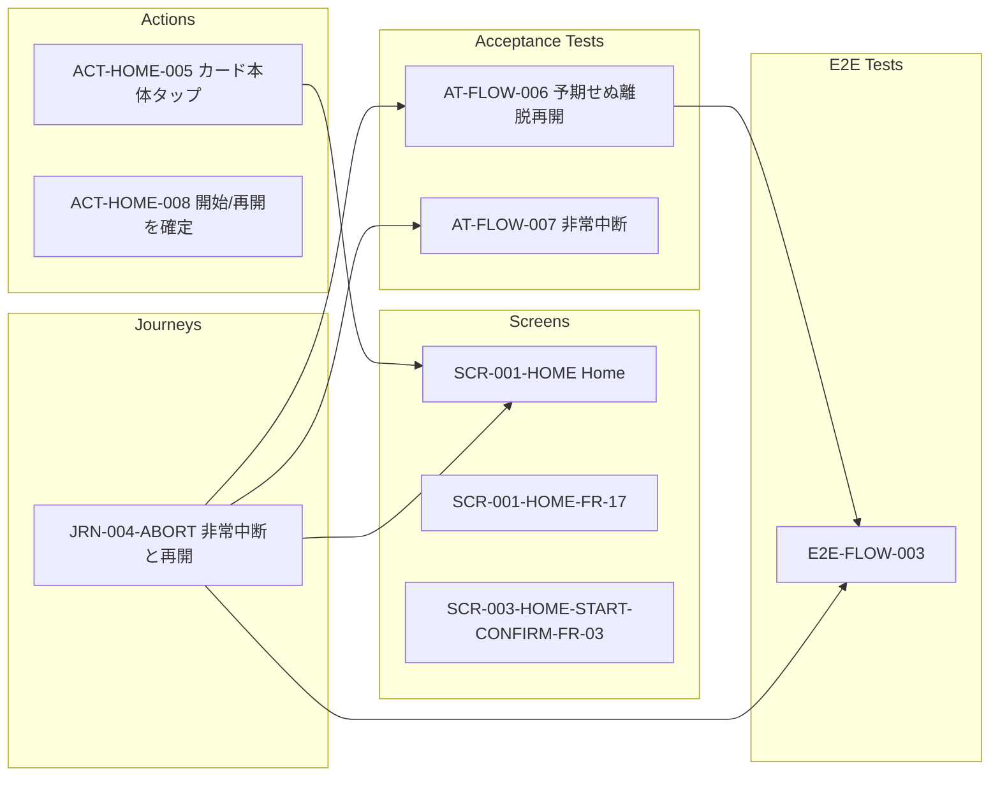

# SCR-001-HOME-FR-17 マップ

```mermaid
flowchart LR
  %% SCR-001-HOME-FR-17
  subgraph JRN["Journeys"]
    N6["JRN-004-ABORT 非常中断と再開"]
  end
  subgraph ACT["Actions"]
    N1["ACT-HOME-005 カード本体タップ"]
    N2["ACT-HOME-008 開始/再開を確定"]
  end
  subgraph SCR["Screens"]
    N7["SCR-001-HOME Home"]
    N8["SCR-001-HOME-FR-17"]
    N9["SCR-003-HOME-START-CONFIRM-FR-03"]
  end
  subgraph AT["Acceptance Tests"]
    N3["AT-FLOW-006 予期せぬ離脱再開"]
    N4["AT-FLOW-007 非常中断"]
  end
  subgraph E2E["E2E Tests"]
    N5["E2E-FLOW-003"]
  end
  N1 --> N7
  N3 --> N5
  N6 --> N3
  N6 --> N4
  N6 --> N5
  N6 --> N7
```

