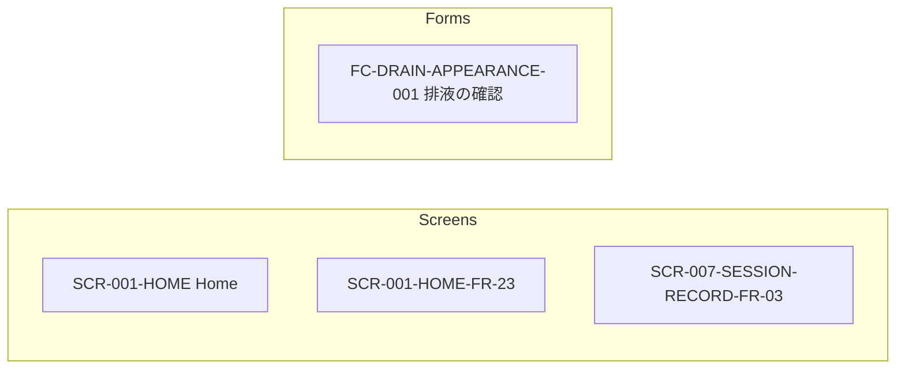

# SCR-001-HOME-FR-23 マップ

```mermaid
flowchart LR
  %% SCR-001-HOME-FR-23
  subgraph SCR["Screens"]
    N2["SCR-001-HOME Home"]
    N3["SCR-001-HOME-FR-23"]
    N4["SCR-007-SESSION-RECORD-FR-03"]
  end
  subgraph FC["Forms"]
    N1["FC-DRAIN-APPEARANCE-001 排液の確認"]
  end
```

