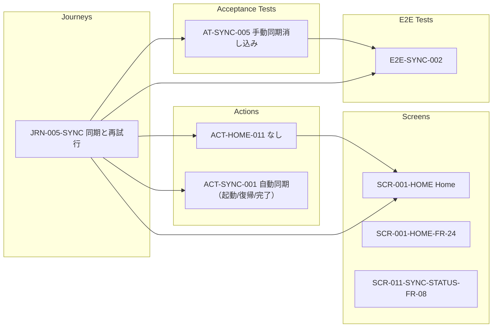

# SCR-001-HOME-FR-24 マップ

```mermaid
flowchart LR
  %% SCR-001-HOME-FR-24
  subgraph JRN["Journeys"]
    N5["JRN-005-SYNC 同期と再試行"]
  end
  subgraph ACT["Actions"]
    N1["ACT-HOME-011 なし"]
    N2["ACT-SYNC-001 自動同期（起動/復帰/完了）"]
  end
  subgraph SCR["Screens"]
    N6["SCR-001-HOME Home"]
    N7["SCR-001-HOME-FR-24"]
    N8["SCR-011-SYNC-STATUS-FR-08"]
  end
  subgraph AT["Acceptance Tests"]
    N3["AT-SYNC-005 手動同期消し込み"]
  end
  subgraph E2E["E2E Tests"]
    N4["E2E-SYNC-002"]
  end
  N1 --> N6
  N3 --> N4
  N5 --> N1
  N5 --> N2
  N5 --> N3
  N5 --> N4
  N5 --> N6
```

