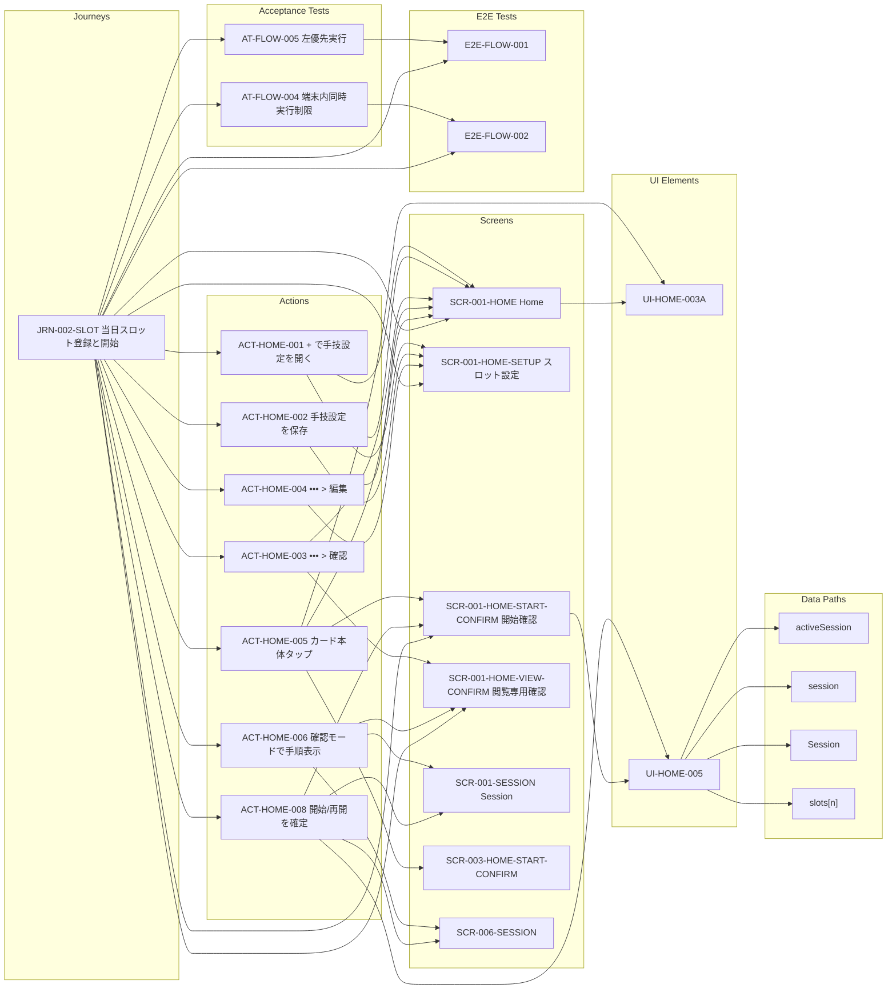

# SCR-001-HOME-START-CONFIRM マップ

```mermaid
flowchart LR
  %% SCR-001-HOME-START-CONFIRM
  subgraph JRN["Journeys"]
    N16["JRN-002-SLOT 当日スロット登録と開始"]
  end
  subgraph ACT["Actions"]
    N1["ACT-HOME-001 + で手技設定を開く"]
    N2["ACT-HOME-002 手技設定を保存"]
    N3["ACT-HOME-003 ••• > 確認"]
    N4["ACT-HOME-004 ••• > 編集"]
    N5["ACT-HOME-005 カード本体タップ"]
    N6["ACT-HOME-006 確認モードで手順表示"]
    N7["ACT-HOME-008 開始/再開を確定"]
  end
  subgraph SCR["Screens"]
    N17["SCR-001-HOME Home"]
    N18["SCR-001-HOME-SETUP スロット設定"]
    N19["SCR-001-HOME-START-CONFIRM 開始確認"]
    N20["SCR-001-HOME-VIEW-CONFIRM 閲覧専用確認"]
    N21["SCR-001-SESSION Session"]
    N22["SCR-003-HOME-START-CONFIRM"]
    N23["SCR-006-SESSION"]
  end
  subgraph UI["UI Elements"]
    N24["UI-HOME-003A"]
    N25["UI-HOME-005"]
  end
  subgraph AT["Acceptance Tests"]
    N8["AT-FLOW-004 端末内同時実行制限"]
    N9["AT-FLOW-005 左優先実行"]
  end
  subgraph E2E["E2E Tests"]
    N14["E2E-FLOW-001"]
    N15["E2E-FLOW-002"]
  end
  subgraph DATA["Data Paths"]
    N10["activeSession"]
    N11["session"]
    N12["Session"]
    N13["slots[n]"]
  end
  N1 --> N17
  N1 --> N18
  N2 --> N17
  N2 --> N18
  N3 --> N17
  N3 --> N20
  N4 --> N17
  N4 --> N18
  N5 --> N17
  N5 --> N19
  N5 --> N22
  N5 --> N24
  N6 --> N20
  N6 --> N21
  N6 --> N23
  N7 --> N19
  N7 --> N21
  N7 --> N23
  N7 --> N25
  N8 --> N15
  N9 --> N14
  N16 --> N1
  N16 --> N2
  N16 --> N3
  N16 --> N4
  N16 --> N5
  N16 --> N6
  N16 --> N7
  N16 --> N8
  N16 --> N9
  N16 --> N14
  N16 --> N15
  N16 --> N17
  N16 --> N18
  N16 --> N19
  N16 --> N20
  N17 --> N24
  N19 --> N25
  N25 --> N10
  N25 --> N11
  N25 --> N12
  N25 --> N13
```

