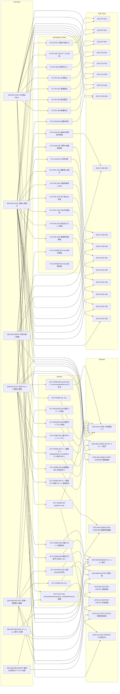

# SCR-001-HOME マップ

```mermaid
flowchart LR
  %% SCR-001-HOME
  subgraph JRN["Journeys"]
    N51["JRN-001-CSV CSV取込（Mac）"]
    N52["JRN-002-SLOT 当日スロット登録と開始"]
    N53["JRN-003-SESSION セッション進行と記録"]
    N54["JRN-004-ABORT 非常中断と再開"]
    N55["JRN-005-SYNC 同期と再試行"]
    N56["JRN-006-RECOVERY 復旧（DB消失/クラウド欠損）"]
    N57["JRN-008-HISTORY 記録一覧閲覧と編集"]
  end
  subgraph ACT["Actions"]
    N1["ACT-HISTORY-001 対象photoIdが存在"]
    N2["ACT-HOME-001 進行中セッションなし"]
    N3["ACT-HOME-002 protocolId と recommendedAtLocal が妥当"]
    N4["ACT-HOME-003 ••• > 確認 かつ対象スロット登録済み"]
    N5["ACT-HOME-004 ••• > 編集 かつdisplayStatus!=completed かつ進行中なし"]
    N6["ACT-HOME-005 右側開始時に左側全完了"]
    N7["ACT-HOME-006 対象スロット登録済み"]
    N8["ACT-HOME-007 platform=mac"]
    N9["ACT-HOME-008 開始不可条件に該当しない"]
    N10["ACT-HOME-010 なし"]
    N11["ACT-HOME-011 なし"]
    N12["ACT-SESSION-004 最終ステップ到達"]
    N13["ACT-SESSION-006 確認ダイアログ承認"]
    N14["ACT-SYNC-001 startup/resume/session_complete/manual 契機"]
  end
  subgraph SCR["Screens"]
    N58["SCR-001-HOME 手技開始ハブ"]
    N59["SCR-002-HOME-SETUP スロット設定"]
    N60["SCR-003-HOME-START-CONFIRM 開始確認"]
    N61["SCR-004-HOME-VIEW-CONFIRM 閲覧専用確認"]
    N62["SCR-006-SESSION セッション進行"]
    N63["SCR-008-HISTORY 記録一覧"]
    N64["SCR-009-HISTORY-DETAIL 記録詳細"]
    N65["SCR-010-HISTORY-PHOTO 写真詳細"]
    N66["SCR-011-SYNC-STATUS 同期状態表示"]
    N67["SCR-012-MAC-IMPORT CSV取込I/F"]
  end
  subgraph AT["Acceptance Tests"]
    N15["AT-API-001 公開API最小化"]
    N16["AT-API-003 CSVローカル完結"]
    N17["AT-API-004 非暗号化キー"]
    N18["AT-CSV-001 正常取込"]
    N19["AT-CSV-002 重複検出"]
    N20["AT-CSV-003 直列整合"]
    N21["AT-CSV-004 画像存在"]
    N22["AT-FLOW-004 端末内同時実行制限"]
    N23["AT-FLOW-005 左優先実行"]
    N24["AT-FLOW-006 予期せぬ離脱再開"]
    N25["AT-FLOW-007 非常中断"]
    N26["AT-SYNC-001 起動時pull復元"]
    N27["AT-SYNC-002 完了時push反映"]
    N28["AT-SYNC-003 LWW内部適用"]
    N29["AT-SYNC-004 同日同スロット競合"]
    N30["AT-SYNC-005 手動同期消し込み"]
    N31["AT-SYNC-006 復帰時失敗導線"]
    N32["AT-UI-HOME-001 Home表示確認"]
    N33["AT-UI-HOME-002 Home初期状態"]
  end
  subgraph E2E["E2E Tests"]
    N34["E2E-API-001"]
    N35["E2E-API-002"]
    N36["E2E-API-004"]
    N37["E2E-CSV-001"]
    N38["E2E-CSV-002"]
    N39["E2E-CSV-003"]
    N40["E2E-CSV-004"]
    N41["E2E-FLOW-001"]
    N42["E2E-FLOW-002"]
    N43["E2E-FLOW-003"]
    N44["E2E-FLOW-004"]
    N45["E2E-SYNC-001"]
    N46["E2E-SYNC-002"]
    N47["E2E-SYNC-003"]
    N48["E2E-SYNC-004"]
    N49["E2E-SYNC-005"]
    N50["E2E-SYNC-006"]
  end
  N1 --> N63
  N1 --> N65
  N2 --> N59
  N3 --> N58
  N4 --> N61
  N5 --> N59
  N6 --> N60
  N7 --> N62
  N8 --> N58
  N8 --> N67
  N9 --> N62
  N10 --> N63
  N11 --> N58
  N12 --> N58
  N13 --> N58
  N14 --> N66
  N15 --> N34
  N16 --> N35
  N17 --> N36
  N18 --> N37
  N19 --> N38
  N20 --> N39
  N21 --> N40
  N22 --> N42
  N23 --> N41
  N24 --> N43
  N25 --> N44
  N26 --> N45
  N27 --> N47
  N28 --> N48
  N29 --> N49
  N30 --> N46
  N31 --> N50
  N51 --> N8
  N51 --> N16
  N51 --> N18
  N51 --> N19
  N51 --> N20
  N51 --> N21
  N51 --> N35
  N51 --> N37
  N51 --> N38
  N51 --> N39
  N51 --> N40
  N51 --> N58
  N51 --> N67
  N52 --> N2
  N52 --> N3
  N52 --> N4
  N52 --> N5
  N52 --> N6
  N52 --> N7
  N52 --> N9
  N52 --> N22
  N52 --> N23
  N52 --> N41
  N52 --> N42
  N52 --> N58
  N52 --> N59
  N52 --> N60
  N52 --> N61
  N53 --> N12
  N53 --> N62
  N53 --> N64
  N54 --> N13
  N54 --> N24
  N54 --> N25
  N54 --> N43
  N54 --> N44
  N54 --> N58
  N54 --> N62
  N55 --> N11
  N55 --> N14
  N55 --> N15
  N55 --> N17
  N55 --> N26
  N55 --> N27
  N55 --> N28
  N55 --> N29
  N55 --> N30
  N55 --> N31
  N55 --> N34
  N55 --> N36
  N55 --> N45
  N55 --> N46
  N55 --> N47
  N55 --> N48
  N55 --> N49
  N55 --> N50
  N55 --> N58
  N55 --> N62
  N55 --> N66
  N56 --> N14
  N56 --> N66
  N57 --> N1
  N57 --> N10
  N57 --> N32
  N57 --> N58
  N57 --> N63
  N57 --> N64
  N57 --> N65
```

