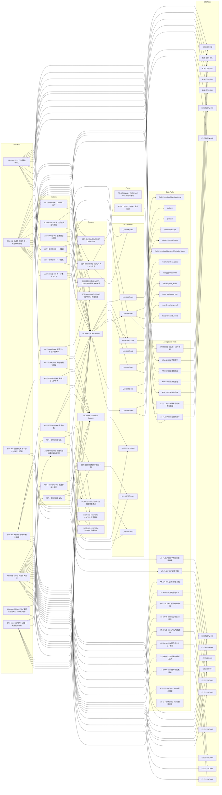

# SCR-001-HOME マップ

```mermaid
flowchart LR
  %% SCR-001-HOME
  subgraph JRN["Journeys"]
    N65["JRN-001-CSV CSV取込（Mac）"]
    N66["JRN-002-SLOT 当日スロット登録と開始"]
    N67["JRN-003-SESSION セッション進行と記録"]
    N68["JRN-004-ABORT 非常中断と再開"]
    N69["JRN-005-SYNC 同期と再試行"]
    N70["JRN-006-RECOVERY 復旧（DB消失/クラウド欠損）"]
    N71["JRN-008-HISTORY 記録一覧閲覧と編集"]
  end
  subgraph ACT["Actions"]
    N1["ACT-HISTORY-001 写真詳細を開く"]
    N2["ACT-HOME-001 + で手技設定を開く"]
    N3["ACT-HOME-002 手技設定を保存"]
    N4["ACT-HOME-003 ••• > 確認"]
    N5["ACT-HOME-004 ••• > 編集"]
    N6["ACT-HOME-005 カード本体タップ"]
    N7["ACT-HOME-006 確認モードで手順表示"]
    N8["ACT-HOME-007 CSV取り込み"]
    N9["ACT-HOME-008 開始/再開を確定"]
    N10["ACT-HOME-010 なし"]
    N11["ACT-HOME-011 なし"]
    N12["ACT-SESSION-004 最終ステップ完了"]
    N13["ACT-SESSION-006 非常中断"]
    N14["ACT-SYNC-001 自動同期（起動/復帰/完了）"]
  end
  subgraph SCR["Screens"]
    N72["SCR-001-HOME Home"]
    N73["SCR-002-HOME-SETUP スロット設定"]
    N74["SCR-003-HOME-START-CONFIRM 開始確認"]
    N75["SCR-004-HOME-VIEW-CONFIRM 閲覧専用確認"]
    N76["SCR-006-SESSION Session"]
    N77["SCR-008-HISTORY 記録一覧"]
    N78["SCR-009-HISTORY-DETAIL 記録詳細"]
    N79["SCR-010-HISTORY-PHOTO 写真詳細"]
    N80["SCR-011-SYNC-STATUS 同期状態表示"]
    N81["SCR-012-MAC-IMPORT CSV取込I/F"]
  end
  subgraph FC["Forms"]
    N63["FC-DRAIN-APPEARANCE-001 排液の確認"]
    N64["FC-SLOT-SETUP-001 手技設定"]
  end
  subgraph UI["UI Elements"]
    N82["UI-HISTORY-001"]
    N83["UI-HOME-001"]
    N84["UI-HOME-002"]
    N85["UI-HOME-003"]
    N86["UI-HOME-003A"]
    N87["UI-HOME-004"]
    N88["UI-HOME-007"]
    N89["UI-HOME-008"]
    N90["UI-HOME-009"]
    N91["UI-SESSION-005"]
    N92["UI-SYNC-002"]
  end
  subgraph AT["Acceptance Tests"]
    N15["AT-API-001 公開API最小化"]
    N16["AT-API-003 CSVローカル完結"]
    N17["AT-API-004 非暗号化キー"]
    N18["AT-CSV-001 正常取込"]
    N19["AT-CSV-002 重複検出"]
    N20["AT-CSV-003 直列整合"]
    N21["AT-CSV-004 画像存在"]
    N22["AT-FLOW-004 端末内同時実行制限"]
    N23["AT-FLOW-005 左優先実行"]
    N24["AT-FLOW-006 予期せぬ離脱再開"]
    N25["AT-FLOW-007 非常中断"]
    N26["AT-SYNC-001 起動時pull復元"]
    N27["AT-SYNC-002 完了時push反映"]
    N28["AT-SYNC-003 LWW内部適用"]
    N29["AT-SYNC-004 同日同スロット競合"]
    N30["AT-SYNC-005 手動同期消し込み"]
    N31["AT-SYNC-006 復帰時失敗導線"]
    N32["AT-UI-HOME-001 Home表示確認"]
    N33["AT-UI-HOME-002 Home初期状態"]
  end
  subgraph E2E["E2E Tests"]
    N46["E2E-API-001"]
    N47["E2E-API-002"]
    N48["E2E-API-004"]
    N49["E2E-CSV-001"]
    N50["E2E-CSV-002"]
    N51["E2E-CSV-003"]
    N52["E2E-CSV-004"]
    N53["E2E-FLOW-001"]
    N54["E2E-FLOW-002"]
    N55["E2E-FLOW-003"]
    N56["E2E-FLOW-004"]
    N57["E2E-SYNC-001"]
    N58["E2E-SYNC-002"]
    N59["E2E-SYNC-003"]
    N60["E2E-SYNC-004"]
    N61["E2E-SYNC-005"]
    N62["E2E-SYNC-006"]
  end
  subgraph DATA["Data Paths"]
    N34["DailyProcedurePlan.dateLocal"]
    N35["DailyProcedurePlan.slots[*].displayStatus"]
    N36["platform"]
    N37["protocol"]
    N38["ProtocolPackage"]
    N39["recommendedAtLocal"]
    N40["record_exchange_no)"]
    N41["Record(record_event"]
    N42["Record(timer_event"]
    N43["slots[*].protocolTitle"]
    N44["slots[n].displayStatus"]
    N45["timer_exchange_no)"]
  end
  N1 --> N77
  N1 --> N79
  N2 --> N72
  N2 --> N73
  N3 --> N72
  N3 --> N73
  N3 --> N87
  N4 --> N72
  N4 --> N75
  N5 --> N72
  N5 --> N73
  N6 --> N72
  N6 --> N74
  N6 --> N86
  N7 --> N75
  N7 --> N76
  N8 --> N72
  N8 --> N81
  N8 --> N88
  N9 --> N74
  N9 --> N76
  N10 --> N72
  N10 --> N77
  N10 --> N82
  N11 --> N72
  N11 --> N92
  N12 --> N72
  N12 --> N76
  N13 --> N72
  N13 --> N76
  N13 --> N91
  N14 --> N80
  N15 --> N46
  N16 --> N47
  N17 --> N48
  N18 --> N49
  N19 --> N50
  N20 --> N51
  N21 --> N52
  N22 --> N54
  N23 --> N53
  N24 --> N55
  N25 --> N56
  N26 --> N57
  N27 --> N59
  N28 --> N60
  N29 --> N61
  N30 --> N58
  N31 --> N62
  N64 --> N23
  N65 --> N8
  N65 --> N16
  N65 --> N18
  N65 --> N19
  N65 --> N20
  N65 --> N21
  N65 --> N47
  N65 --> N49
  N65 --> N50
  N65 --> N51
  N65 --> N52
  N65 --> N72
  N65 --> N81
  N66 --> N2
  N66 --> N3
  N66 --> N4
  N66 --> N5
  N66 --> N6
  N66 --> N7
  N66 --> N9
  N66 --> N22
  N66 --> N23
  N66 --> N53
  N66 --> N54
  N66 --> N72
  N66 --> N73
  N66 --> N74
  N66 --> N75
  N67 --> N12
  N67 --> N76
  N67 --> N78
  N68 --> N13
  N68 --> N24
  N68 --> N25
  N68 --> N55
  N68 --> N56
  N68 --> N72
  N68 --> N76
  N69 --> N11
  N69 --> N14
  N69 --> N15
  N69 --> N17
  N69 --> N26
  N69 --> N27
  N69 --> N28
  N69 --> N29
  N69 --> N30
  N69 --> N31
  N69 --> N46
  N69 --> N48
  N69 --> N57
  N69 --> N58
  N69 --> N59
  N69 --> N60
  N69 --> N61
  N69 --> N62
  N69 --> N72
  N69 --> N76
  N69 --> N80
  N70 --> N14
  N70 --> N80
  N71 --> N1
  N71 --> N10
  N71 --> N32
  N71 --> N72
  N71 --> N77
  N71 --> N78
  N71 --> N79
  N72 --> N83
  N72 --> N84
  N72 --> N85
  N72 --> N86
  N72 --> N88
  N72 --> N89
  N72 --> N90
  N73 --> N64
  N73 --> N87
  N76 --> N91
  N77 --> N82
  N80 --> N92
  N83 --> N34
  N84 --> N35
  N85 --> N39
  N85 --> N43
  N86 --> N44
  N88 --> N36
  N88 --> N37
  N88 --> N38
  N89 --> N42
  N89 --> N45
  N90 --> N40
  N90 --> N41
```

