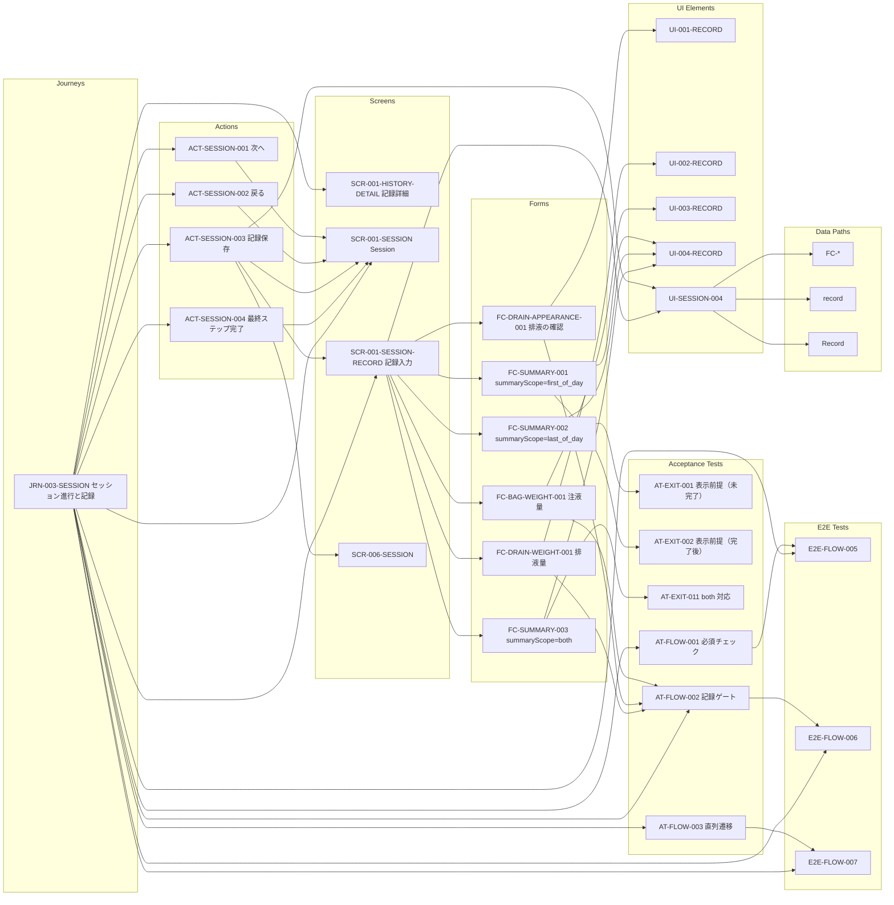

# SCR-001-SESSION-RECORD マップ

```mermaid
flowchart LR
  %% SCR-001-SESSION-RECORD
  subgraph JRN["Journeys"]
    N23["JRN-003-SESSION セッション進行と記録"]
  end
  subgraph ACT["Actions"]
    N1["ACT-SESSION-001 次へ"]
    N2["ACT-SESSION-002 戻る"]
    N3["ACT-SESSION-003 記録保存"]
    N4["ACT-SESSION-004 最終ステップ完了"]
  end
  subgraph SCR["Screens"]
    N24["SCR-001-HISTORY-DETAIL 記録詳細"]
    N25["SCR-001-SESSION Session"]
    N26["SCR-001-SESSION-RECORD 記録入力"]
    N27["SCR-006-SESSION"]
  end
  subgraph FC["Forms"]
    N17["FC-BAG-WEIGHT-001 注液量"]
    N18["FC-DRAIN-APPEARANCE-001 排液の確認"]
    N19["FC-DRAIN-WEIGHT-001 排液量"]
    N20["FC-SUMMARY-001 summaryScope=first_of_day"]
    N21["FC-SUMMARY-002 summaryScope=last_of_day"]
    N22["FC-SUMMARY-003 summaryScope=both"]
  end
  subgraph UI["UI Elements"]
    N28["UI-001-RECORD"]
    N29["UI-002-RECORD"]
    N30["UI-003-RECORD"]
    N31["UI-004-RECORD"]
    N32["UI-SESSION-004"]
  end
  subgraph AT["Acceptance Tests"]
    N5["AT-EXIT-001 表示前提（未完了）"]
    N6["AT-EXIT-002 表示前提（完了後）"]
    N7["AT-EXIT-011 both 対応"]
    N8["AT-FLOW-001 必須チェック"]
    N9["AT-FLOW-002 記録ゲート"]
    N10["AT-FLOW-003 直列遷移"]
  end
  subgraph E2E["E2E Tests"]
    N14["E2E-FLOW-005"]
    N15["E2E-FLOW-006"]
    N16["E2E-FLOW-007"]
  end
  subgraph DATA["Data Paths"]
    N11["FC-*"]
    N12["record"]
    N13["Record"]
  end
  N1 --> N25
  N2 --> N25
  N3 --> N25
  N3 --> N26
  N3 --> N27
  N3 --> N32
  N4 --> N25
  N8 --> N14
  N9 --> N15
  N10 --> N16
  N17 --> N9
  N17 --> N30
  N18 --> N9
  N18 --> N28
  N19 --> N9
  N19 --> N29
  N20 --> N6
  N20 --> N31
  N21 --> N5
  N21 --> N31
  N22 --> N7
  N22 --> N31
  N23 --> N1
  N23 --> N2
  N23 --> N3
  N23 --> N4
  N23 --> N8
  N23 --> N9
  N23 --> N10
  N23 --> N14
  N23 --> N15
  N23 --> N16
  N23 --> N24
  N23 --> N25
  N23 --> N26
  N26 --> N17
  N26 --> N18
  N26 --> N19
  N26 --> N20
  N26 --> N21
  N26 --> N22
  N26 --> N32
  N32 --> N11
  N32 --> N12
  N32 --> N13
```

